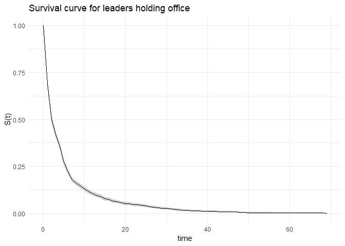

GSERM LDA: Exercise Two
================

The purpose of this exercise is to estimate and interpret various survival models, and compare conclusions from these models.

The subject is leadership tenure. The data is time-varying, with observations on leader-years for 2990 leaders from 1875 to 2003. The total number of observations are 15 244.

The main dependent variables are tenurestart, tenureend and leftoffice. Leftoffice is the event indicator, indicating whether the relevant leader left office in the given year. There seems to be some rounding here. There are 2 821 events in the dataset, with an mean tenure of six and a half year. The median survial time in office is about 2 years. The various reasons for leaving office (from coups to elections to other stuff) are ignored for the purpose of the assignment.

The independent variables are age, female, and five variables for world region (North America is the implicit reference category). A potentially important thing to note for the substantial interpretations is that while age vares from 11 to 93, with a mean of 55 years and a standard-deviation of 12 years, the gender-variable female indicates that female leaders comprise about 1 % of the observations. That is, the age-variable has a lot more variation than gender.

``` r
#libraries
library(dplyr) #data manipulation
```

    ## 
    ## Attaching package: 'dplyr'

    ## The following objects are masked from 'package:stats':
    ## 
    ##     filter, lag

    ## The following objects are masked from 'package:base':
    ## 
    ##     intersect, setdiff, setequal, union

``` r
library(ggplot2) #plotting
library(knitr) #table generation
library(survival) #basic survival analysis
library(eha) #parametric survival models
library(psych) #solely for the describe-function
```

    ## 
    ## Attaching package: 'psych'

    ## The following objects are masked from 'package:ggplot2':
    ## 
    ##     %+%, alpha

``` r
library(broom) #data-tidying

#parameters
set.seed(1106)
options(scipen=99)

#data
df <- read.csv("data/GSERM-Oslo-2019-ExTwo.csv", stringsAsFactors=FALSE)

#fename = female
names(df)[grep("fename",names(df),fixed=TRUE)] ="female"

#descriptive statistics
kable(describe(select(df,year,tenurestart,tenureend,leftoffice,age,female,LatinAm,Europe,Africa,Asia,MidEast),skew=FALSE),digits=2)
```

|             |  vars|      n|     mean|     sd|   min|   max|  range|    se|
|-------------|-----:|------:|--------:|------:|-----:|-----:|------:|-----:|
| year        |     1|  15244|  1950.89|  38.80|  1840|  2003|    163|  0.31|
| tenurestart |     2|  15244|     5.46|   8.20|    -1|    67|     68|  0.07|
| tenureend   |     3|  15244|     6.46|   8.20|     0|    68|     68|  0.07|
| leftoffice  |     4|  15244|     0.19|   0.39|     0|     1|      1|  0.00|
| age         |     5|  15064|    54.62|  12.15|    11|    93|     82|  0.10|
| female      |     6|  15244|     0.01|   0.10|     0|     1|      1|  0.00|
| LatinAm     |     7|  15244|     0.11|   0.32|     0|     1|      1|  0.00|
| Europe      |     8|  15244|     0.29|   0.45|     0|     1|      1|  0.00|
| Africa      |     9|  15244|     0.15|   0.36|     0|     1|      1|  0.00|
| Asia        |    10|  15244|     0.18|   0.39|     0|     1|      1|  0.00|
| MidEast     |    11|  15244|     0.11|   0.31|     0|     1|      1|  0.00|

``` r
#na_count <- data.frame(sapply(df, function(y) sum(is.na(y))))

#some more manipulation
#eha::phreg gets a hickup from negative tenurestart-times (if tenurestart <0, tenureend==0 and leftoffice==1, then you got yourself a negative duration). Add +1 to all - this has implications for interpretations
sum(df$tenurestart<0)
```

    ## [1] 1870

``` r
df = mutate(df,tenurestart_mod = tenurestart+1,tenureend_mod=tenureend+1)
sum(df$tenurestart_mod<0)
```

    ## [1] 0

``` r
#there are 180 missing values in age - we'll replace those with means, for sake om completion
df$age[is.na(df$age)==TRUE] = mean(df$age,na.rm=TRUE)
#to make interpretation of age easy, we'll center age by mean
df = mutate(df,age = age - mean(age,na.rm=TRUE))

#basic survival curve 
survival = Surv(df$tenurestart_mod,df$tenureend_mod,df$leftoffice)
model_0 = survfit(survival~1,data=df)
temp = tidy(model_0)

ggplot(data=temp)+
  geom_line(aes(x=time,y=estimate))+
  geom_ribbon(aes(x=time,ymin=conf.low,ymax=conf.high),alpha=0.2)+
  theme_minimal()+
  labs(y="S(t)",title="Survival curve for leaders holding office")
```



Parametric models
=================

To estimate a parametric model, I need to specify both a model of covariates and a distribution function for the hazard rates: do we assume that the risks of failiure at any given point rises, falls or exhibit other trends over tenure time - conditional on the covariates included in the model? The last part of the sentence is important: it implies that I need to think a baseline hazard after drawing out hazard-rate variations between genders, ages, world region and any interactions between world region and gender.

One potentially reasonable hazard-rate distribution might be that the hazard is rising at first, but after some amount of duration, it could fall: the risk of leaving office is larger at first, and grows as one approaches election-type durations, but then falls as one approaches more autocratic modes of leadership. The degree of democracy is not a part of the model. This could suggest something like a log-normal or log-logistic distribution.

Such a model can be fit with eha::phreg - or at least in theory, as it yields rather cryptic error codes for the log-normal distribution. The help-page also indicates that this is an experimental feature. the log-logistic estimation seems to work though. I and assume for the sake of this excerice that the coefficients can be interpreted. That is, I assume correct calculations, but not necessarily correctly specified distribution function.

I include all the independent varibles, and a squared age-term, as the effects of age often turn up to be of this kind.

``` r
#as per the documentation, arrangement of observations does matter for eha::phreg-estimation.
df = arrange(df,leadid)

model_parametric = phreg(survival~age+I(age^2)+female+LatinAm+Europe+Africa+Asia+MidEast,
                         data=df,dist="loglogistic",center=FALSE)
#phreg is not AFT-form

summary(model_parametric)
```

    ## Call:
    ## phreg(formula = survival ~ age + I(age^2) + female + LatinAm + 
    ##     Europe + Africa + Asia + MidEast, data = df, dist = "loglogistic", 
    ##     center = FALSE)
    ## 
    ## Covariate          W.mean      Coef Exp(Coef)  se(Coef)    Wald p
    ## (Intercept)                  -0.521               0.105     0.000 
    ## age                -0.000    -0.002     0.998     0.002     0.171 
    ## I(age^2)          145.936     0.000     1.000     0.000     0.116 
    ## female              0.010     0.188     1.207     0.174     0.279 
    ## LatinAm             0.115    -0.059     0.943     0.072     0.412 
    ## Europe              0.292     0.203     1.225     0.054     0.000 
    ## Africa              0.154    -0.354     0.702     0.073     0.000 
    ## Asia                0.181    -0.293     0.746     0.070     0.000 
    ## MidEast             0.111    -0.391     0.676     0.084     0.000 
    ## 
    ## log(scale)                    0.744               0.068     0.000 
    ## log(shape)                    0.777               0.048     0.000 
    ## 
    ## Events                    2821 
    ## Total time at risk         15244 
    ## Max. log. likelihood       -7217 
    ## LR test statistic         141.31 
    ## Degrees of freedom        8 
    ## Overall p-value           0

``` r
#plot(model_parametric)
```

As we can see, neither age, gender nor Latin-America. That is, males do not have a statistically significantly different hazard rate than females, older leaders have no different hazard than younger people, and Latin-American leaders do not have a different leadership hazard than their North-American colleagus.

The coefficients for Europe, Africa, Asia and the Mid-East are statistically significant. Being a Europan leader increases the hazard of leaving office by 23 %, compared to a North-American leader. Being a leader from Africa, Asia or the Middle-East on the other hand decreases the hazard of leaving office.

Cox's proportionate hazards model
=================================

We then take a look at the semi-parametric Cox's proportional hazards model. As Cox does not assume a distribution of the hazard, only the proportionality of said hazards, we can get around misspecifying the baseline hazard.

The exact-method is preferred for handling ties in cases with actual discrete data - that is, where the events actually take place in the same years. This method is, however, rather computationally intensive, and keeps crashing my computer. As such, we'll go with the default-method of Efron.

``` r
model_cox = coxph(survival~age+I(age^2)+female+LatinAm+Europe+Africa+Asia+MidEast,
                  data=df, ties = "efron")
summary(model_cox)
```

    ## Call:
    ## coxph(formula = survival ~ age + I(age^2) + female + LatinAm + 
    ##     Europe + Africa + Asia + MidEast, data = df, ties = "efron")
    ## 
    ##   n= 15244, number of events= 2821 
    ## 
    ##                 coef   exp(coef)    se(coef)      z    Pr(>|z|)    
    ## age      -0.00268275  0.99732085  0.00157817 -1.700      0.0891 .  
    ## I(age^2)  0.00013553  1.00013554  0.00008555  1.584      0.1132    
    ## female    0.16558232  1.18008010  0.17397465  0.952      0.3412    
    ## LatinAm  -0.10663517  0.89885355  0.07178539 -1.485      0.1374    
    ## Europe    0.16764467  1.18251635  0.05451821  3.075      0.0021 ** 
    ## Africa   -0.38545948  0.68013805  0.07299854 -5.280 0.000000129 ***
    ## Asia     -0.35456012  0.70148195  0.06996417 -5.068 0.000000403 ***
    ## MidEast  -0.44784014  0.63900683  0.08415871 -5.321 0.000000103 ***
    ## ---
    ## Signif. codes:  0 '***' 0.001 '**' 0.01 '*' 0.05 '.' 0.1 ' ' 1
    ## 
    ##          exp(coef) exp(-coef) lower .95 upper .95
    ## age         0.9973     1.0027    0.9942    1.0004
    ## I(age^2)    1.0001     0.9999    1.0000    1.0003
    ## female      1.1801     0.8474    0.8391    1.6596
    ## LatinAm     0.8989     1.1125    0.7809    1.0346
    ## Europe      1.1825     0.8457    1.0627    1.3159
    ## Africa      0.6801     1.4703    0.5895    0.7848
    ## Asia        0.7015     1.4256    0.6116    0.8046
    ## MidEast     0.6390     1.5649    0.5418    0.7536
    ## 
    ## Concordance= 0.587  (se = 0.007 )
    ## Rsquare= 0.01   (max possible= 0.925 )
    ## Likelihood ratio test= 151.3  on 8 df,   p=<0.0000000000000002
    ## Wald test            = 148.3  on 8 df,   p=<0.0000000000000002
    ## Score (logrank) test = 150.8  on 8 df,   p=<0.0000000000000002

``` r
tabell_cox = tidy(model_cox)%>%
  mutate(.,exp_estimate = exp(estimate))

kable(tabell_cox,digits=2)
```

| term     |  estimate|  std.error|  statistic|  p.value|  conf.low|  conf.high|  exp\_estimate|
|:---------|---------:|----------:|----------:|--------:|---------:|----------:|--------------:|
| age      |      0.00|       0.00|      -1.70|     0.09|     -0.01|       0.00|           1.00|
| I(age^2) |      0.00|       0.00|       1.58|     0.11|      0.00|       0.00|           1.00|
| female   |      0.17|       0.17|       0.95|     0.34|     -0.18|       0.51|           1.18|
| LatinAm  |     -0.11|       0.07|      -1.49|     0.14|     -0.25|       0.03|           0.90|
| Europe   |      0.17|       0.05|       3.08|     0.00|      0.06|       0.27|           1.18|
| Africa   |     -0.39|       0.07|      -5.28|     0.00|     -0.53|      -0.24|           0.68|
| Asia     |     -0.35|       0.07|      -5.07|     0.00|     -0.49|      -0.22|           0.70|
| MidEast  |     -0.45|       0.08|      -5.32|     0.00|     -0.61|      -0.28|           0.64|

``` r
#also put in a (smooth?) estimate of the hazard-curve from these data?
```

We quickly see that the same variables are statistically significant in this model as in the last: Leaders from Europe, Africa, Asia and the Middle East probably have different hazards from leaders from North America. The European leaders have a higher hazard, while the other ones have lower hazards. The differences in hazards ranges from 3 to 5 percentage points.

-   Leaders in Europe have 23 % (parametric) vs. 18 % (cox) higher hazard rate than North America
-   Leaders in Asia have 25 % (parametric) vs. 29 % (cox) lower hazard rate than North America
-   Leaders in Africa have 29 % (parametric) vs. 32 % (cox) lower hazard rate than North America
-   Leaders in the Middle East have 32 % (parametric) vs. 36 % (cox) lower hazard rate than North America

Discrete-time-models
====================

Discrete time-models are Generalized Linear Model-based approaches. As opposed to the survival models above, such a model must deal with time-dependence explicitly - unless you assume a flat hazard.

There are various ways of dealing with such issues. As I briefly assumed for the section on parametric surival models, a curvilinear trend of leaving office over time might be reasonable. Other approaches could be including dummy-variables for time. With 164 timepoints, this would prove rather hard to interpret.

``` r
#baseline glm, flat hazard
model_glm0 = glm(leftoffice~age+I(age^2)+female+LatinAm+Europe+Africa+Asia+MidEast,
                  data=df, family="binomial")
summary(model_glm0)
```

    ## 
    ## Call:
    ## glm(formula = leftoffice ~ age + I(age^2) + female + LatinAm + 
    ##     Europe + Africa + Asia + MidEast, family = "binomial", data = df)
    ## 
    ## Deviance Residuals: 
    ##     Min       1Q   Median       3Q      Max  
    ## -0.8280  -0.7241  -0.5643  -0.4240   2.6008  
    ## 
    ## Coefficients:
    ##               Estimate Std. Error z value             Pr(>|z|)    
    ## (Intercept) -1.1629526  0.0513065 -22.667 < 0.0000000000000002 ***
    ## age          0.0202419  0.0019435  10.415 < 0.0000000000000002 ***
    ## I(age^2)    -0.0004528  0.0001161  -3.900      0.0000960160881 ***
    ## female      -0.0430156  0.2156617  -0.199                0.842    
    ## LatinAm     -0.1052624  0.0774598  -1.359                0.174    
    ## Europe       0.0424940  0.0611236   0.695                0.487    
    ## Africa      -0.8889323  0.0832503 -10.678 < 0.0000000000000002 ***
    ## Asia        -0.4907347  0.0735878  -6.669      0.0000000000258 ***
    ## MidEast     -0.9550109  0.0961308  -9.934 < 0.0000000000000002 ***
    ## ---
    ## Signif. codes:  0 '***' 0.001 '**' 0.01 '*' 0.05 '.' 0.1 ' ' 1
    ## 
    ## (Dispersion parameter for binomial family taken to be 1)
    ## 
    ##     Null deviance: 14603  on 15243  degrees of freedom
    ## Residual deviance: 14114  on 15235  degrees of freedom
    ## AIC: 14132
    ## 
    ## Number of Fisher Scoring iterations: 5

``` r
#some linear trend of tenureend 
#model_glm1 = glm(leftoffice~age+I(age^2)+female+LatinAm+Europe+Africa+Asia+MidEast+tenureend,
#                  data=df, family="binomial")
#summary(model_glm1)

#curvilinear trend
model_glm2 = glm(leftoffice~age+I(age^2)+female+LatinAm+Europe+Africa+Asia+MidEast+tenureend+I(tenureend^2),
                  data=df, family="binomial")
summary(model_glm2)
```

    ## 
    ## Call:
    ## glm(formula = leftoffice ~ age + I(age^2) + female + LatinAm + 
    ##     Europe + Africa + Asia + MidEast + tenureend + I(tenureend^2), 
    ##     family = "binomial", data = df)
    ## 
    ## Deviance Residuals: 
    ##     Min       1Q   Median       3Q      Max  
    ## -1.2316  -0.7150  -0.5353  -0.3292   2.7368  
    ## 
    ## Coefficients:
    ##                  Estimate Std. Error z value             Pr(>|z|)    
    ## (Intercept)    -0.8782917  0.0540527 -16.249 < 0.0000000000000002 ***
    ## age             0.0277190  0.0020042  13.831 < 0.0000000000000002 ***
    ## I(age^2)       -0.0002083  0.0001175  -1.772             0.076336 .  
    ## female         -0.1785293  0.2157786  -0.827             0.408026    
    ## LatinAm        -0.0198334  0.0783539  -0.253             0.800171    
    ## Europe          0.1461639  0.0620273   2.356             0.018451 *  
    ## Africa         -0.5641573  0.0852778  -6.616       0.000000000037 ***
    ## Asia           -0.2676776  0.0750612  -3.566             0.000362 ***
    ## MidEast        -0.5596441  0.0987310  -5.668       0.000000014416 ***
    ## tenureend      -0.1190142  0.0071115 -16.735 < 0.0000000000000002 ***
    ## I(tenureend^2)  0.0018229  0.0001845   9.880 < 0.0000000000000002 ***
    ## ---
    ## Signif. codes:  0 '***' 0.001 '**' 0.01 '*' 0.05 '.' 0.1 ' ' 1
    ## 
    ## (Dispersion parameter for binomial family taken to be 1)
    ## 
    ##     Null deviance: 14603  on 15243  degrees of freedom
    ## Residual deviance: 13671  on 15233  degrees of freedom
    ## AIC: 13693
    ## 
    ## Number of Fisher Scoring iterations: 5

``` r
#model test
test_curves = anova(model_glm0,model_glm2, test="Chisq")
test_curves
```

    ## Analysis of Deviance Table
    ## 
    ## Model 1: leftoffice ~ age + I(age^2) + female + LatinAm + Europe + Africa + 
    ##     Asia + MidEast
    ## Model 2: leftoffice ~ age + I(age^2) + female + LatinAm + Europe + Africa + 
    ##     Asia + MidEast + tenureend + I(tenureend^2)
    ##   Resid. Df Resid. Dev Df Deviance              Pr(>Chi)    
    ## 1     15235      14114                                      
    ## 2     15233      13671  2   442.91 < 0.00000000000000022 ***
    ## ---
    ## Signif. codes:  0 '***' 0.001 '**' 0.01 '*' 0.05 '.' 0.1 ' ' 1

``` r
kable(tidy(test_curves),digits=2)
```

    ## Warning in tidy.anova(test_curves): The following column names in ANOVA
    ## output were not recognized or transformed: Resid..Df, Resid..Dev, Deviance

    ## Warning: Unknown or uninitialised column: 'term'.

|  Resid..Df|  Resid..Dev|   df|  Deviance|  p.value|
|----------:|-----------:|----:|---------:|--------:|
|      15235|    14114.35|   NA|        NA|       NA|
|      15233|    13671.44|    2|    442.91|        0|

``` r
#coefficients from model_glm2
tabell_glm = tidy(model_glm2)%>%
  mutate(.,estimate_or = exp(estimate),estimate_p = exp(estimate)/(1+exp(estimate)))
kable(tabell_glm,digits=2)
```

| term           |  estimate|  std.error|  statistic|  p.value|  estimate\_or|  estimate\_p|
|:---------------|---------:|----------:|----------:|--------:|-------------:|------------:|
| (Intercept)    |     -0.88|       0.05|     -16.25|     0.00|          0.42|         0.29|
| age            |      0.03|       0.00|      13.83|     0.00|          1.03|         0.51|
| I(age^2)       |      0.00|       0.00|      -1.77|     0.08|          1.00|         0.50|
| female         |     -0.18|       0.22|      -0.83|     0.41|          0.84|         0.46|
| LatinAm        |     -0.02|       0.08|      -0.25|     0.80|          0.98|         0.50|
| Europe         |      0.15|       0.06|       2.36|     0.02|          1.16|         0.54|
| Africa         |     -0.56|       0.09|      -6.62|     0.00|          0.57|         0.36|
| Asia           |     -0.27|       0.08|      -3.57|     0.00|          0.77|         0.43|
| MidEast        |     -0.56|       0.10|      -5.67|     0.00|          0.57|         0.36|
| tenureend      |     -0.12|       0.01|     -16.74|     0.00|          0.89|         0.47|
| I(tenureend^2) |      0.00|       0.00|       9.88|     0.00|          1.00|         0.50|

``` r
#consider some other time-type-things. clustering on a variable?
```

The analysis of deviance indicates that the model including the time-varying coefficients are the better one.

So how does these results compare to those above? Well, some more coefficient estimates are statistically significant. Both age and Europe have turned significant.

Interpreting the coefficients as odds ratios, we see that a 1 unit increase in age increases the odds of leaving office slightly. Beeing a leader in Europe again increases the odds of leaving office compared to North America, while the leaders in Africa, the Middle Easst and Asia all have lower odds of leaving office. The directions of the coefficients are thus the same as in the parametric model and the Cox-model.
