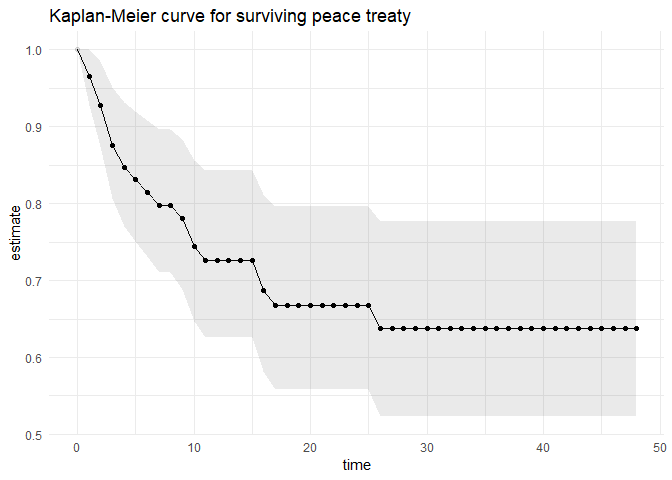
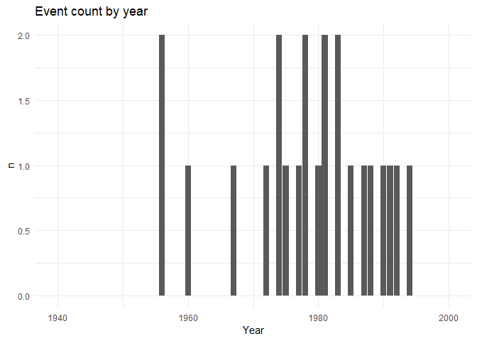
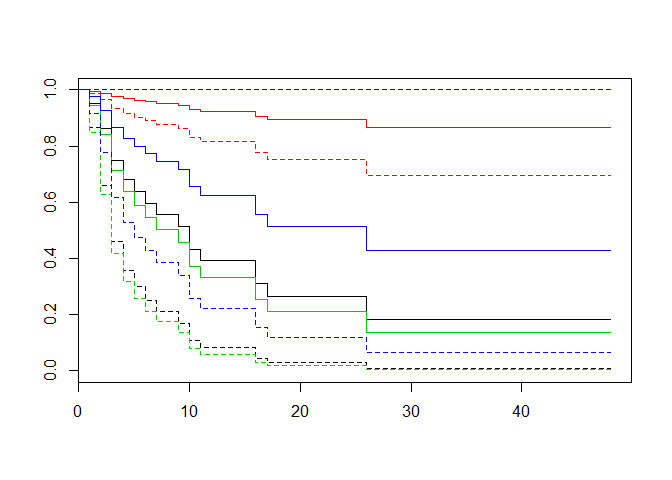
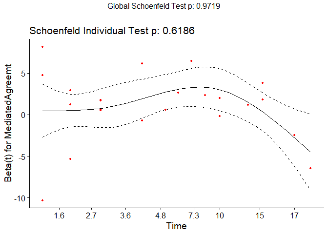
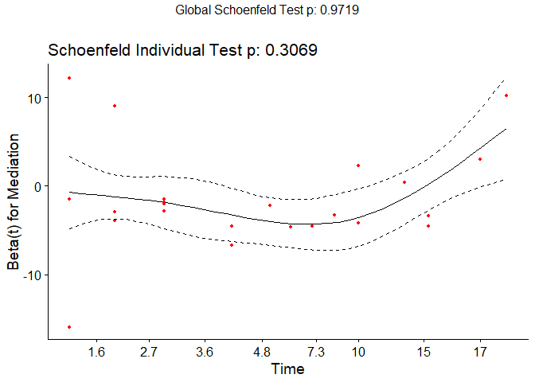
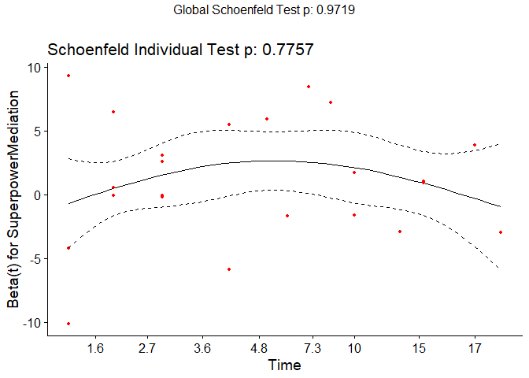
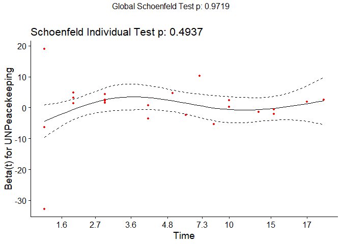
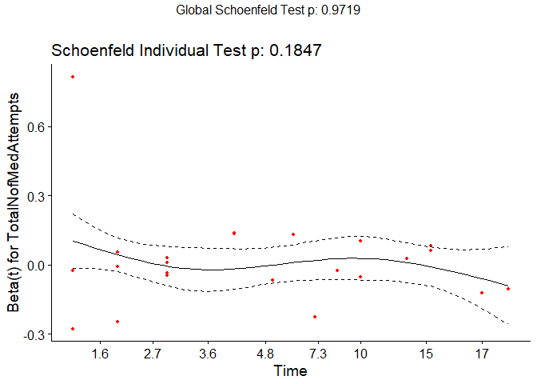

GSERM LDA: Final Examination
================

In this paper, I will answer Question two of the FINAL EXAM: On up to 7-8 pages, use text, graphs, tables, etc. to answer the following questions: Reestimate and re-evaluate GRMs analyses of post-civil peace duration, using their data. I am not to replicate the original article, but to reconsider their findings regarding four types of measured mediation.

Admin: - deliver as a PDF. That is, spend some time on formatting. - also deliver all computer output and all code used to generate your findings. - take the MVP-approach here, make sure not to get bogged down by early questions. 2, 3 and 4 are the meat of the game.

``` r
#libraries
library(here)
```

    ## here() starts at C:/Users/Kauna/Documents/R/gserm_2019_lda_public

``` r
suppressPackageStartupMessages(library(tidyverse))
library(survival)
library(knitr)
library(survminer)
```

    ## Loading required package: ggpubr

    ## Loading required package: magrittr

    ## 
    ## Attaching package: 'magrittr'

    ## The following object is masked from 'package:purrr':
    ## 
    ##     set_names

    ## The following object is masked from 'package:tidyr':
    ## 
    ##     extract

``` r
#some parameters
theme_set(theme_minimal())
```

1. Briefly describe the survival data
=====================================

The data comes from Gurses, Rost and McLeod (2016) Mediating Civil War Settlements and the Duration of Peace (GRM from now on).

``` r
#data
df <- read.csv(here("data","GSERM-Oslo-2019-Exam-Q2-Data.csv"), stringsAsFactors=FALSE)
```

It is a total of 1 357 observations of 24 variables. The dataset has 55 countries. The first year a country is observed is recorded in "origin" (might also be that this is the origin of peace-year). Each country then has an observation per country-year until the recurrence of a civil war (our event of interest) or censoring. Failed (and d) records the recurrence of civil war. If a new peace then emerges, the observations continue."d" is the censoring indicator, more properly thought of as an event indicator: it is 1 if the event happens, and 0 otherwise. There are 23 recurrences of civil war.

The dependent variable is number of years the peace last after the end of a civil war. PeaceStart is the year the peace started, PeaceEnd is the year the peace ended for that year. The event here is civil war recurrence. t0 and t is a legacy-variable from STATA indicating start and stop, which seems to count the number of start and stops of Peace.

Since PeaceStart and PeaceEnd always start with a constant PeaceStart-year, I assume that the correct observational timepoints are t0 and t.

``` r
#base_model = survfit(Surv(PeaceStart,PeaceEnd,event=d)~1,data=df)

base_model = survfit(Surv(t0,t,event=d)~1,data=df)
temp = broom::tidy(base_model)

ggplot(data=temp)+
  geom_line(aes(x=time,y=estimate))+
  geom_ribbon(aes(x=time,ymin=conf.low,ymax=conf.high),alpha=0.1)+
  geom_point(aes(x=time,y=estimate,alpha=n.censor>0))+
  labs(title="Kaplan-Meier curve for surviving peace treaty")+
  theme(legend.position ="none")
```

    ## Warning: Using alpha for a discrete variable is not advised.



``` r
#some wrangling to get at event-count and possible ties
temp = select(df,PeaceStart,PeaceEnd,Failed)%>%
  filter(.,Failed==1)%>%
  group_by(.,PeaceEnd)%>%
  summarise(.,n=sum(Failed))
temp2 = data.frame(Year=1940:2000)%>%
  left_join(.,temp,by=c("Year"="PeaceEnd"))

temp2$n[is.na(temp2$n)]=0

qplot(x=Year,y=n,data=temp2,geom="col")+
  labs(title="Event count by year")
```



The survial curve indicates a falling rate of survival for the first years of a peace agreement, with some plateaus here and there, before it stabilizes after about 25 years. That is, if a peace agreement survives 25 years, the odds of surviving even longer is stable.

independent variables (might be dropped)
----------------------------------------

The 13 predictors used by GRM are described in the article. Many of the variables relate to the last ended civil war, and as such are time-invariant for the duration of the peace. The variables measuring GDP per capita and military strength are time-varying covariates - which induces certain kinds of problems.

-   Mediated Agreement (MediatedAgreemt): 1 if the final peace agreement was mediated
-   Mediation (Mediation): 1 if there was a mediation attempt during the last year of the civil war
-   Super Power Mediation (SuperpowerMediation): 1 if there was a mediation attempt by a super-power
-   Total number of mediation attempts(TotalNofMedAttempts): the number of such attempts during the civil war
-   UN Peacekeeping (UNPeacekeeping): ordinal variable, degree of UN involvement, from 4) enforcement missing, 3) peacekeeping missions, 2) observer missions, 1) mediations, 0) no peacekeeping missions
-   Ethnic war (EthnicWar): 1 if the war was over ethnic, religious or other ascribed characteristics
-   Log of total deaths(LogTotalDeaths): natural log of deaths in the civil war
-   war duration (WarDuration): the length of the civil war in years
-   military victory ((MilitaryVictory): 1 if the war ended in a one-sided military victory, 0 is a negotiated settlement
-   democracy (Democracy): POLITY autocracy-democracy score, from -10 fully autocracti to 10 fully democratic
-   log of GDP(lnGDP): natural log of countrys GDP per capita, in constant 1985 US dollars
-   log of army size(LogArmySize): log of troop counts
-   war counts(WarCount): number of civil wars the country experienced during this period.

There are also some ID-variables, identifying countryCode, CountryName. Unaccounted for: st: a constant of 1? ID?

``` r
#consider adding something here for the independent variables.
kable(psych::describe(select(df,Failed:WarCount),skew=FALSE),digits=2)
```

|                     |  vars|     n|  mean|    sd|    min|    max|  range|    se|
|---------------------|-----:|-----:|-----:|-----:|------:|------:|------:|-----:|
| Failed              |     1|  1357|  0.02|  0.13|   0.00|   1.00|   1.00|  0.00|
| Mediation           |     2|  1357|  0.24|  0.42|   0.00|   1.00|   1.00|  0.01|
| MediatedAgreemt     |     3|  1357|  0.09|  0.29|   0.00|   1.00|   1.00|  0.01|
| SuperpowerMediation |     4|  1357|  0.12|  0.32|   0.00|   1.00|   1.00|  0.01|
| TotalNofMedAttempts |     5|  1357|  2.77|  8.51|   0.00|  78.00|  78.00|  0.23|
| UNPeacekeeping      |     6|  1357|  0.03|  0.18|   0.00|   1.00|   1.00|  0.00|
| EthnicWar           |     7|  1357|  0.41|  0.49|   0.00|   1.00|   1.00|  0.01|
| LogTotalDeaths      |     8|  1357|  9.85|  2.18|   6.91|  14.57|   7.66|  0.06|
| WarDuration         |     9|  1357|  3.94|  4.69|   1.00|  36.00|  35.00|  0.13|
| MilitaryVictory     |    10|  1357|  0.85|  0.36|   0.00|   1.00|   1.00|  0.01|
| Democracy           |    11|  1357|  0.24|  0.42|   0.00|   1.00|   1.00|  0.01|
| lnGDP               |    12|  1357|  0.43|  0.89|  -3.04|   2.36|   5.40|  0.02|
| LogArmySize         |    13|  1357|  4.63|  1.83|   0.00|   8.47|   8.47|  0.05|
| WarCount            |    14|  1357|  1.37|  0.75|   1.00|   5.00|   4.00|  0.02|

2. Specify and estimate one or more survival models
===================================================

The goal is to compare the duration of peace after mediated agreements with the duration of peace after non-mediated agreements. Does mediated peaces have a higher or lower hazard rate, are they more or less likely to survive?

The general choice is between a parametric and a semi-parametric survival model. GRM uses both of these, a Weibull-model and a Cox-model. I focus on a Cox-model. The baseline hazard rate for recurrence of civil war after a civil war is unknown, and as such the semi-parametric models allows me to draw inferences without pre-specifying a distribution.

This does not, however, allow for easily made predictions - which seems like a good motivation for styding this type of subject matter. An added pragmatic reason is that the lectureres specified that parametric models for time-varying data are pretty poorly implemented in R, which is the statistical programming language I am currently using.

For handling ties, I apply the Efron approximation. The assumption behind this approximation is that the recurrence of civil war is some continous process that might happen in any of the years. One might argue that as we observe the events only in years, an alternative approach would be to consider the event as happening at discrete times. As the number of years are quite large, I go with the continous approximation. Furthermore, as we only have five years were two peaces are broken, the choice of tie-breaker should not have much of an effect.

To handle correlation of observations within the same country, I fit a separate model that estimates robust sandwich variance estimators for country-level variance.

``` r
surv_object = Surv(df$t0,df$t,event=df$d)

modell_0 = coxph(surv_object~MediatedAgreemt+Mediation+SuperpowerMediation+TotalNofMedAttempts+UNPeacekeeping+EthnicWar+LogTotalDeaths+WarDuration+MilitaryVictory+Democracy+lnGDP+LogArmySize+WarCount,
                 data=df,
                 ties="efron"
                 )

summary(modell_0)
```

    ## Call:
    ## coxph(formula = surv_object ~ MediatedAgreemt + Mediation + SuperpowerMediation + 
    ##     TotalNofMedAttempts + UNPeacekeeping + EthnicWar + LogTotalDeaths + 
    ##     WarDuration + MilitaryVictory + Democracy + lnGDP + LogArmySize + 
    ##     WarCount, data = df, ties = "efron")
    ## 
    ##   n= 1357, number of events= 23 
    ## 
    ##                         coef exp(coef) se(coef)      z Pr(>|z|)   
    ## MediatedAgreemt      1.00796   2.74000  0.73993  1.362  0.17313   
    ## Mediation           -1.46205   0.23176  0.84751 -1.725  0.08451 . 
    ## SuperpowerMediation  1.16536   3.20708  0.83275  1.399  0.16169   
    ## TotalNofMedAttempts  0.01483   1.01494  0.02411  0.615  0.53852   
    ## UNPeacekeeping       0.31407   1.36899  1.21435  0.259  0.79592   
    ## EthnicWar            1.61146   5.01010  0.66272  2.432  0.01503 * 
    ## LogTotalDeaths       0.29690   1.34568  0.11934  2.488  0.01285 * 
    ## WarDuration          0.01132   1.01139  0.05272  0.215  0.82994   
    ## MilitaryVictory      0.18873   1.20771  0.69484  0.272  0.78592   
    ## Democracy           -1.37253   0.25347  0.92305 -1.487  0.13703   
    ## lnGDP                0.01288   1.01296  0.33531  0.038  0.96936   
    ## LogArmySize         -0.42959   0.65078  0.16561 -2.594  0.00949 **
    ## WarCount            -0.18392   0.83201  0.34012 -0.541  0.58869   
    ## ---
    ## Signif. codes:  0 '***' 0.001 '**' 0.01 '*' 0.05 '.' 0.1 ' ' 1
    ## 
    ##                     exp(coef) exp(-coef) lower .95 upper .95
    ## MediatedAgreemt        2.7400     0.3650   0.64256   11.6838
    ## Mediation              0.2318     4.3148   0.04402    1.2202
    ## SuperpowerMediation    3.2071     0.3118   0.62701   16.4040
    ## TotalNofMedAttempts    1.0149     0.9853   0.96809    1.0641
    ## UNPeacekeeping         1.3690     0.7305   0.12669   14.7929
    ## EthnicWar              5.0101     0.1996   1.36691   18.3633
    ## LogTotalDeaths         1.3457     0.7431   1.06503    1.7003
    ## WarDuration            1.0114     0.9887   0.91210    1.1215
    ## MilitaryVictory        1.2077     0.8280   0.30940    4.7142
    ## Democracy              0.2535     3.9453   0.04152    1.5475
    ## lnGDP                  1.0130     0.9872   0.52502    1.9544
    ## LogArmySize            0.6508     1.5366   0.47040    0.9003
    ## WarCount               0.8320     1.2019   0.42718    1.6205
    ## 
    ## Concordance= 0.809  (se = 0.043 )
    ## Rsquare= 0.022   (max possible= 0.127 )
    ## Likelihood ratio test= 30.86  on 13 df,   p=0.004
    ## Wald test            = 28.18  on 13 df,   p=0.009
    ## Score (logrank) test = 35.74  on 13 df,   p=7e-04

``` r
modell_1 = coxph(surv_object~MediatedAgreemt+Mediation+SuperpowerMediation+TotalNofMedAttempts+UNPeacekeeping+EthnicWar+LogTotalDeaths+WarDuration+MilitaryVictory+Democracy+lnGDP+LogArmySize+WarCount+cluster(CountryCode),
                 data=df,
                 ties="efron"
                 )

summary(modell_1)
```

    ## Call:
    ## coxph(formula = surv_object ~ MediatedAgreemt + Mediation + SuperpowerMediation + 
    ##     TotalNofMedAttempts + UNPeacekeeping + EthnicWar + LogTotalDeaths + 
    ##     WarDuration + MilitaryVictory + Democracy + lnGDP + LogArmySize + 
    ##     WarCount + cluster(CountryCode), data = df, ties = "efron")
    ## 
    ##   n= 1357, number of events= 23 
    ## 
    ##                         coef exp(coef) se(coef) robust se      z Pr(>|z|)
    ## MediatedAgreemt      1.00796   2.74000  0.73993   0.65351  1.542 0.122985
    ## Mediation           -1.46205   0.23176  0.84751   0.83088 -1.760 0.078468
    ## SuperpowerMediation  1.16536   3.20708  0.83275   0.70947  1.643 0.100468
    ## TotalNofMedAttempts  0.01483   1.01494  0.02411   0.02422  0.612 0.540355
    ## UNPeacekeeping       0.31407   1.36899  1.21435   1.08249  0.290 0.771710
    ## EthnicWar            1.61146   5.01010  0.66272   0.66001  2.442 0.014624
    ## LogTotalDeaths       0.29690   1.34568  0.11934   0.08309  3.573 0.000353
    ## WarDuration          0.01132   1.01139  0.05272   0.04718  0.240 0.810354
    ## MilitaryVictory      0.18873   1.20771  0.69484   0.49912  0.378 0.705342
    ## Democracy           -1.37253   0.25347  0.92305   0.75020 -1.830 0.067318
    ## lnGDP                0.01288   1.01296  0.33531   0.38841  0.033 0.973547
    ## LogArmySize         -0.42959   0.65078  0.16561   0.15103 -2.844 0.004451
    ## WarCount            -0.18392   0.83201  0.34012   0.24627 -0.747 0.455187
    ##                        
    ## MediatedAgreemt        
    ## Mediation           .  
    ## SuperpowerMediation    
    ## TotalNofMedAttempts    
    ## UNPeacekeeping         
    ## EthnicWar           *  
    ## LogTotalDeaths      ***
    ## WarDuration            
    ## MilitaryVictory        
    ## Democracy           .  
    ## lnGDP                  
    ## LogArmySize         ** 
    ## WarCount               
    ## ---
    ## Signif. codes:  0 '***' 0.001 '**' 0.01 '*' 0.05 '.' 0.1 ' ' 1
    ## 
    ##                     exp(coef) exp(-coef) lower .95 upper .95
    ## MediatedAgreemt        2.7400     0.3650   0.76116     9.863
    ## Mediation              0.2318     4.3148   0.04548     1.181
    ## SuperpowerMediation    3.2071     0.3118   0.79838    12.883
    ## TotalNofMedAttempts    1.0149     0.9853   0.96788     1.064
    ## UNPeacekeeping         1.3690     0.7305   0.16405    11.424
    ## EthnicWar              5.0101     0.1996   1.37418    18.266
    ## LogTotalDeaths         1.3457     0.7431   1.14345     1.584
    ## WarDuration            1.0114     0.9887   0.92205     1.109
    ## MilitaryVictory        1.2077     0.8280   0.45406     3.212
    ## Democracy              0.2535     3.9453   0.05826     1.103
    ## lnGDP                  1.0130     0.9872   0.47313     2.169
    ## LogArmySize            0.6508     1.5366   0.48403     0.875
    ## WarCount               0.8320     1.2019   0.51345     1.348
    ## 
    ## Concordance= 0.809  (se = 0.035 )
    ## Rsquare= 0.022   (max possible= 0.127 )
    ## Likelihood ratio test= 30.86  on 13 df,   p=0.004
    ## Wald test            = 73.51  on 13 df,   p=2e-10
    ## Score (logrank) test = 35.74  on 13 df,   p=7e-04,   Robust = 14.05  p=0.4
    ## 
    ##   (Note: the likelihood ratio and score tests assume independence of
    ##      observations within a cluster, the Wald and robust score tests do not).

``` r
kable(broom::tidy(modell_0),digits=2)
```

| term                |  estimate|  std.error|  statistic|  p.value|  conf.low|  conf.high|
|:--------------------|---------:|----------:|----------:|--------:|---------:|----------:|
| MediatedAgreemt     |      1.01|       0.74|       1.36|     0.17|     -0.44|       2.46|
| Mediation           |     -1.46|       0.85|      -1.73|     0.08|     -3.12|       0.20|
| SuperpowerMediation |      1.17|       0.83|       1.40|     0.16|     -0.47|       2.80|
| TotalNofMedAttempts |      0.01|       0.02|       0.62|     0.54|     -0.03|       0.06|
| UNPeacekeeping      |      0.31|       1.21|       0.26|     0.80|     -2.07|       2.69|
| EthnicWar           |      1.61|       0.66|       2.43|     0.02|      0.31|       2.91|
| LogTotalDeaths      |      0.30|       0.12|       2.49|     0.01|      0.06|       0.53|
| WarDuration         |      0.01|       0.05|       0.21|     0.83|     -0.09|       0.11|
| MilitaryVictory     |      0.19|       0.69|       0.27|     0.79|     -1.17|       1.55|
| Democracy           |     -1.37|       0.92|      -1.49|     0.14|     -3.18|       0.44|
| lnGDP               |      0.01|       0.34|       0.04|     0.97|     -0.64|       0.67|
| LogArmySize         |     -0.43|       0.17|      -2.59|     0.01|     -0.75|      -0.10|
| WarCount            |     -0.18|       0.34|      -0.54|     0.59|     -0.85|       0.48|

``` r
kable(broom::tidy(modell_1),digits=2)
```

| term                |  estimate|  std.error|  robust.se|  statistic|  p.value|  conf.low|  conf.high|
|:--------------------|---------:|----------:|----------:|----------:|--------:|---------:|----------:|
| MediatedAgreemt     |      1.01|       0.74|       0.65|       1.54|     0.12|     -0.27|       2.29|
| Mediation           |     -1.46|       0.85|       0.83|      -1.76|     0.08|     -3.09|       0.17|
| SuperpowerMediation |      1.17|       0.83|       0.71|       1.64|     0.10|     -0.23|       2.56|
| TotalNofMedAttempts |      0.01|       0.02|       0.02|       0.61|     0.54|     -0.03|       0.06|
| UNPeacekeeping      |      0.31|       1.21|       1.08|       0.29|     0.77|     -1.81|       2.44|
| EthnicWar           |      1.61|       0.66|       0.66|       2.44|     0.01|      0.32|       2.91|
| LogTotalDeaths      |      0.30|       0.12|       0.08|       3.57|     0.00|      0.13|       0.46|
| WarDuration         |      0.01|       0.05|       0.05|       0.24|     0.81|     -0.08|       0.10|
| MilitaryVictory     |      0.19|       0.69|       0.50|       0.38|     0.71|     -0.79|       1.17|
| Democracy           |     -1.37|       0.92|       0.75|      -1.83|     0.07|     -2.84|       0.10|
| lnGDP               |      0.01|       0.34|       0.39|       0.03|     0.97|     -0.75|       0.77|
| LogArmySize         |     -0.43|       0.17|       0.15|      -2.84|     0.00|     -0.73|      -0.13|
| WarCount            |     -0.18|       0.34|       0.25|      -0.75|     0.46|     -0.67|       0.30|

I included all the same independent variables as GMR.

3. The association between mediaton and the hazard of civil war recurrence
==========================================================================

The exponentiated coefficients are what we are interested in here, as they are interpreted as hazard ratios. That is, having a 1 unit larger army, decreases the hazard of a recurrence of a ciwil war by about 35 %. On the other hand, if the last conflict was an ethnic war (as defined by GRM), that increases the hazard of a recurrence of a civil war by about 400 %. Note that this is relative judgements, and says nothing about the absolute risk of a recurrent war.

So, as we can see from the model, none of the main variables of interest are statistically significant. That is, we cannot be sure that the estimated effects are different from 0. Neither a mediation during the last year of the war, a super-power mediation attempt, a mediated peace agreement, a larger amount of mediation attempts or involvement by the UN has an effect.

``` r
#compare survival curves
simulated_data = data.frame(
  MediatedAgreemt = c(1,0,0,0),
  Mediation = c(0,1,0,0),
  SuperpowerMediation = c(0,0,1,0),
  UNPeacekeeping = c(0,0,0,1),
  TotalNofMedAttempts = rep(mean(df$TotalNofMedAttempts),4),
  EthnicWar = rep(1,4),
  LogTotalDeaths = rep(mean(df$LogTotalDeaths),4),
  WarDuration = rep(mean(df$WarDuration),4),
  MilitaryVictory = rep(1,4),
  Democracy = rep(mean(df$Democracy),4),
  lnGDP = rep(mean(df$lnGDP),4),
  LogArmySize = rep(mean(df$LogArmySize),4),
  WarCount = rep(mean(df$WarCount),4)
)

model_simulated_1 = survfit(modell_1,simulated_data)
plot(model_simulated_1,conf.int=TRUE,col=c(1,2,3,4),pch=c("Mediated agreement","Meditation","Superpower","UN"))
```

 (labeling failed here, so: Mediated agreement: Black; Mediation: Red; Superpower: Green; UN:Blue)

If we take a brief look at some averaged out data, where the only thing that varies is the mediation agreement, we can clearly see how broad the confidence intervals are. Mediation in red seems to be the only one who does not in fact encompass all other estimates of peace survival time - but is then, of course, included in all the confidence intervals for all the other survival curve estimates.

\[Some more stuff here!\]

4. Post-estimation diagnostics and robustness checks
====================================================

So, for the Cox proportional hazards model, the central assumption is the proportionality of the hazards. There are two ways to test this:

-   formally, through a test of whether the effects stay proportionate over time, or
-   graphically, examining pseudo-residuals over the time period.

The function cox.zph calculates Shoenfeld residuals scaled with time. If the relationship between the various variables and time are insignificant, the assumption holds. A significant relationship indicates a broken assumption

``` r
test_1 = cox.zph(modell_1)
kable(print(test_1),digits=2)
```

    ##                         rho   chisq     p
    ## MediatedAgreemt     -0.0799 0.24789 0.619
    ## Mediation            0.1470 1.04406 0.307
    ## SuperpowerMediation  0.0434 0.08115 0.776
    ## TotalNofMedAttempts -0.1567 1.75949 0.185
    ## UNPeacekeeping       0.0852 0.46846 0.494
    ## EthnicWar            0.1288 0.57214 0.449
    ## LogTotalDeaths      -0.2484 1.15185 0.283
    ## WarDuration          0.0176 0.01277 0.910
    ## MilitaryVictory      0.0510 0.09105 0.763
    ## Democracy            0.0112 0.00438 0.947
    ## lnGDP                0.0510 0.14913 0.699
    ## LogArmySize          0.0386 0.07370 0.786
    ## WarCount             0.1730 1.16696 0.280
    ## GLOBAL                   NA 5.14175 0.972

|                     |    rho|  chisq|     p|
|---------------------|------:|------:|-----:|
| MediatedAgreemt     |  -0.08|   0.25|  0.62|
| Mediation           |   0.15|   1.04|  0.31|
| SuperpowerMediation |   0.04|   0.08|  0.78|
| TotalNofMedAttempts |  -0.16|   1.76|  0.18|
| UNPeacekeeping      |   0.09|   0.47|  0.49|
| EthnicWar           |   0.13|   0.57|  0.45|
| LogTotalDeaths      |  -0.25|   1.15|  0.28|
| WarDuration         |   0.02|   0.01|  0.91|
| MilitaryVictory     |   0.05|   0.09|  0.76|
| Democracy           |   0.01|   0.00|  0.95|
| lnGDP               |   0.05|   0.15|  0.70|
| LogArmySize         |   0.04|   0.07|  0.79|
| WarCount            |   0.17|   1.17|  0.28|
| GLOBAL              |     NA|   5.14|  0.97|

We can also plot these residuals over time:

``` r
#mediation related variables
ggcoxzph(test_1,var="MediatedAgreemt")
```



``` r
ggcoxzph(test_1,var="Mediation")
```



``` r
ggcoxzph(test_1,var="SuperpowerMediation")
```



``` r
ggcoxzph(test_1,var="UNPeacekeeping")
```



``` r
ggcoxzph(test_1,var="TotalNofMedAttempts") 
```



``` r
#the statistically significant variables
#ggcoxzph(test_0,var="EthnicWar") #no effect
#ggcoxzph(test_0,var="LogTotalDeaths")
#ggcoxzph(test_0,var="LogArmySize")

#other independent variables
#ggcoxzph(test_0,var="WarDuration")
#ggcoxzph(test_0,var="MilitaryVictory")
#ggcoxzph(test_0,var="Democracy")
#ggcoxzph(test_0,var="lnGDP")
#ggcoxzph(test_0,var="WarCount")
```

Plotting all of them would be a bit much. Looking at the coefficient of whether the agreement was mediated, we see a curvilinear trend over time. The same for medition and superpower mediation. That could indicate that the effects are varying with time. But as the actual number of observations of recurrence are quite low, and the general test statistic insignificant, it is hard to say whether this is an actual problem.

\[More on time here\]

5. Might an extension be more approproatie?
===========================================

There were three kinds of extensions discussed in class: cure models, frailty models and multilevel-models.

Appropiate for the data. As we could see from the base survival curve of a peace agreement, the survival rate flattens out after 25 years. This could potentially indicate that there is a cure for civil war somewhere to be found, in which case a cure model could be appropriate - or at least potentially interesting for additional insights.

The main concern, though, seems to be with the amount of data one has. The recurrence of civil war is, luckily, a rather rare phenomenon - at least for the time period under study.
