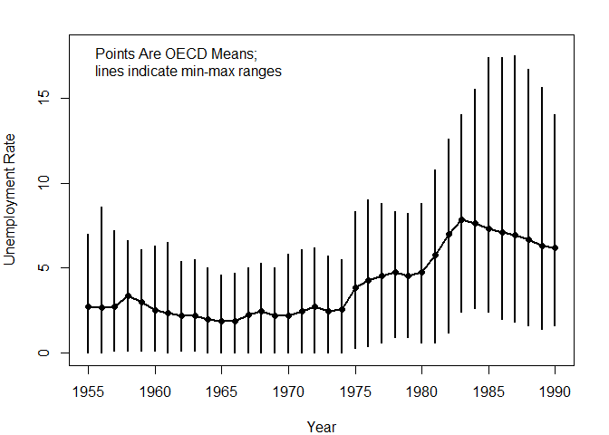
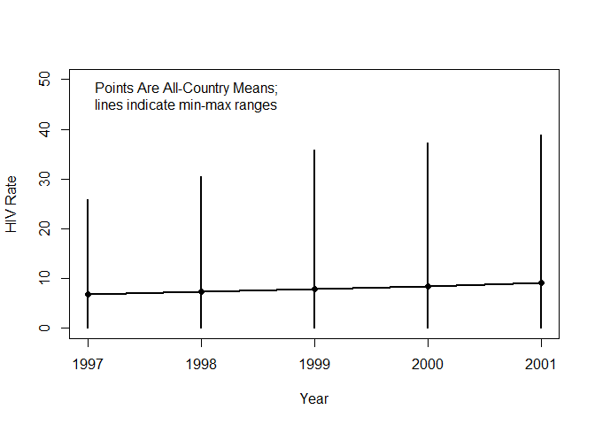
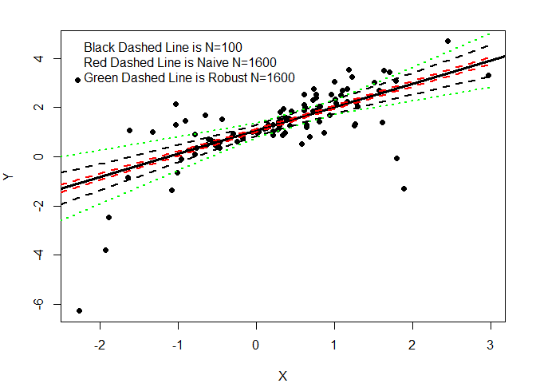
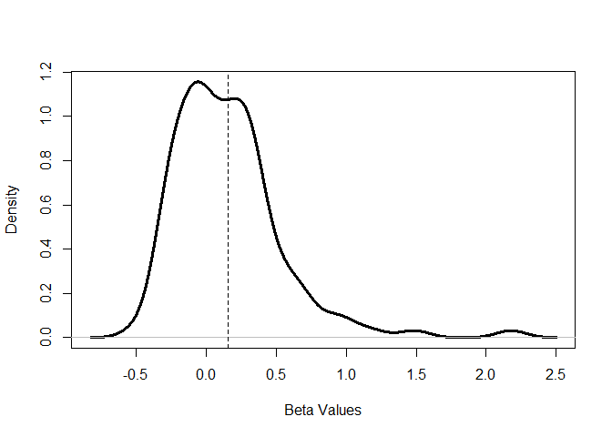
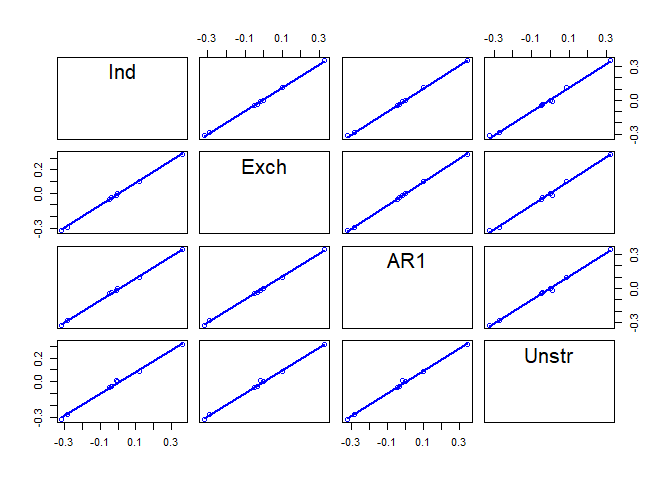
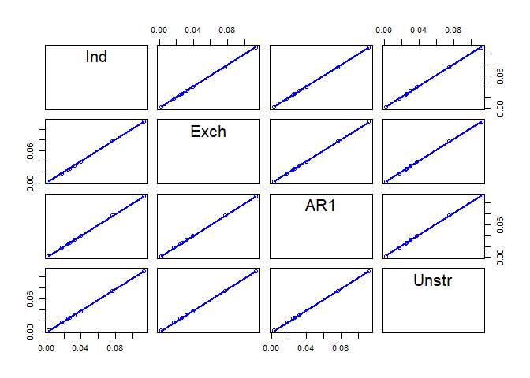

Longitudinel dataanalyse - variasjon i tid og rom
================

Dette er et sammendrag av kurset "Longitudinal Data Analysis", arrangert av GSERM på BI i Oslo januar 2019. Slides, data m.m. lå under kurset ute på [Christopher Zorns github-repo](https://github.com/PrisonRodeo/GSERM-Oslo-2019-git). Data og kodeeksempler lenger ned er basert på hans kode.

Dette er delen som tar for seg analyse av paneldata. Den andre delen tar for seg tid-til-hendelse-analyse.

``` r
#biblioteker
library(knitr)
suppressPackageStartupMessages(library(tidyverse))
library(plm)
```

    ## Loading required package: Formula

    ## 
    ## Attaching package: 'plm'

    ## The following objects are masked from 'package:dplyr':
    ## 
    ##     between, lag, lead

``` r
library(lme4) #paneldata-pakkene skjuler enkelte ordne-funksjoner i tidyverse-pakker
```

    ## Loading required package: Matrix

    ## 
    ## Attaching package: 'Matrix'

    ## The following object is masked from 'package:tidyr':
    ## 
    ##     expand

``` r
library(lmtest) #maskerer as.Date og as.Date.numeric
```

    ## Loading required package: zoo

    ## 
    ## Attaching package: 'zoo'

    ## The following objects are masked from 'package:base':
    ## 
    ##     as.Date, as.Date.numeric

``` r
library(prais)
library(nlme)
```

    ## 
    ## Attaching package: 'nlme'

    ## The following object is masked from 'package:lme4':
    ## 
    ##     lmList

    ## The following object is masked from 'package:dplyr':
    ## 
    ##     collapse

``` r
library(rms)
```

    ## Loading required package: Hmisc

    ## Loading required package: lattice

    ## Loading required package: survival

    ## 
    ## Attaching package: 'Hmisc'

    ## The following objects are masked from 'package:dplyr':
    ## 
    ##     src, summarize

    ## The following objects are masked from 'package:base':
    ## 
    ##     format.pval, units

    ## Loading required package: SparseM

    ## 
    ## Attaching package: 'SparseM'

    ## The following object is masked from 'package:base':
    ## 
    ##     backsolve

    ## 
    ## Attaching package: 'rms'

    ## The following object is masked from 'package:lmtest':
    ## 
    ##     lrtest

``` r
library(glmmML)
library(geepack)
library(car)
```

    ## Loading required package: carData

    ## 
    ## Attaching package: 'car'

    ## The following objects are masked from 'package:rms':
    ## 
    ##     Predict, vif

    ## The following object is masked from 'package:dplyr':
    ## 
    ##     recode

    ## The following object is masked from 'package:purrr':
    ## 
    ##     some

``` r
#innstillinger
set.seed(1106)
options(scipen = 99) #aldri vitenskapelig notasjon
options(digits = 2) #generelt sett færre desimaler
```

Hva er longitudinelle data, og hvordan snakke om det?
=====================================================

Longitudinelle data er data hvor du har observasjoner av ulike enheter (fra 1 til N) over tid (fra 1 til T tidspunkter). Det kan f.eks. være en jevnlig gjennomført spørreundersøkelse, eller informasjon om alle norske kommuner over tid. Et eksempel kan f.eks. se slik ut:

``` r
df = read.table("https://raw.githubusercontent.com/PrisonRodeo/GSERM-Oslo-2019-git/master/Data/tinyTSCSexample.txt", header=TRUE)
kable(df,digits=2)
```

|     ID|    Year| Female    | PresVote    | PID    |                                                    Approve|
|------:|-------:|:----------|:------------|:-------|----------------------------------------------------------:|
|      1|    1998| female    | clinton     | dem    |                                                          3|
|      1|    2000| female    | clinton     | dem    |                                                          3|
|      1|    2002| female    | bush        | dem    |                                                          5|
|      1|    2004| female    | bush        | dem    |                                                          3|
|      2|    1998| male      | clinton     | gop    |                                                          2|
|      2|    2000| male      | clinton     | gop    |                                                          1|
|      2|    2002| male      | bush        | gop    |                                                          4|
|      2|    2004| male      | bush        | gop    |                                                          3|
|      3|    1998| male      | clinton     | gop    |                                                          2|
|      3|    2000| male      | clinton     | gop    |                                                          2|
|      3|    2002| male      | bush        | gop    |                                                          4|
|      3|    2004| male      | bush        | dem    |                                                          1|
|  Dette|  er lek| e-data, s | om viser da | ta for |  3 enheter målt i 1998, 2000, 2002 og 2004. Hver enhet har|

-   en tidsinvariant egenskap: kjønn (koda som female her),
-   en egenskap som deles på tvers av enhet: den sittende presidenten,
-   en egenskap som endrer seg sakte eller lite over tid: partiidentifikasjon,
-   en egenskap som endrer seg en del over tid, og som antakeligvis samvarierer både med tidsbestemte hendelser og partiidentifikasjon.

Et av hovedpoengene i kurset ser ut til å være alle utfordringene man støter på hvis man bruker longitudinelle data. Mange av antakelsene man må gjøre for å kjøre en standard regresjonsmodell med OLS mister all troverdighet når en får data på både tid og sted.

Men hvis du i stedet for å utnytte de longitudinelle dataene gjør en form for aggregering, enten ved å se på snittet for personer over tid - eller snittet for år over personer - så går du raskt i ei anna felle: du mister informasjon, skjuler potensielt viktige sammenhenger og gjør at du må ta litt tilfeldige valg om hvordan ting skal kodes og regnes. Se på disse eksemplene:

``` r
agg_crossection = group_by(df,ID)%>%
  mutate(female = as.numeric(Female))%>%
  mutate(gop_pid = as.numeric(PID))%>%
  summarise(male = (mean(female)-1), gop_pid = (mean(gop_pid)-1), approve = mean(Approve))
kable(agg_crossection, digits = 2)
```

|   ID|  male|  gop\_pid|  approve|
|----:|-----:|---------:|--------:|
|    1|     0|      0.00|      3.5|
|    2|     1|      1.00|      2.5|
|    3|     1|      0.75|      2.2|

``` r
agg_timeseries = group_by(df,Year)%>%
  mutate(female = as.numeric(Female))%>%
  mutate(gop_pid = as.numeric(PID))%>%
  summarise(male = (mean(female)-1), gop_pid = (mean(gop_pid)-1), approve = mean(Approve))
kable(agg_timeseries, digits = 2)
```

|  Year|  male|  gop\_pid|  approve|
|-----:|-----:|---------:|--------:|
|  1998|  0.67|      0.67|      2.3|
|  2000|  0.67|      0.67|      2.0|
|  2002|  0.67|      0.67|      4.3|
|  2004|  0.67|      0.33|      2.3|

``` r
rm(agg_timeseries,agg_crossection)
```

Det første eksempelet er en aggregering av individer over tid. Det andre eksempelet er aggregering over tid. Jeg har ikke så stor sans for slike leke-eksempler, og lar det ligge slik.

Så hvordan snakker en om longitudinelle data?
---------------------------------------------

-   Hvis N er en god del større enn T, kalles det paneldata.
-   Hvis T er om lag like stor som N, eller større, har en "time-series cross-section" / TSCS-data, kanskje oversettbart til "tidsserie med tverrsnittdata" på norsk.

Hvorfor skille mellom disse to? Noen av estimeringsmetodene oppfører seg ulikt for situasjoner med N større enn T og omvendt. I mange tilfeller kan det også si noe om hva en ønsker å gjøre slutninger til: for paneldata kan det gjerne dreie seg om et utvalg fra en større populasjon N (f.eks. spørreundersøkelse). For tidsserier med tverrsnittdata kan man ha hele populasjonen som N, men kanskje ønske å si noe om utviklinga over tid (f.eks. alle OECD-land).

Enheter som observeres indekseres gjerne med i, mens tidspunkter for observasjoner gjerne indekseres med t. Hvis en har observasjoner for alle T for alle N, har en et balansert panel. I et balansert panel er totalt antall observasjoner N\*T.

Variasjon mellom enheter og variasjon innad i en enhet
======================================================

Det er ulike kilder til variasjon i longitudinelle data. Hovedskillet går mellom - variasjonen som er mellom ulike enheter (between-unit variation), og - variasjonen innad i en enhet over tid (within-unit variation).

En måte å tenke rundt dette på er ved å se på gjennomsnittet over tid for en variabel Y(i). Den totale variasjonen i Y(it) er gitt av snittet for Y(i), pluss variasjonen rundt dette snittet på hvert tidspunkt t.

Et eksempel kan kanskje hjelpe: Her er eksempeldata fra Zorn på dommere i den amerikanske høyesteretten. Data er på 107 dommere, antall år de har tjenestegjort i Høyesterett, hvorvidt de har pensjonert seg eller trukket seg, alder - og en variabel pagree som ikke er forklart.

Det vi er interessert i er variasjonen i antall år tjenestegjort. Først ser vi på total variasjon:

``` r
df = read.csv("https://raw.githubusercontent.com/PrisonRodeo/GSERM-Oslo-2019-git/master/Data/scotus.csv", header=TRUE)

kable(psych::describe(df$service,skew=FALSE,range=TRUE),digits=1)
```

|      |     vars|        n|     mean|      sd|    min|     max|    range|                                                                                                                                                                                                                             se|
|------|--------:|--------:|--------:|-------:|------:|-------:|--------:|------------------------------------------------------------------------------------------------------------------------------------------------------------------------------------------------------------------------------:|
| X1   |        1|     1765|       12|     8.3|      1|      37|       36|                                                                                                                                                                                                                            0.2|
| I de |  1765 ob|  servasj|  onene v|  i har,|  er gj|  ennoms|  nittlig|  tjenestelengde på nesten 12 år, fra minimum 1 til maksimum 37. Standardavviket er 8 år. Dette ser på variasjonen mellom alle observasjoner - både mellom ulike dommere, samme dommer i ulike år, og ulike dommere i ulike år.|

Hva er så variasjonen mellom enheter? Her tar vi snittet over tid.

``` r
between_scotus = group_by(df,justice)%>%
  summarise(.,service = mean(service))

kable(psych::describe(between_scotus$service,skew=FALSE,range=TRUE),digits=1)
```

|       |    vars|      n|     mean|    sd|     min|     max|    range|                                                           se|
|-------|-------:|------:|--------:|-----:|-------:|-------:|--------:|------------------------------------------------------------:|
| X1    |       1|    107|      8.9|     5|     1.5|      21|       20|                                                          0.5|
| Blant |  de 107|  domme|  rne, er|  gjen|  nomsni|  ttet 9|  års tje|  neste, med 5 års standardavvik - fra 1,5 år til 21 år maks.|

Hvis vi så heller ser på variasjonen innad i hver enkelt dommer?

``` r
within_scotus = group_by(df,justice)%>%
  mutate(.,servmean = mean(service),within = service-servmean)

kable(psych::describe(within_scotus$within,skew=FALSE,range=TRUE),digits=1)
```

|       |    vars|       n|     mean|      sd|    min|     max|     range|                                                                                                                                                                                                         se|
|-------|-------:|-------:|--------:|-------:|------:|-------:|---------:|----------------------------------------------------------------------------------------------------------------------------------------------------------------------------------------------------------:|
| X1    |       1|    1765|        0|     6.9|    -18|      18|        36|                                                                                                                                                                                                        0.2|
| Dette |  er var|  iasjon|  rundt s|  nitter|  for d|  en enk|  elte enh|  et - i dette tilfellet den enkelte dmmer. Gjennomsnittet er 0, standardavviket nesten 7 år, og min-maks fra -18 til +18 år - noe som gir mening når vi tenker på at den lengste tjenestetida er 36/37 år.|

Regresjonsanalyse av longitudinelle data
========================================

En standard regresjonslikning har en rekke antakelser. Det samme gjelder når en skal kjøre regresjon på longitudinelle data - men med noen tillegg for den ekstra dimensjonen T.

(ta en sjekk av disse tingene i pensum!) - feilleddet u(it) er identisk og uavhengig normalfordelt for alle i og for alle t - variasjonen i feileddet er identisk på tvers av observasjoner i (ingen heteroskedastisitet på tvers av enheter). Dvs. at modellen passer like godt for alle enheter på et gitt tidspunkt t. - variasjonen i feilleddet er identisk på tvers av tid t (ingen heteroskedastisitet på tvers av tid). Det vil si at modellen passer like godt for en gitt enhet i på tidspunkt t og t+1. - det er ingen kovariasjon mellom feilleddet over tid t eller enhet i - en feil for u(it) er ikke informativ for en feil u(js) (utover at de er identiske...?) - altså ingen autokorrelasjon eller spatiell korrelasjon.

Dette er selv med standard tverrsnittdata ganske kraftige antakelser.

En antakelse som ikke ofte blir nevnt er antakelsen om konstante effekter av b0 og bXi for alle i og for alle t. Dvs. at "intercept"/skjæringspunktet/konstantleddet er lik , og at koeffisienten er lik.

En rimelig antakelse for mye longitudinelle data er at den korrekte modellen er unike skjæringspunkt for hver i, eller for hver t, eller for hver i og t. Ulike enheter har ulike gjennomsnittlige verdier.

\[Kunne ha lagt inn et eksempel her - eller i hvert fall et bilde?\]

En variant av dette er at det er variasjon i koeffisientene / slopes, der bXi varierer for i eller t: Altså at effekten av X på Y er forskjellig for ulike enheter, eller på ulike tidspunkt. F.eks. at effekten av skatteøkninger er en annen for land A enn for land B. Eller at effekten av kontakt med innvandrere er annerledes for ulike personer i en panelundersøkelse.

Ikke å hensynta dette gir en feil spesifisert modell, som kan være en av de mest alvorlige feilene for modellering.

Så når bør data pooles? Og når må en gjøre noe annet?
-----------------------------------------------------

Å analysere dataene samlet kalles "pooling". Det ligger gjerne substansielle betraktninger bak en avgjørelse om å poole observasjoner: når gir det mening for modellen å slå sammen ekorn og mennesker? Eller 1900 og 2019?

(Slide 22 gir standard-formel for B og Var i matriserammeverket)

Svaret er når de er like (nok). En kan gjøre en F-test, for å se om to modeller er forskjellig fra en modell (Bartels har utviklet dette - se nærmere på hva dette faktisk er, og hvordan det kan gjøres i praksis. Hva er intuisjonen? Hvilken form for pooling er det dette skal se nærmere på?).

Bartels foreslår en "fractional pooling" som en sensitivitetstest, der lamda-parameteren gir en vekt på hvordan du vekter de ulike kildene til variasjon - hvor mye A-data inkluderes? (Sjekk for å finne ut hva dette faktisk er, helt konkret).

Selv med sensitivitetstest, er dette gjerne en avgjørelse som krever domene-kunnskap.

En-vei enhetseffekter - random og fixed effects
===============================================

Toveisvariasjon (two-way unit variation, effects): variasjon i tid for noen variabler, og variasjon over enheter for andre variabler.

Hvis alle enheter er unike, men konstant unike over tid, kan en legge til et feilled alphai - alle er konstant litt forskjellige. Det samme kan gjøres for variasjon over tid: hvert år er litt annerledes for alle i.

En vanlig antakelse er at effektene man er interessert i er enten over tid eller over enheter, og at en dermed ikke trenger å modellere begge variasjonskilder (dette høres ikke riktig ut - er ikke poenget med paneldata at en har begge kilder til variasjon? Hva er intuisjonen bak her? Er det kanskje feilledettet en snakker om? Niet?). Dette er enhetseffekter.

Fixed effekts er within-effects
-------------------------------

Den brutale metoden her er å inkludere dummy-variabler for det du er interessert i å holde konstant. Men denne modellen kan formuleres på en annen, og potensielt mer informativ måte: som within effects-modellen. Når du inkluderer en dummy-variabel per enhet, benytter du kun variasjonen innad i enheter over tid. Gitt en konstant effekt av en enhets unikhet, hva er effekten av x på y for denne enheten?

Er dette en rimelig modell? Det kan besvares med en standard F-test av modellen med og uten slike faste konstantledd/skjæringspunkt.

Slide 32 - 36 har eksempel, med data på flyktningestrømmer mellom to land i Afrika 1992-2001. Dvs. hver observasjon er en rekke egenskaper for en dyade - forholdet mellom to land.

Vi kan bruke en standard lineær modell som referanse-modell:

``` r
df = read.csv("https://raw.githubusercontent.com/PrisonRodeo/GSERM-Oslo-2019-git/master/Data/Refugees.csv",header=TRUE)

ref_ols = lm(ln_ref_flow~pop_diff+distance+regimedif+wardiff,data=df)
summary(ref_ols)
```

    ## 
    ## Call:
    ## lm(formula = ln_ref_flow ~ pop_diff + distance + regimedif + 
    ##     wardiff, data = df)
    ## 
    ## Residuals:
    ##    Min     1Q Median     3Q    Max 
    ## -0.611 -0.211 -0.086  0.034 14.376 
    ## 
    ## Coefficients:
    ##              Estimate Std. Error t value            Pr(>|t|)    
    ## (Intercept) -0.322407   0.011920  -27.05 <0.0000000000000002 ***
    ## pop_diff    -0.173293   0.216666   -0.80                0.42    
    ## distance    -0.126653   0.004702  -26.94 <0.0000000000000002 ***
    ## regimedif   -0.000248   0.015796   -0.02                0.99    
    ## wardiff      0.074322   0.006817   10.90 <0.0000000000000002 ***
    ## ---
    ## Signif. codes:  0 '***' 0.001 '**' 0.01 '*' 0.05 '.' 0.1 ' ' 1
    ## 
    ## Residual standard error: 0.91 on 23613 degrees of freedom
    ## Multiple R-squared:  0.0347, Adjusted R-squared:  0.0345 
    ## F-statistic:  212 on 4 and 23613 DF,  p-value: <0.0000000000000002

``` r
summary(select(df,year,ln_ref_flow,pop_diff,distance,regimedif,wardiff))
```

    ##       year       ln_ref_flow      pop_diff         distance  
    ##  Min.   :1992   Min.   :-0.7   Min.   :-0.118   Min.   :0.0  
    ##  1st Qu.:1994   1st Qu.:-0.7   1st Qu.:-0.009   1st Qu.:1.3  
    ##  Median :1996   Median :-0.7   Median : 0.000   Median :2.2  
    ##  Mean   :1996   Mean   :-0.6   Mean   : 0.000   Mean   :2.2  
    ##  3rd Qu.:1999   3rd Qu.:-0.7   3rd Qu.: 0.009   3rd Qu.:3.1  
    ##  Max.   :2001   Max.   :14.1   Max.   : 0.118   Max.   :5.7  
    ##    regimedif        wardiff  
    ##  Min.   :-1.00   Min.   :-4  
    ##  1st Qu.:-0.25   1st Qu.: 0  
    ##  Median : 0.00   Median : 0  
    ##  Mean   : 0.00   Mean   : 0  
    ##  3rd Qu.: 0.25   3rd Qu.: 0  
    ##  Max.   : 1.00   Max.   : 4

``` r
ref_fe = plm(ln_ref_flow~pop_diff+distance+regimedif+wardiff,
             data=df,effect="individual",model="within")
```

Når vi estimerer en within-effects modell her, ser vi bl.a. at

-   konstantleddet / skjæringspunktet blir borte, ettersom en får et konstantledd per enhet, med gjennomsnitt 0.
-   tidsinvariante variabler droppes, fordi disse oppsummeres og kontrolleres av det individspesifikke konstantleddet. Det innebærer også at disse variablene får en bedre spesifisering enn den ville gjort manuelt, ettersom en ikke trenger å tenke på f.eks. andregradsledd.

En interessant ting å se på ved bytte fra OLS til within effects er endringer i koeffisienter. Noen kan endre størrelse og fortegn. Hvorfor endres disse? Her er det gjerne slik at enkelte koeffisienter blir større og mer usikre p.g.a. at hovedkilden til variasjon i dataene er between-variasjon - hvis en variabel endrer seg lite innad i en enhet (politisk overbevisning, folketall), men mye på tvers av enheter, vil estimeringa bli annerledes.

Motargumenter mot denne typen modeller

-   ineffektivt, fordi du legger til flere parametre i modellen når du øker N.
-   vi får ikke estimater som ser på forskjeller mellom enheter, kun estimater av effekter for et land når det endrer seg på en av sine variabler. Hvis det er det du er interessert i, må du gjøre noe annet.

Between effects
---------------

En between-effects-modell er en modell av snittet for Y(t) mellom enheter, som ignorerer variasjon over t. Her utnytter du variasjonen i N, ikke T.

``` r
ref_be = plm(ln_ref_flow~pop_diff+distance+regimedif+wardiff,
             data=df,effect="individual",model="between")
summary(ref_be)
```

    ## Oneway (individual) effect Between Model
    ## 
    ## Call:
    ## plm(formula = ln_ref_flow ~ pop_diff + distance + regimedif + 
    ##     wardiff, data = df, effect = "individual", model = "between")
    ## 
    ## Unbalanced Panel: n = 2450, T = 1-10, N = 23618
    ## Observations used in estimation: 2450
    ## 
    ## Residuals:
    ##    Min. 1st Qu.  Median 3rd Qu.    Max. 
    ## -0.5846 -0.2201 -0.0840  0.0534  9.6489 
    ## 
    ## Coefficients:
    ##             Estimate Std. Error t-value             Pr(>|t|)    
    ## (Intercept)  -0.2997     0.0297  -10.08 < 0.0000000000000002 ***
    ## pop_diff     -0.2469     0.5252   -0.47                 0.64    
    ## distance     -0.1349     0.0118  -11.47 < 0.0000000000000002 ***
    ## regimedif     0.0107     0.0451    0.24                 0.81    
    ## wardiff       0.1242     0.0220    5.64          0.000000019 ***
    ## ---
    ## Signif. codes:  0 '***' 0.001 '**' 0.01 '*' 0.05 '.' 0.1 ' ' 1
    ## 
    ## Total Sum of Squares:    1380
    ## Residual Sum of Squares: 1300
    ## R-Squared:      0.063
    ## Adj. R-Squared: 0.0615
    ## F-statistic: 41.1269 on 4 and 2445 DF, p-value: <0.0000000000000002

Pooling i OLS gir estimater som vil likne på within effects eller between effects etter hvor variasjonen er.

Random effects
--------------

Hvorfor heter det random effects? I en regresjonsmodell skiller man mellom de estimerte delene/fixed-delene, og random-delen, dvs. feilleddet, dvs- stokastiske forskjeller, ikke systematiske forskjeller.

En random-effectsmodell har er feilledd med tre komponenter: feil for i, feil for t og støy for it.Antakelser for en slik modell er bl.a.:

-   snittet på de ulike delene av feilleddet er 0
-   det er ingen korrelasjoner mellom de ulike delene av feilleddet
-   ingen korrelasjoner innad i feilleddene - modellen passer like godt for i som j, på t som s, og for it som js.
-   og så en sentral antakelse: ingen korrelasjon mellom X og de ulike delene av feilleddet.

Dette lar seg estimere med generalized least squares og iterering.

Det en ender opp med er da en slaks vektet sak mellom within og between-effects-modellene. Vekten til within vs. between-variasjon bestemmes av størrelsen på variasjonen i feilleddet for enhetene (gitt at dette er med i feilleddet- antar at en her ser på et tilfelle uten tidsvariante effekter i feilleddet). Hvis variasjonen er 0, blir det standard OLS, hvis variasjonen er 1, blird et between...(sjekk dette!)

Random effects anslår en ekstra variabel mer enn OLS, theta, som er variasjonen for feilleddet. Fixed effects anslår OLS + N parametre.

Her er et eksempel, samme som over. Det er da altså hver enkelt enhet som får et random feilledd.

``` r
ref_re_lmer=lmer(ln_ref_flow~pop_diff+distance+regimedif+
              wardiff+(1|dirdyadID), data=df)
summary(ref_re_lmer)
```

    ## Linear mixed model fit by REML ['lmerMod']
    ## Formula: ln_ref_flow ~ pop_diff + distance + regimedif + wardiff + (1 |  
    ##     dirdyadID)
    ##    Data: df
    ## 
    ## REML criterion at convergence: 50719
    ## 
    ## Scaled residuals: 
    ##     Min      1Q  Median      3Q     Max 
    ## -13.465  -0.031  -0.011   0.010  18.775 
    ## 
    ## Random effects:
    ##  Groups    Name        Variance Std.Dev.
    ##  dirdyadID (Intercept) 0.467    0.683   
    ##  Residual              0.386    0.621   
    ## Number of obs: 23618, groups:  dirdyadID, 2450
    ## 
    ## Fixed effects:
    ##              Estimate Std. Error t value
    ## (Intercept) -0.306147   0.029148  -10.50
    ## pop_diff     0.075899   0.507594    0.15
    ## distance    -0.132543   0.011513  -11.51
    ## regimedif    0.000714   0.019908    0.04
    ## wardiff      0.022348   0.006978    3.20
    ## 
    ## Correlation of Fixed Effects:
    ##           (Intr) pp_dff distnc regmdf
    ## pop_diff   0.000                     
    ## distance  -0.869  0.000              
    ## regimedif  0.000  0.036  0.000       
    ## wardiff    0.000 -0.004  0.000  0.109

Merk at det er minst to pakker med funksjonalitet for å estimere en slik random effects-modell: lme4::lmer og plm::plm

``` r
ref_re_plm = plm(ln_ref_flow~pop_diff+distance+regimedif+
              wardiff, data=df, effect="individual",
              model="random")
summary(ref_re_plm)
```

    ## Oneway (individual) effect Random Effect Model 
    ##    (Swamy-Arora's transformation)
    ## 
    ## Call:
    ## plm(formula = ln_ref_flow ~ pop_diff + distance + regimedif + 
    ##     wardiff, data = df, effect = "individual", model = "random")
    ## 
    ## Unbalanced Panel: n = 2450, T = 1-10, N = 23618
    ## 
    ## Effects:
    ##                 var std.dev share
    ## idiosyncratic 0.385   0.620  0.47
    ## individual    0.441   0.664  0.53
    ## theta:
    ##    Min. 1st Qu.  Median    Mean 3rd Qu.    Max. 
    ##    0.32    0.72    0.72    0.71    0.72    0.72 
    ## 
    ## Residuals:
    ##    Min. 1st Qu.  Median    Mean 3rd Qu.    Max. 
    ##   -6.58   -0.06   -0.03    0.00    0.01   12.28 
    ## 
    ## Coefficients:
    ##              Estimate Std. Error z-value            Pr(>|z|)    
    ## (Intercept) -0.306396   0.028526  -10.74 <0.0000000000000002 ***
    ## pop_diff     0.063786   0.497393    0.13              0.8980    
    ## distance    -0.132453   0.011267  -11.76 <0.0000000000000002 ***
    ## regimedif    0.000562   0.019858    0.03              0.9774    
    ## wardiff      0.022856   0.006978    3.28              0.0011 ** 
    ## ---
    ## Signif. codes:  0 '***' 0.001 '**' 0.01 '*' 0.05 '.' 0.1 ' ' 1
    ## 
    ## Total Sum of Squares:    9220
    ## Residual Sum of Squares: 9160
    ## R-Squared:      0.00627
    ## Adj. R-Squared: 0.0061
    ## Chisq: 148.75 on 4 DF, p-value: <0.0000000000000002

Tror ikke Zorn sier noe annet enn at dette er litt smak og behag. Summary av funksjonene gir litt ulik output, listene er litt ulike, og kanskje svakt forskjellige koeffisient-estimater:

``` r
temp = bind_rows("plm" = broom::tidy(ref_re_plm),"lmer"=broom::tidy(ref_re_lmer),.id="modell")%>%
  select(.,modell,term,estimate)%>%
  spread(.,modell,estimate)
```

    ## Warning in bind_rows_(x, .id): binding factor and character vector,
    ## coercing into character vector

    ## Warning in bind_rows_(x, .id): binding character and factor vector,
    ## coercing into character vector

``` r
kable(temp,digits=2)
```

| term                      |   lmer|    plm|
|:--------------------------|------:|------:|
| (Intercept)               |  -0.31|  -0.31|
| distance                  |  -0.13|  -0.13|
| pop\_diff                 |   0.08|   0.06|
| regimedif                 |   0.00|   0.00|
| sd\_(Intercept).dirdyadID |   0.68|     NA|
| sd\_Observation.Residual  |   0.62|     NA|
| wardiff                   |   0.02|   0.02|

``` r
temp = bind_rows("ols"=broom::tidy(ref_ols),"we/fe"=broom::tidy(ref_fe),"be"=broom::tidy(ref_be),"re"=broom::tidy(ref_re_plm),.id="modell")

#hvordan lage en nokenlunde pen tabell av dette? Estimatene er en ting, men standardfeilene og p-verdien bør vel også være med?

tabell = select(temp,modell,term,estimate)%>%
  spread(.,modell,estimate)
kable(tabell,digits=2)
```

| term        |     be|    ols|     re|  we/fe|
|:------------|------:|------:|------:|------:|
| (Intercept) |  -0.30|  -0.32|  -0.31|     NA|
| distance    |  -0.13|  -0.13|  -0.13|     NA|
| pop\_diff   |  -0.25|  -0.17|   0.06|   6.86|
| regimedif   |   0.01|   0.00|   0.00|   0.01|
| wardiff     |   0.12|   0.07|   0.02|   0.01|

Hvordan teste om en skal ha fixed eller random effects?
-------------------------------------------------------

En aktuell test er Hausmann-test. Hvis koeffisientene er veldig forskjellige, tolkes det som bevis på at random effects er dårlig egna. For å ta vårt eksempel fra over, en sammenlikning av FE og RE(plm):

``` r
phtest(ref_fe, ref_re_plm)
```

    ## 
    ##  Hausman Test
    ## 
    ## data:  ln_ref_flow ~ pop_diff + distance + regimedif + wardiff
    ## chisq = 30, df = 3, p-value = 0.0000001
    ## alternative hypothesis: one model is inconsistent

Nullhypotesen er at random effects er best, alternativhypotesen at fixed effects er best. I vårt tilfelle tyder Hausman-testen på at fixed effects er best.

Men du må ha mye data på N og T for at test-statistikken skal være kjikvadratfordelt. Testen kan feile. Og det er en generell spesifiseringstest mellom modeller, som sier at den ene er riktig, eller den andre skikkelig feil - noe som ikke er realistisk(?)

Zorn argumenterer her for at en bør bruke substansielle argumenter for å bestemme hvilken modell en skal ha.

1.  Hvis det er rimelig å anta at feilleddet for i er uavhengig av X, kan en velge Random effects. Hvis ikke, kan en velge fixed effects.
2.  Hvis du har paneldata, og skal slutte om N, og antar at effektene gjelder for hele populasjonen N - så antar du også at alle her er unike individer, noe som virker noe prakitsk. Er det heller rimelig å anta at effektene er tilfeldige, trukket fra et større univers? Antakeligvis, siden det er det du har gjort. Bruk Random effects.
3.  Hvis du har tidsserie med tverrsnittdata, f.eks. land, så skal du gjøre en slutning om de unike enhetene, eller utviklign over tid T. Effektene er gjerne ikke tilfeldig. Bruk fixed effects.
4.  Hva genererer forskjellene mellom individene på X og Y? Er det tilfeldig? Eller systematisk?
5.  Skal vi studere noe som er konstant over tid, kan vi ikke bruke fixed effects.

Hvorfor ikke bare estimere Y(it) med både between og within-variasjon? (Virker som om svaret er ja, bare gjør det!)

GLS-ARMA og dynamikk
====================

Som vi har sett lenger opp, er noen av de klassiske antakelsene for OLS om strukturen på feilleddet, deriblant:

-   Homoskedasitiet over tid og rom (modellen passer like godt for alle enheter på et gitt tidspunkt, og for en gitt enhet over tid)
-   Ingen korrelasjon mellom feilledet over tid eller rom (autokorrelasjon, spatiell korrelasjon)

(Fikser fixed og random-effects-modellene pkt. 1 for deg? Dvs. at dette kun er aktuelt hvis tiden gir deg problemer? Delvis - du kan modellere individ/enhetsfaste effekter enten eksplisitte eller som en del av varianskomponenten)

I situasjoner med longitudinelle data er dette gjerne urealistisk. Og for å lette disse antakelsene kan en bruke generalised least squares, enten feasible GLS eller substantiv kunnskap om feilleddet.

Parks utviklet (på 60-tallet eller noe) en rekke antakelser om feilleddet for paneldata han jobbet med, som er brukt mye i seinere tid. Disse utgjør også grunnlaget for PCSE - panelkorrigerte standardfeil.

1.  enheter er homoskedastiske over tid - like bra modell over tid for en enhet i
2.  det er noe kovariasjon mellom enhet i og j på tidspunkt t, men det er stabilt over tid.
3.  alle feil er korrelerte på tidspunkt t, men ikke over tid på tvers av enheter.
4.  enheter har autokorrelasjon over tid.

Så kan dette brukes for fGLS. Men B og K har vist hvordan dette ikke lar estimere hvis en ikke har høy T, relativt til N - altså at en har mange obserasjoner over tid for hver enhet (?). Så mye data har en sjeldent. (Her er notatene om hvor store disse forskjellene bør være litt utydelige - ved behov, sjekk litteraturen)

I stedet brukes en estimeringsmetode som håndterer korrelasjonen innafor et tverrsnitt, ved å låne informasjon fra variasjon over tid. Ettersom OLS gir konsistente estimater av koeffisientene, men skjeive standardfeil, kan en beholde OLS-koeffisienter og erstatte standardfeilene med PCSE. Typisk vil en da få større standardfeil, og usikrere estimater. Dvs: gitt at det er rett, får en bedre følelse med usikkerheten av estimatene.

Her antar en med PCSE ellers at paneldata-antakelsene er møtt.

Så hvordan velge estimeringsmetode i disse tilfellene?
------------------------------------------------------

Antakelser:

1.  Passer modellen like bra for alle?
2.  Kan du anta at feil ikke er korrelerte
3.  Kan du anta at autokorrelasjon er 0?

Hvis ja på alle: velg OLS. Hvis nei på alle: Parks tilnærming, eller PCSE. Behold OLS-koeffisienter. Hvis autokorrelason: Prais-Winsten. Hvis autokorrelasjon og forskjellig korrelasjon for forskjellige land: Hvis autokorrelasjon, og modellen ikke passer like bra for alle enheter: Unike feil for hver enhet-

Poenget er at en må bruke substantiv kunnskap for å si noe om hvordan feilen er strukturert.

Men PCSE er altså et verktøy for å håndtere et spesifikt problem med standardfeilene, det håndterer ikke heterogenitet på enhetsnivå (slik FE og RE gjør), og det håndterer ikke dynamikk over tid.

``` r
df <- read.csv("https://raw.githubusercontent.com/PrisonRodeo/GSERM-Oslo-2019-git/master/Data/HF1998.csv", header=TRUE)
summary(df)
```

    ##     country          year            ue            inf      
    ##  Min.   : 1.0   Min.   :1955   Min.   : 0.0   Min.   :-1.7  
    ##  1st Qu.: 5.0   1st Qu.:1964   1st Qu.: 1.6   1st Qu.: 3.2  
    ##  Median : 9.5   Median :1972   Median : 3.0   Median : 4.9  
    ##  Mean   :10.3   Mean   :1972   Mean   : 4.0   Mean   : 6.0  
    ##  3rd Qu.:15.0   3rd Qu.:1981   3rd Qu.: 5.7   3rd Qu.: 7.7  
    ##  Max.   :21.0   Max.   :1990   Max.   :17.5   Max.   :27.2  
    ##       cbi          cwagebrg        GDP_PC         open           uden     
    ##  Min.   :0.12   Min.   :0.00   Min.   :7.6   Min.   :0.07   Min.   :0.10  
    ##  1st Qu.:0.41   1st Qu.:0.25   1st Qu.:8.9   1st Qu.:0.31   1st Qu.:0.32  
    ##  Median :0.47   Median :0.50   Median :9.2   Median :0.43   Median :0.41  
    ##  Mean   :0.50   Mean   :0.49   Mean   :9.1   Mean   :0.46   Mean   :0.44  
    ##  3rd Qu.:0.61   3rd Qu.:0.75   3rd Qu.:9.4   3rd Qu.:0.54   3rd Qu.:0.56  
    ##  Max.   :0.93   Max.   :1.00   Max.   :9.8   Max.   :1.40   Max.   :0.85  
    ##       lcab         wagexcbi       HasLCAB 
    ##  Min.   :0.00   Min.   :0.00   Min.   :1  
    ##  1st Qu.:0.00   1st Qu.:0.04   1st Qu.:1  
    ##  Median :0.07   Median :0.21   Median :1  
    ##  Mean   :0.31   Mean   :0.25   Mean   :1  
    ##  3rd Qu.:0.58   3rd Qu.:0.37   3rd Qu.:1  
    ##  Max.   :1.00   Max.   :0.70   Max.   :1

Dette er eksempeldata fra Hall og Franzese (1998). Det er data på 18 OECD-land i 1955 til 1990, med N = 18, T = 36 og NT = 648. Den avhengige variabelen i studien er arbeidsledighet (ue), med uavhengige variabler GDP (GDP\_PC), åpenhet (open), organisasjonsgrad (uden), venstrestyrt (lcab eller HasLCAB?), sentralbankens uavhengighet (cbi), koordinert lønnsdannelse (cwagebrg), interaksjon mellom sentralbank og lønnsdannelse (wagexcbi). Ligger også en variabel inf her.

``` r
temp = group_by(df,year)%>%
  summarise(mean_unemployment = mean(ue,na.rm=TRUE),
            min_unemployment = min(ue),
            max_unemployment = max(ue)
            )

# Nifty range plot by year:
par(mar=c(4,4,2,2))
with(temp, plot(year, mean_unemployment, t="l",lwd=2,ylim=c(0,18),
               xlab="Year",ylab="Unemployment Rate"))
with(temp, points(year, mean_unemployment, pch=19))
with(temp, segments(year,min_unemployment,year,max_unemployment,lwd=2))
legend("topleft",bty="n",legend=c("Points Are OECD Means;",
                                  "lines indicate min-max ranges"))
```



``` r
#kopiert i ggplot...
```

Hvis vi aller først estimerer en standard oLS-modell (pooled OLS) for disse dataene, hva får vi da?

``` r
modell_ols = plm(ue~GDP_PC+open+uden+lcab+cbi+cwagebrg+wagexcbi,
                 data=df,
                 model="pooling")

summary(modell_ols)
```

    ## Pooling Model
    ## 
    ## Call:
    ## plm(formula = ue ~ GDP_PC + open + uden + lcab + cbi + cwagebrg + 
    ##     wagexcbi, data = df, model = "pooling")
    ## 
    ## Balanced Panel: n = 18, T = 36, N = 648
    ## 
    ## Residuals:
    ##    Min. 1st Qu.  Median 3rd Qu.    Max. 
    ##  -5.117  -1.505  -0.241   1.232   9.293 
    ## 
    ## Coefficients:
    ##             Estimate Std. Error t-value             Pr(>|t|)    
    ## (Intercept)  -13.579      2.328   -5.83         0.0000000086 ***
    ## GDP_PC         1.603      0.263    6.09         0.0000000020 ***
    ## open           5.119      0.418   12.24 < 0.0000000000000002 ***
    ## uden           0.709      0.808    0.88                 0.38    
    ## lcab           0.236      0.293    0.81                 0.42    
    ## cbi            5.169      1.097    4.71         0.0000030150 ***
    ## cwagebrg      -1.292      0.792   -1.63                 0.10    
    ## wagexcbi      -7.030      1.505   -4.67         0.0000036327 ***
    ## ---
    ## Signif. codes:  0 '***' 0.001 '**' 0.01 '*' 0.05 '.' 0.1 ' ' 1
    ## 
    ## Total Sum of Squares:    6500
    ## Residual Sum of Squares: 3730
    ## R-Squared:      0.426
    ## Adj. R-Squared: 0.42
    ## F-statistic: 67.9634 on 7 and 640 DF, p-value: <0.0000000000000002

Prais-Winsten

``` r
model_prais <- prais_winsten(ue~GDP_PC+open+uden+lcab+cbi+cwagebrg+wagexcbi,
                          data=df,max_iter=100)
```

    ## Iteration 0: rho = 0
    ## Iteration 1: rho = 0.91
    ## Iteration 2: rho = 0.94
    ## Iteration 3: rho = 0.94
    ## Iteration 4: rho = 0.94
    ## Iteration 5: rho = 0.94
    ## Iteration 6: rho = 0.94
    ## Iteration 7: rho = 0.94
    ## Iteration 8: rho = 0.94

Så kan vi estimere en GLS med homoskedastiske AR(1)-feil:

``` r
model_gls <- gls(ue~GDP_PC+open+uden+lcab+cbi+cwagebrg+wagexcbi,
                          data=df,correlation=corAR1(form=~1|country))
summary(model_gls)
```

    ## Generalized least squares fit by REML
    ##   Model: ue ~ GDP_PC + open + uden + lcab + cbi + cwagebrg + wagexcbi 
    ##   Data: df 
    ##    AIC  BIC logLik
    ##   1484 1529   -732
    ## 
    ## Correlation Structure: AR(1)
    ##  Formula: ~1 | country 
    ##  Parameter estimate(s):
    ##  Phi 
    ## 0.99 
    ## 
    ## Coefficients:
    ##             Value Std.Error t-value p-value
    ## (Intercept)    43       7.3     5.8   0.000
    ## GDP_PC         -4       0.7    -5.5   0.000
    ## open           -1       0.8    -1.8   0.072
    ## uden            1       2.2     0.3   0.792
    ## lcab            0       0.1    -0.7   0.473
    ## cbi            -1       7.5    -0.2   0.848
    ## cwagebrg       -5       6.4    -0.8   0.402
    ## wagexcbi        3      11.7     0.3   0.770
    ## 
    ##  Correlation: 
    ##          (Intr) GDP_PC open   uden   lcab   cbi    cwgbrg
    ## GDP_PC   -0.827                                          
    ## open      0.124 -0.207                                   
    ## uden     -0.145  0.017 -0.048                            
    ## lcab      0.041 -0.054  0.005 -0.003                     
    ## cbi      -0.421 -0.100  0.033  0.069  0.009              
    ## cwagebrg -0.371 -0.065  0.018 -0.084 -0.014  0.721       
    ## wagexcbi  0.334  0.082 -0.028  0.017  0.004 -0.813 -0.905
    ## 
    ## Standardized residuals:
    ##   Min    Q1   Med    Q3   Max 
    ## -1.49 -0.64 -0.20  0.46  2.55 
    ## 
    ## Residual standard error: 4.5 
    ## Degrees of freedom: 648 total; 640 residual

GLS med enhetsbasert heteroskedastisitet.

``` r
model_gls2 <- gls(ue~GDP_PC+open+uden+lcab+cbi+cwagebrg+wagexcbi,
              data=df,
              correlation=corAR1(form=~1|country),
              weights = varIdent(form = ~1|country))

summary(model_gls2)
```

    ## Generalized least squares fit by REML
    ##   Model: ue ~ GDP_PC + open + uden + lcab + cbi + cwagebrg + wagexcbi 
    ##   Data: df 
    ##    AIC  BIC logLik
    ##   1326 1446   -636
    ## 
    ## Correlation Structure: AR(1)
    ##  Formula: ~1 | country 
    ##  Parameter estimate(s):
    ##  Phi 
    ## 0.98 
    ## Variance function:
    ##  Structure: Different standard deviations per stratum
    ##  Formula: ~1 | country 
    ##  Parameter estimates:
    ##    1    2    3    4    5    6    7    8    9   10   11   13   14   15   18 
    ## 1.00 0.19 0.75 0.54 0.60 1.00 0.95 0.32 0.88 0.89 0.78 1.09 0.92 0.57 0.33 
    ##   19   20   21 
    ## 0.38 0.86 0.60 
    ## 
    ## Coefficients:
    ##             Value Std.Error t-value p-value
    ## (Intercept)  21.1       4.7     4.5  0.0000
    ## GDP_PC       -1.6       0.4    -4.3  0.0000
    ## open         -2.2       0.6    -3.4  0.0008
    ## uden          0.9       1.5     0.6  0.5415
    ## lcab         -0.1       0.1    -1.2  0.2206
    ## cbi          -1.9       7.3    -0.3  0.7984
    ## cwagebrg     -6.3       4.7    -1.3  0.1794
    ## wagexcbi      5.0       9.5     0.5  0.5996
    ## 
    ##  Correlation: 
    ##          (Intr) GDP_PC open   uden   lcab   cbi    cwgbrg
    ## GDP_PC   -0.640                                          
    ## open      0.066 -0.153                                   
    ## uden     -0.166  0.089 -0.078                            
    ## lcab      0.037 -0.054 -0.039 -0.007                     
    ## cbi      -0.638 -0.079  0.000  0.047  0.004              
    ## cwagebrg -0.632 -0.073  0.017 -0.094 -0.017  0.813       
    ## wagexcbi  0.577  0.082 -0.017  0.008  0.006 -0.921 -0.900
    ## 
    ## Standardized residuals:
    ##     Min      Q1     Med      Q3     Max 
    ## -2.7093 -0.4532  0.0029  0.6115  2.2796 
    ## 
    ## Residual standard error: 5.6 
    ## Degrees of freedom: 648 total; 640 residual

Og så eksempel med panelkorrigerte standardfeil:

``` r
#her tester vi koeffsientene, med Beck og Katz sin robuste covarians-matriseestimator - også kjent som panel corrected standard errors
coeftest(modell_ols,vcov=vcovBK)
```

    ## 
    ## t test of coefficients:
    ## 
    ##             Estimate Std. Error t value Pr(>|t|)    
    ## (Intercept)  -13.579      7.320   -1.86    0.064 .  
    ## GDP_PC         1.603      0.821    1.95    0.051 .  
    ## open           5.119      1.304    3.93 0.000096 ***
    ## uden           0.709      2.518    0.28    0.778    
    ## lcab           0.236      0.668    0.35    0.724    
    ## cbi            5.169      3.439    1.50    0.133    
    ## cwagebrg      -1.292      2.478   -0.52    0.602    
    ## wagexcbi      -7.030      4.726   -1.49    0.137    
    ## ---
    ## Signif. codes:  0 '***' 0.001 '**' 0.01 '*' 0.05 '.' 0.1 ' ' 1

``` r
#kan også beregnes ved å ta en vanlig OLS fra lm() og regne ut PCSE med pcse()
```

``` r
rm(model_gls,model_gls2,model_prais,modell_ols)
```

Dynamikk i modellen over tid
============================

(Dynamics - effekter som har med tid å gjøre?)

Hvis du ser på paneldata eller tidsserie med tverrsnittdata som mange tidsserier, hva gjør du da? Moralen i visa her ser ut til å være at en ikke bør gjøre det, eller i hvert fall ikke forsøke dette samtidig som en løser ett eller flere av problemene over.

En modell med et lagget ledd kalles for en autoregressiv modell. Hvis en i en slik modell har et perfekt feilledd, får du en skjeiv, men konsistent estimator - det vil si at problemet blir mindre når T vokser.

Feilleddet vil imidlertid ikke være perfekt, fordi du (minst) har autokorrelasjon. Og da får du skjeive og inkonsistente estimater.

Du kan løse dette ved å også modellere et feilledd som er lagget (er ikke det den autoregressive modellen da?). Men når du gjør dette, vil den laggede Y gi en svær effekt, og alle de andre X vil bli bittesmå.

Keele og Kelly viser at så lenge det ikke er autokorrelerte feil, så er ikke dette nødvendigvis et statistisk problem. Det er ikke nødvendigvis et substansielt problem heller: Siden b påvirker Y over tid (gjennom effekten på Y, som kommer igjen i Y(t-1)), er den reelle effekten av b større enn koeffisient-estimatet alene tilsier.

Kombinasjon av enhetseffekter og autoregresjon
----------------------------------------------

Å ikke modellerer feilleddet u(i), dvs. unike, uobserverte effekter for individer, selv om vi veit de er systematiske, vil være å inkludere dem i feilleddet. Det gir spesifikasjonsfeil.

Men det er heller ikke slik at å modellere feilleddet lar seg gjøre, fordi du får en feil på en annen parameter (autokorrelasjonsanslaget)....dette skjønte jeg ikke.

Løsning 1: Ta første differanser av alt. Da ser en på endringer over tid, i stedet for nivå over tid. Her bruker du da differanser som et slags instrument - det er ikke autokorrelert? Det vil også i praksis være within effects, du ser på endringer over tid for en enhet. (Her er det også en som foreslår å bruke alle laggede variabler - hva? hvordan?)

Løsning 2: Bias correction model. Hvor mye skjeivhet har vi? Dette fungerer for inntil ca. 20 T.

Stasjonære tidsserier i paneldataene dine?
------------------------------------------

Generelt sett: ikke en god ide, vanskelig å finne en god test som sier om du har stasjonære data eller ikke.

En tidsserie kan være gjennomsnittlig stasjonær, variabel stasjonær eller kovariant stasjonær. Serierer som er stasjonære lar seg enklere analysere, og ikke-stasjonære serier må antakeligvis transformeres med f.eks. differensiering.

En sentral antakelse er fortsatt at data har samme trend på tvers, samme variasjon over tid på tvers av enheter. Uten denne antakelsen kan man ikke bruke variasjon på tvers av enheter. En måte å teste dette på ser ut til å være "unit root tests":

``` r
df = read.csv("https://raw.githubusercontent.com/PrisonRodeo/GSERM-Oslo-2019-git/master/Data/AIDS-Africa-97-01.csv", header=TRUE)
summary(df)
```

    ##      ccode          year          lnAIDS       lnAIDSlag      warlag    
    ##  Min.   :404   Min.   :1997   Min.   :-3.8   Min.   :-4   Min.   :0.00  
    ##  1st Qu.:451   1st Qu.:1998   1st Qu.: 0.6   1st Qu.: 1   1st Qu.:0.00  
    ##  Median :506   Median :1999   Median : 1.6   Median : 2   Median :0.00  
    ##  Mean   :510   Mean   :1999   Mean   : 1.2   Mean   : 1   Mean   :0.14  
    ##  3rd Qu.:560   3rd Qu.:2000   3rd Qu.: 2.4   3rd Qu.: 2   3rd Qu.:0.00  
    ##  Max.   :651   Max.   :2001   Max.   : 3.7   Max.   : 4   Max.   :1.00  
    ##                                              NA's   :46                 
    ##      popden         refsin   
    ##  Min.   :0.00   Min.   :  0  
    ##  1st Qu.:0.01   1st Qu.:  1  
    ##  Median :0.03   Median : 10  
    ##  Mean   :0.06   Mean   : 56  
    ##  3rd Qu.:0.07   3rd Qu.: 46  
    ##  Max.   :0.57   Max.   :543  
    ## 

Datasettet erAIDs-tilfeller i Afrikanske land, 1997-2001. Som vi ser har dataene en god del variasjon innad i hvert år og over tid:

``` r
temp = group_by(df,year)%>%
  summarise(mean_HIV = mean(exp(lnAIDS),na.rm=TRUE),
            min_HIV = min(exp(lnAIDS)),
            max_HIV = max(exp(lnAIDS))
            )

with(temp, plot(year, mean_HIV, t="l",lwd=2,ylim=c(0,50),
               xlab="Year",ylab="HIV Rate"))
with(temp, points(year, mean_HIV, pch=19))
with(temp, segments(year,min_HIV,year,max_HIV,lwd=2))
legend("topleft",bty="n",legend=c("Points Are All-Country Means;",
                                  "lines indicate min-max ranges"))
```



``` r
# Panel unit root tests:

temp = select(df,ccode,year,lnAIDS)

purtest(temp,exo="trend",test=c("levinlin"))
```

    ## 
    ##  Levin-Lin-Chu Unit-Root Test (ex. var.: Individual Intercepts and
    ##  Trend)
    ## 
    ## data:  temp
    ## z = 3000000000000, p-value = 1
    ## alternative hypothesis: stationarity

``` r
purtest(temp,exo="trend",test=c("hadri"))
```

    ## 
    ##  Hadri Test (ex. var.: Individual Intercepts and Trend)
    ##  (Heterosked. Consistent)
    ## 
    ## data:  temp
    ## z = 60, p-value <0.0000000000000002
    ## alternative hypothesis: at least one series has a unit root

``` r
purtest(temp,exo="trend",test=c("ips"))
```

    ## Warning in selectT(l, theTs): the time series is long

    ## Warning in adj.ips.value(x, y, exo = exo): lags should be an integer
    ## between 0 and 8

    ## Warning in selectT(l, theTs): the time series is long

    ## Warning in selectT(l, theTs): the time series is long

    ## 
    ##  Im-Pesaran-Shin Unit-Root Test (ex. var.: Individual Intercepts
    ##  and Trend)
    ## 
    ## data:  temp
    ## z = 4, p-value = 1
    ## alternative hypothesis: stationarity

Dette skjønte jeg ikke helt, men testene ser ut til å indikere litt forskjellige ting, noe som gjør det vanskelig å tolke - så hva gjør du? Oppsummerende: Hva sier teorien? Hva er du interessert i? Og hva er det mulig å svare på med data?

Hierachical / multilevel models - flernivåanalyse
=================================================

Forkortes HLM/MM

Robuste varians-kovarians-estimater (sandwich-estimator)
--------------------------------------------------------

(NB! hva er koblinga mellom dette og flernivåanalysen? hva bruker en varians-kovarians til? Basert på White 1994 Estimation, Inference and Specification Analysis)

Utgangspunktet er den standard antakelsen om homoskedastisitet - altså at modellen passer like bra for alle enheter. Hvis det ikke er oppfylt, får vi en matrise omega som ikke kan fjernes. Denne matrisen kan være kjent eller ukjent - og typisk er den ukjent. Da veit vi heller ikke feilvariansen til hver enkelt observasjon.

uu' = transponert variansematrise, ' brukes for transponert matrise.

Whites insikt er at en kan bruke kvadratet av estimert standardfeil (residualen = forventa - observert) for å komme til en empirisk justert estimator, der observasjoner med store residualer vektes opp og observasjoner med små residualer vektes ned (i modellen?).

Dette funker også i tilfeller hvor vi ikke kjenner omega - altså at analysen ikke veit noe om feilvariasjone for ulike observasjoner.

Slide 4: et eksempel på hvordan en gjør dette i et sannsynlighetsrammeverk, MLE. Intuisjonen er lik: bruk empirisk informasjon for å justere sannsynlighetsestimatene. MLE dukker opp i modellene seinere.

``` r
#vi generer noen data der vi kjenner y som en funksjon av 1 + støy
id<-seq(1,100,1) # 100 observations
x<-rnorm(100) # N(0,1) noise
y<-1+1*x+rnorm(100)*abs(x)

fit <- ols(y~x,x=TRUE,y=TRUE)
fit
```

    ## Linear Regression Model
    ##  
    ##  ols(formula = y ~ x, x = TRUE, y = TRUE)
    ##  
    ##                 Model Likelihood     Discrimination    
    ##                    Ratio Test           Indexes        
    ##  Obs     100    LR chi2     54.96    R2       0.423    
    ##  sigma1.1053    d.f.            1    R2 adj   0.417    
    ##  d.f.     98    Pr(> chi2) 0.0000    g        1.054    
    ##  
    ##  Residuals
    ##  
    ##       Min       1Q   Median       3Q      Max 
    ##  -5.19926 -0.24387  0.06294  0.47589  4.19561 
    ##  
    ##  
    ##            Coef   S.E.   t    Pr(>|t|)
    ##  Intercept 1.0754 0.1145 9.39 <0.0001 
    ##  x         0.9465 0.1117 8.47 <0.0001 
    ## 

``` r
rvcv = robcov(fit)
rvcv
```

    ## Linear Regression Model
    ##  
    ##  ols(formula = y ~ x, x = TRUE, y = TRUE)
    ##  
    ##                 Model Likelihood     Discrimination    
    ##                    Ratio Test           Indexes        
    ##  Obs     100    LR chi2     54.96    R2       0.423    
    ##  sigma1.1053    d.f.            1    R2 adj   0.417    
    ##  d.f.     98    Pr(> chi2) 0.0000    g        1.054    
    ##  
    ##  Residuals
    ##  
    ##       Min       1Q   Median       3Q      Max 
    ##  -5.19926 -0.24387  0.06294  0.47589  4.19561 
    ##  
    ##  
    ##            Coef   S.E.   t    Pr(>|t|)
    ##  Intercept 1.0754 0.1455 7.39 <0.0001 
    ##  x         0.9465 0.2206 4.29 <0.0001 
    ## 

Hvis heteroskedastisitet skyldes gruppe-nivå-egenskaper?
--------------------------------------------------------

I Whites tilfelle kan vi vite ingenting. I det opprinnelige tilfellet kjenner vi hele Omega. Som oftest veit vi noe - som for eksempel at enhetene kan klustres i grupper. Gruppene er forskjellige, men enheter innafor ei gruppe har likere feilvariasjon. Da kan vi bruke robuste variansestimater.

(Eksempelet på slide 6: feil estimat av standardfeil, robust covarians fikser standardfeil)

I et slikt tilfelle estimeres feilvariasjonen innenfor hver gruppe først. Hvis gruppa er likere, så har en færre observasjoner enn man tror. Eksempelet på slide 8 viser dette: dette er samme data som før, bare ganger 16 - så ikke nye data. Men standardfeilene er 4 ganger så små. Asymptopia handler ikke om hvor mange observasjoner en legger til, men hvor mye informasjon en legger til.

``` r
bigID<-rep(id,16)
bigX<-rep(x,16)
bigY<-rep(y,16)
bigdata<-as.data.frame(cbind(bigID,bigY,bigX))

bigOLS<-ols(bigY~bigX,data=bigdata,x=TRUE,y=TRUE)
bigOLS
```

    ## Linear Regression Model
    ##  
    ##  ols(formula = bigY ~ bigX, data = bigdata, x = TRUE, y = TRUE)
    ##  
    ##                 Model Likelihood     Discrimination    
    ##                    Ratio Test           Indexes        
    ##  Obs    1600    LR chi2    879.30    R2       0.423    
    ##  sigma1.0948    d.f.            1    R2 adj   0.422    
    ##  d.f.   1598    Pr(> chi2) 0.0000    g        1.044    
    ##  
    ##  Residuals
    ##  
    ##       Min       1Q   Median       3Q      Max 
    ##  -5.19926 -0.24387  0.06294  0.47589  4.19561 
    ##  
    ##  
    ##            Coef   S.E.   t     Pr(>|t|)
    ##  Intercept 1.0754 0.0284 37.92 <0.0001 
    ##  bigX      0.9465 0.0277 34.21 <0.0001 
    ## 

Robcov på den gir samme standardfeil som det opprinnelige eksempelet.

``` r
BigRVCV<-robcov(bigOLS,bigdata$bigID)
BigRVCV
```

    ## Linear Regression Model
    ##  
    ##  ols(formula = bigY ~ bigX, data = bigdata, x = TRUE, y = TRUE)
    ##  
    ##                             Model Likelihood     Discrimination    
    ##                                Ratio Test           Indexes        
    ##  Obs               1600     LR chi2    879.30    R2       0.423    
    ##  sigma           1.0948     d.f.            1    R2 adj   0.422    
    ##  d.f.              1598     Pr(> chi2) 0.0000    g        1.044    
    ##  Cluster onbigdata$bigID                                           
    ##  Clusters           100                                            
    ##  
    ##  Residuals
    ##  
    ##       Min       1Q   Median       3Q      Max 
    ##  -5.19926 -0.24387  0.06294  0.47589  4.19561 
    ##  
    ##  
    ##            Coef   S.E.   t    Pr(>|t|)
    ##  Intercept 1.0754 0.1455 7.39 <0.0001 
    ##  bigX      0.9465 0.2206 4.29 <0.0001 
    ## 

``` r
xsim=c(-3,-2,-1,0,1,2,3)
hats100<-predict(fit,xsim,se.fit=TRUE)
hats1600<-predict(bigOLS,xsim,se.fit=TRUE)
hatsRVCV<-predict(BigRVCV,xsim,se.fit=TRUE)
ub100<-hats100$linear.predictors + (1.96*hats100$se.fit)
lb100<-hats100$linear.predictors - (1.96*hats100$se.fit)
ub1600<-hats1600$linear.predictors + (1.96*hats1600$se.fit)
lb1600<-hats1600$linear.predictors - (1.96*hats1600$se.fit)
ubRVCV<-hatsRVCV$linear.predictors + (1.96*hatsRVCV$se.fit)
lbRVCV<-hatsRVCV$linear.predictors - (1.96*hatsRVCV$se.fit)

par(mar=c(4,4,2,2))
plot(x,y,pch=16,xlab="X",ylab="Y")
abline(lm(y~x),lwd=3)
lines(xsim,ub100,lty=2,lwd=2)
lines(xsim,lb100,lty=2,lwd=2)
lines(xsim,ub1600,lty=2,lwd=2,col="red")
lines(xsim,lb1600,lty=2,lwd=2,col="red")
lines(xsim,ubRVCV,lty=3,lwd=2,col="green")
lines(xsim,lbRVCV,lty=3,lwd=2,col="green")
legend("topleft",legend=c("Black Dashed Line is N=100",
                           "Red Dashed Line is Naive N=1600",
                           "Green Dashed Line is Robust N=1600"),
       bty="n")
```



Robcov kan brukes på mange typer modeller, estimert på mange ulike måter - og er mye brukt. Hva er nedsida? slide 11.

-   i lineær regresjon gir robcov-estimater som bare er konsistente - altså kun uskjeive for høye datamengder. Eller lettere sagt - mer informasjon. For små datamengder blir t-testen feil.
-   hvis dataene dine faktisk er homoskedastiske, vil robcov være ineffektive. (men du bør ikke legge alt på effektivitet)
-   Freedman: Slutt å bekymre deg for varians-estimater, bekymre deg heller for spesifiseringsfeil og andre former for bias i koeffisient-estimatene. Særlig i tilfeller med mye data!

(Freedman er interessant og flink - og slem - statistiker)

``` r
rm(bigdata,bigOLS,BigRVCV,fit,hats100,hats1600,rvcv,hatsRVCV)
```

Flernivåanalyse
===============

(Kompliment fra kjøkkenet-mengde om temaet. Er relevant fordi det er en god måte å tenke om regresjonsmodeller og -effekter på)

Har du data med flere nivåer, der i har 1:N enheter, gruppert i gruppene j 1:J. Så J kan også tenkes som en variabel med variasjon i en dimensjon.

Det klassiske eksempelet handler om elever i klasser på skoler. Altså det vi har i introduksjonsprogrammet.

Både intercept og slope kan variere på tvers av grupper, dvs. at det er både individuelle og gruppe-slopes og intercept. Disse kan modelleres fixed eller random. Fixed og random viser her til hvorvidt en varierer på tvers av en eller anne gruppering av enhetene.

Koeffisientene for slopes og intercept kan modelleres som liknininger, som har egne prediktor-variabler på gruppenivå. Plugget inn i likninga som helhet får vi likninga på slide 15. Dette er en full modell for hele greia - med interaksjonseffekter for alt. Og en X som følger sammen med feilleddet, noe du ikke vil ha.

Følger vanlige antakelser. Antar uavhengighet mellom residualene mellom nivåene, i tillegg til observasjonene innenfor N og J.

Modellering her er typisk opptatt av å få til en riktig spesifisert modell (med interaksjoner o.l.), enn standardfeil o.l.

To måter for estimering: MLE, RMLE. MLE funker dårlig i tilfeller hvor en mangler informasjon om noen av kombinasjonene av dataene, noe som kan være et problem med små utvalg. MLE er også skjeive for små utvalg. Og det har en gjerne på andre nivå. Da bør en bruke RMLE, men det gir andre svakheter.

Noen eksempler, med data på HIV-dødsrater 1990-2007.

``` r
temp = read.csv("https://raw.githubusercontent.com/PrisonRodeo/GSERM-Oslo-2019-git/master/Data/HIVDeaths.csv", header=TRUE)
df = filter(temp,is.na(HIVDeathRate)==FALSE)%>%
  mutate(.,LnDeathPM = log(HIVDeathRate*1000)) #den avhengige variabelen må logges, den er skjeiv.

summary(df)
```

    ##       country          ISO3           year       HIVDeathRate 
    ##  Angola   :  18   AGO    :  18   Min.   :1990   Min.   :0.00  
    ##  Argentina:  18   ARG    :  18   1st Qu.:1995   1st Qu.:0.14  
    ##  Australia:  18   AUS    :  18   Median :2000   Median :0.23  
    ##  Benin    :  18   BDI    :  18   Mean   :1999   Mean   :0.26  
    ##  Botswana :  18   BEN    :  18   3rd Qu.:2004   3rd Qu.:0.35  
    ##  Brazil   :  18   BFA    :  18   Max.   :2007   Max.   :2.49  
    ##  (Other)  :1540   (Other):1540                                
    ##  CivilWarDummy     OPENLag     GDPGrowthLag   POLITYLag    POLITYSQLag 
    ##  Min.   :0.00   Min.   :  1   Min.   :-62   Min.   :-10   Min.   :  0  
    ##  1st Qu.:0.00   1st Qu.: 44   1st Qu.:  0   1st Qu.: -4   1st Qu.: 25  
    ##  Median :0.00   Median : 61   Median :  2   Median :  6   Median : 49  
    ##  Mean   :0.18   Mean   : 74   Mean   :  2   Mean   :  3   Mean   : 49  
    ##  3rd Qu.:0.00   3rd Qu.: 97   3rd Qu.:  4   3rd Qu.:  9   3rd Qu.: 81  
    ##  Max.   :1.00   Max.   :457   Max.   : 89   Max.   : 10   Max.   :100  
    ##                 NA's   :30    NA's   :32    NA's   :63    NA's   :63   
    ##  InterstateWarLag   PolityLag  BatDeaths1000Lag    GDPLagK     LnDeathPM  
    ##  Min.   :0        Min.   : 0   Min.   : 0.0     Min.   : 0   Min.   :1.6  
    ##  1st Qu.:0        1st Qu.: 6   1st Qu.: 0.0     1st Qu.: 2   1st Qu.:5.0  
    ##  Median :0        Median :16   Median : 0.0     Median : 5   Median :5.5  
    ##  Mean   :0        Mean   :13   Mean   : 0.3     Mean   : 9   Mean   :5.4  
    ##  3rd Qu.:0        3rd Qu.:19   3rd Qu.: 0.0     3rd Qu.:10   3rd Qu.:5.9  
    ##  Max.   :1        Max.   :20   Max.   :30.2     Max.   :43   Max.   :7.8  
    ##                   NA's   :63                    NA's   :30

Pooled, standard ols:

``` r
model_ols = lm(LnDeathPM ~ GDPLagK + GDPGrowthLag + OPENLag + POLITYLag + POLITYSQLag + CivilWarDummy +               InterstateWarLag + BatDeaths1000Lag,
               data=df)

summary(model_ols)
```

    ## 
    ## Call:
    ## lm(formula = LnDeathPM ~ GDPLagK + GDPGrowthLag + OPENLag + POLITYLag + 
    ##     POLITYSQLag + CivilWarDummy + InterstateWarLag + BatDeaths1000Lag, 
    ##     data = df)
    ## 
    ## Residuals:
    ##    Min     1Q Median     3Q    Max 
    ## -3.940 -0.388  0.095  0.447  1.953 
    ## 
    ## Coefficients:
    ##                   Estimate Std. Error t value             Pr(>|t|)    
    ## (Intercept)       5.493740   0.044516  123.41 < 0.0000000000000002 ***
    ## GDPLagK          -0.027965   0.002509  -11.15 < 0.0000000000000002 ***
    ## GDPGrowthLag     -0.002261   0.002430   -0.93               0.3524    
    ## OPENLag           0.001972   0.000368    5.35          0.000000099 ***
    ## POLITYLag         0.010009   0.003356    2.98               0.0029 ** 
    ## POLITYSQLag      -0.002182   0.000734   -2.97               0.0030 ** 
    ## CivilWarDummy     0.051862   0.047026    1.10               0.2703    
    ## InterstateWarLag  0.129922   0.283361    0.46               0.6467    
    ## BatDeaths1000Lag -0.024675   0.011732   -2.10               0.0356 *  
    ## ---
    ## Signif. codes:  0 '***' 0.001 '**' 0.01 '*' 0.05 '.' 0.1 ' ' 1
    ## 
    ## Residual standard error: 0.65 on 1548 degrees of freedom
    ##   (91 observations deleted due to missingness)
    ## Multiple R-squared:  0.177,  Adjusted R-squared:  0.173 
    ## F-statistic: 41.7 on 8 and 1548 DF,  p-value: <0.0000000000000002

Fixed effects / within-effects i paneldata-forstand

``` r
model_fe = plm(LnDeathPM ~ GDPLagK+GDPGrowthLag+OPENLag+POLITYLag+POLITYSQLag+CivilWarDummy+             InterstateWarLag+BatDeaths1000Lag,
           data=df,
           effect="individual", 
           model="within",
           index=c("ISO3","year"))

summary(model_fe)
```

    ## Oneway (individual) effect Within Model
    ## 
    ## Call:
    ## plm(formula = LnDeathPM ~ GDPLagK + GDPGrowthLag + OPENLag + 
    ##     POLITYLag + POLITYSQLag + CivilWarDummy + InterstateWarLag + 
    ##     BatDeaths1000Lag, data = df, effect = "individual", model = "within", 
    ##     index = c("ISO3", "year"))
    ## 
    ## Unbalanced Panel: n = 117, T = 1-18, N = 1557
    ## 
    ## Residuals:
    ##    Min. 1st Qu.  Median 3rd Qu.    Max. 
    ## -2.4161 -0.3026  0.0288  0.3121  1.8082 
    ## 
    ## Coefficients:
    ##                   Estimate Std. Error t-value             Pr(>|t|)    
    ## GDPLagK          -0.098755   0.009460  -10.44 < 0.0000000000000002 ***
    ## GDPGrowthLag      0.004568   0.002089    2.19                0.029 *  
    ## OPENLag           0.007704   0.000947    8.14  0.00000000000000087 ***
    ## POLITYLag         0.050560   0.005115    9.89 < 0.0000000000000002 ***
    ## POLITYSQLag      -0.000674   0.000959   -0.70                0.482    
    ## CivilWarDummy     0.075114   0.053471    1.40                0.160    
    ## InterstateWarLag -0.303038   0.239627   -1.26                0.206    
    ## BatDeaths1000Lag  0.000423   0.010324    0.04                0.967    
    ## ---
    ## Signif. codes:  0 '***' 0.001 '**' 0.01 '*' 0.05 '.' 0.1 ' ' 1
    ## 
    ## Total Sum of Squares:    446
    ## Residual Sum of Squares: 379
    ## R-Squared:      0.15
    ## Adj. R-Squared: 0.0769
    ## F-statistic: 31.7023 on 8 and 1432 DF, p-value: <0.0000000000000002

Flernavå. Random effect på gruppe-intercept (gruppe=land), der hver intercept er tilfeldig, med estimert variasjon, uten prediktor på gruppenivå. Modellen sier om lag det samme som den andre modellen, så en trenger ikke å bekymre seg så mye for testing.

``` r
model_re = lmer(LnDeathPM~GDPLagK+GDPGrowthLag+OPENLag+POLITYLag+POLITYSQLag+CivilWarDummy+              InterstateWarLag+BatDeaths1000Lag+(1|ISO3),
            data=df,
            REML=FALSE)

summary(model_re)
```

    ## Linear mixed model fit by maximum likelihood  ['lmerMod']
    ## Formula: 
    ## LnDeathPM ~ GDPLagK + GDPGrowthLag + OPENLag + POLITYLag + POLITYSQLag +  
    ##     CivilWarDummy + InterstateWarLag + BatDeaths1000Lag + (1 |      ISO3)
    ##    Data: df
    ## 
    ##      AIC      BIC   logLik deviance df.resid 
    ##     2699     2758    -1338     2677     1546 
    ## 
    ## Scaled residuals: 
    ##    Min     1Q Median     3Q    Max 
    ## -4.702 -0.587  0.089  0.642  3.544 
    ## 
    ## Random effects:
    ##  Groups   Name        Variance Std.Dev.
    ##  ISO3     (Intercept) 0.265    0.515   
    ##  Residual             0.270    0.520   
    ## Number of obs: 1557, groups:  ISO3, 117
    ## 
    ## Fixed effects:
    ##                   Estimate Std. Error t value
    ## (Intercept)       5.272156   0.086695   60.81
    ## GDPLagK          -0.050509   0.005092   -9.92
    ## GDPGrowthLag      0.002749   0.002077    1.32
    ## OPENLag           0.004776   0.000706    6.76
    ## POLITYLag         0.044502   0.004565    9.75
    ## POLITYSQLag      -0.000964   0.000888   -1.09
    ## CivilWarDummy     0.060363   0.052101    1.16
    ## InterstateWarLag -0.251942   0.240937   -1.05
    ## BatDeaths1000Lag -0.003502   0.010331   -0.34
    ## 
    ## Correlation of Fixed Effects:
    ##             (Intr) GDPLgK GDPGrL OPENLg POLITYL POLITYS CvlWrD IntrWL
    ## GDPLagK     -0.172                                                   
    ## GDPGrowthLg -0.032 -0.051                                            
    ## OPENLag     -0.554 -0.222 -0.015                                     
    ## POLITYLag   -0.047 -0.222  0.002  0.017                              
    ## POLITYSQLag -0.373 -0.341  0.000  0.054 -0.051                       
    ## CivilWrDmmy -0.194 -0.002  0.076  0.074  0.126   0.060               
    ## IntrsttWrLg -0.005  0.014 -0.025 -0.009 -0.028   0.013   0.023       
    ## BtDths1000L -0.045 -0.013  0.129  0.044  0.056  -0.019  -0.105 -0.329

Men hva hvis det er forskjelige effekter av en økonomisk variabel på gruppenivå (gruppe=land) -dvs. random effects på slope.

``` r
model_hlm = lmer(LnDeathPM~GDPLagK+(GDPLagK|ISO3)+GDPGrowthLag+OPENLag+POLITYLag+POLITYSQLag+CivilWarDummy+                InterstateWarLag+BatDeaths1000Lag,
              data=df,
              REML=FALSE)

summary(model_hlm)
```

    ## Linear mixed model fit by maximum likelihood  ['lmerMod']
    ## Formula: 
    ## LnDeathPM ~ GDPLagK + (GDPLagK | ISO3) + GDPGrowthLag + OPENLag +  
    ##     POLITYLag + POLITYSQLag + CivilWarDummy + InterstateWarLag +  
    ##     BatDeaths1000Lag
    ##    Data: df
    ## 
    ##      AIC      BIC   logLik deviance df.resid 
    ##     2299     2368    -1136     2273     1544 
    ## 
    ## Scaled residuals: 
    ##    Min     1Q Median     3Q    Max 
    ## -3.926 -0.563  0.064  0.610  3.132 
    ## 
    ## Random effects:
    ##  Groups   Name        Variance Std.Dev. Corr 
    ##  ISO3     (Intercept) 9.166    3.028         
    ##           GDPLagK     0.199    0.447    -0.74
    ##  Residual             0.136    0.369         
    ## Number of obs: 1557, groups:  ISO3, 117
    ## 
    ## Fixed effects:
    ##                   Estimate Std. Error t value
    ## (Intercept)       4.791039   0.302363   15.85
    ## GDPLagK           0.155295   0.048227    3.22
    ## GDPGrowthLag      0.000872   0.001555    0.56
    ## OPENLag           0.005995   0.000834    7.19
    ## POLITYLag         0.039931   0.003959   10.09
    ## POLITYSQLag      -0.003896   0.000770   -5.06
    ## CivilWarDummy     0.009746   0.040490    0.24
    ## InterstateWarLag -0.261335   0.178586   -1.46
    ## BatDeaths1000Lag  0.013020   0.007920    1.64
    ## 
    ## Correlation of Fixed Effects:
    ##             (Intr) GDPLgK GDPGrL OPENLg POLITYL POLITYS CvlWrD IntrWL
    ## GDPLagK     -0.686                                                   
    ## GDPGrowthLg  0.018 -0.067                                            
    ## OPENLag     -0.120 -0.085  0.002                                     
    ## POLITYLag   -0.018 -0.033 -0.007 -0.074                              
    ## POLITYSQLag -0.084 -0.055  0.002 -0.019  0.039                       
    ## CivilWrDmmy -0.041 -0.004  0.080  0.025  0.101   0.052               
    ## IntrsttWrLg -0.009  0.005 -0.020  0.018 -0.039   0.017   0.019       
    ## BtDths1000L -0.009 -0.008  0.101  0.065  0.063  -0.052  -0.095 -0.353

Her skifter GDPLagK fortegn.

Fordi den har brukt MLE, kan en teste hvilken modell som er best med anova...(NB! Hvilken test er dette?)

``` r
#tester hvor god modellen er med anova
anova(model_re,model_hlm)
```

    ## Data: df
    ## Models:
    ## model_re: LnDeathPM ~ GDPLagK + GDPGrowthLag + OPENLag + POLITYLag + POLITYSQLag + 
    ## model_re:     CivilWarDummy + InterstateWarLag + BatDeaths1000Lag + (1 | 
    ## model_re:     ISO3)
    ## model_hlm: LnDeathPM ~ GDPLagK + (GDPLagK | ISO3) + GDPGrowthLag + OPENLag + 
    ## model_hlm:     POLITYLag + POLITYSQLag + CivilWarDummy + InterstateWarLag + 
    ## model_hlm:     BatDeaths1000Lag
    ##           Df  AIC  BIC logLik deviance Chisq Chi Df          Pr(>Chisq)
    ## model_re  11 2699 2758  -1338     2677                                 
    ## model_hlm 13 2299 2368  -1136     2273   404      2 <0.0000000000000002
    ##              
    ## model_re     
    ## model_hlm ***
    ## ---
    ## Signif. codes:  0 '***' 0.001 '**' 0.01 '*' 0.05 '.' 0.1 ' ' 1

Random-estimatet kan tolkes som et estimat på en fordeling, der fixed effects-estimatet er snittet, og random effects er variasjonen. (illustreres under). Her ser vi at snittet i fordelinga av koeffisient-estimat er høyreskjev, mens mesteparten av data er negativ.

``` r
temp = data.frame(coef(model_hlm)[1])

head(temp)
```

    ##     ISO3..Intercept. ISO3.GDPLagK ISO3.GDPGrowthLag ISO3.OPENLag
    ## AGO              4.0        0.322           0.00087        0.006
    ## ARG              3.6        0.116           0.00087        0.006
    ## ARM              5.1        0.115           0.00087        0.006
    ## AUS             10.0       -0.200           0.00087        0.006
    ## AUT              7.1       -0.084           0.00087        0.006
    ## AZE              3.8        0.015           0.00087        0.006
    ##     ISO3.POLITYLag ISO3.POLITYSQLag ISO3.CivilWarDummy
    ## AGO           0.04          -0.0039             0.0097
    ## ARG           0.04          -0.0039             0.0097
    ## ARM           0.04          -0.0039             0.0097
    ## AUS           0.04          -0.0039             0.0097
    ## AUT           0.04          -0.0039             0.0097
    ## AZE           0.04          -0.0039             0.0097
    ##     ISO3.InterstateWarLag ISO3.BatDeaths1000Lag
    ## AGO                 -0.26                 0.013
    ## ARG                 -0.26                 0.013
    ## ARM                 -0.26                 0.013
    ## AUS                 -0.26                 0.013
    ## AUT                 -0.26                 0.013
    ## AZE                 -0.26                 0.013

``` r
mean(temp$ISO3.GDPLagK)
```

    ## [1] 0.16

``` r
var(temp$ISO3.GDPLagK)
```

    ## [1] 0.15

``` r
with(temp, plot(density(ISO3.GDPLagK),lwd=3,
              main="",xlab="Beta Values"))
abline(v=mean(temp$ISO3.GDPLagK),lty=2)
```



HLM er veldig fleksible, kan bruke flere nivåer - og der noen kan være tid. Men hva vil tid her si? Hva vil det f.eks. si at en modellerer individer-&gt; grupper -&gt; tid? Er da tidseffekten betinget på effekten av gruppen?

``` r
rm(model_fe,model_hlm,model_ols,model_re)
```

Paneldata modeller for binære og tellevariabler
===============================================

Det er en sterk kobling mellom denne typen modeller, og f,eks. modeller for ordinale variabler - variabler med andre typer, ikke-normale, fordeling. Et mål med denne gjennomgangen er å lage en overgang til overlevelsesanalyse/hendelsesanalyse.

Motivasjon: Hvis du har en latent, uobserverbar, variabel, som er en funksjon av noen variabler og støy. Du kan observere en variabel som enten er 1 eller 0, etter hvorvidt en har latent egenskap over en eller annen terskel.

Da trenger du en funksjon som oversetter fra 0 og 1 til en annen sannsynlighetsfordeling (cdf). Men du ivaretar lineære egenskaper.

Hva gjør du hvis du går fra tverrsnitt til longitudinelle data? Antakeligvis har du

-   autokorrelasjon både i x og feilledd,
-   du har konsistente koeffisient-estimater, men standardfeilene er skjeive og ineffektive, og kan være opptil 50 % for små.

Intuisjonen bak dette er tilsvarende som for grupperingseksempelet for lineære modeller over.

One-way unit effects kan la seg estimere for logistisk regresjon, ikke probit. Hva er egenskapene her?

Siden det er en fixed effects-modell med dummy variabler, legger vi til en dummy-variabel for hver ny N. Dette gikk greit for lineære modeller, men for en ikke-lineær modell smitter inkonsistens over fra feilledd-estimater over til koeffisient-estimatene.

Chamberlain fant en måte å unngå å estimere alfa (intercept i fixed effects) på, ut ifra andelen enere i data: en trenger ikke å estimere en egen intercept for hver enhet, det er et begrenset antall verdier den unike intercepten kan ha. Modeller som bygger på dette leder oss også inn i et problem hvor noen enheter kan ha null within-variasjon på Y - bare 1 eller 0. Disse kan ikke brukes av modellen. Men det fjerner inkonsistens-fella.

"Dirty pool"-artikkelen - Green m.fl. 2001 og Beck og Katz 2001 for gode eksempler på dette. Green argumenterer for at en må ha fixed effects - Beck og Katz sier nja, det bir problemer for å si noe om variabler som endrer seg sakte, eller som kan være bare 1 eller 0 (demokrati, går til krig).

Siden det er en fixed effects-modell, kan ikke variabelr som ikke varierer innad i en enhet estimeres.

Siden estimatene er koeffisienter på en ikke-lineær kurve, er effekten avhengig av hvor man er på kurven. For logistisk regresjon må man holde andre egenskaper konstant. Og for logit med paneldata må man inkludere intercept-leddet konstant.

Eksempelet er fra Segal (1986), og er en studie av rettslige avgjørelser om hvorvidt ransaking av personer var tillat (vote), avhengig av en rekke egenskaper ved saken og dommeren. Høy T gir estimerbarhet - fordi det er dommere som er N og stemmegivning som er T. Hadde data vært organisert slik at saker er N og stemmegivning T, kunne en mista saker som var enstemmig.

``` r
#load data
df = read.csv("https://raw.githubusercontent.com/PrisonRodeo/GSERM-Oslo-2019-git/master/Data/SegalVotes.csv",header=TRUE)

summary(df)
```

    ##      justid         caseid         year         vote         warrant    
    ##  Min.   : 1.0   Min.   :  1   Min.   :63   Min.   :0.00   Min.   :0.00  
    ##  1st Qu.: 6.0   1st Qu.: 34   1st Qu.:69   1st Qu.:0.00   1st Qu.:0.00  
    ##  Median : 8.0   Median : 64   Median :73   Median :1.00   Median :0.00  
    ##  Mean   : 8.1   Mean   : 64   Mean   :73   Mean   :0.53   Mean   :0.15  
    ##  3rd Qu.:11.0   3rd Qu.: 94   3rd Qu.:78   3rd Qu.:1.00   3rd Qu.:0.00  
    ##  Max.   :14.0   Max.   :123   Max.   :81   Max.   :1.00   Max.   :1.00  
    ##      house          person        business         car            us      
    ##  Min.   :0.00   Min.   :0.00   Min.   :0.00   Min.   :0.0   Min.   :0.00  
    ##  1st Qu.:0.00   1st Qu.:0.00   1st Qu.:0.00   1st Qu.:0.0   1st Qu.:0.00  
    ##  Median :0.00   Median :0.00   Median :0.00   Median :0.0   Median :0.00  
    ##  Mean   :0.23   Mean   :0.31   Mean   :0.15   Mean   :0.2   Mean   :0.45  
    ##  3rd Qu.:0.00   3rd Qu.:1.00   3rd Qu.:0.00   3rd Qu.:0.0   3rd Qu.:1.00  
    ##  Max.   :1.00   Max.   :1.00   Max.   :1.00   Max.   :1.0   Max.   :1.00  
    ##      except        justideo   
    ##  Min.   :0.00   Min.   :0.05  
    ##  1st Qu.:0.00   1st Qu.:0.17  
    ##  Median :0.00   Median :0.73  
    ##  Mean   :0.35   Mean   :0.59  
    ##  3rd Qu.:1.00   3rd Qu.:0.88  
    ##  Max.   :3.00   Max.   :1.00

``` r
# Fixed Effects model:
model_fe = glmmboot(vote~warrant+house+person+business+car+us+except,
                  data=df,
                  family="binomial",
                  cluster=justid)
summary(model_fe)
```

    ## 
    ## Call:  glmmboot(formula = vote ~ warrant + house + person + business +      car + us + except, family = "binomial", data = df, cluster = justid) 
    ## 
    ## 
    ##            coef se(coef)     z        Pr(>|z|)
    ## warrant   0.599    0.228  2.63 0.0087000000000
    ## house    -1.473    0.305 -4.82 0.0000014000000
    ## person   -1.124    0.282 -3.99 0.0000670000000
    ## business -1.837    0.326 -5.63 0.0000000180000
    ## car      -1.202    0.308 -3.90 0.0000960000000
    ## us        0.537    0.162  3.32 0.0009100000000
    ## except    1.093    0.155  7.03 0.0000000000021
    ## 
    ## Residual deviance: 1050 on 1016 degrees of freedom   AIC: 1090

Random effects
--------------

Random effects? Da setter vi alfa-leddet inn i feilleddet. Dette impliserer noe om variasjonen i feilleddet...?

Hvis variasjonen i ett av feilleddets to komponenter er 0, er det bare hvit støy som går inn i det andre komponenten (?). Hvis den ikke er det, så er det samvariasjon mellom feilene.Hvordan tenke om sannsynlighet her? Både logit og probit krever at du integrerer en gang per T. Det blir mateamaisk krevende

Ved å finne betingede sannsynligheter på alfa - feilleddet for enhetene - kan vi gjøre dette uten at det blir så krevende.

(Noe om at antakelsen om feilvariasjon ligger bak valg av logit eller probit?)

(HM?)

Hva estimerer du her? - rho-estimat:andel av variasjon som skyldes variasjon i alfa-ledd. Mer brukt estimeringsmetode er Markov Chain Monte Carlo MCMC. Bayesiansk, posterior-antakelse.

En antar fortsatt av det ikke er noen covariasjon mellom alfa og X. Altså samme som for lineær random effects.

Eksempel! Vanlig logistisk regresjon på slide 14, fixed effects på 15.

Random effects på s16.

``` r
model_re = glmmML(vote~warrant+house+person+business+car+us+except+justideo,
                  data=df,
                  family="binomial",
                  cluster=justid)

summary(model_re)
```

    ## 
    ## Call:  glmmML(formula = vote ~ warrant + house + person + business +      car + us + except + justideo, family = "binomial", data = df,      cluster = justid) 
    ## 
    ## 
    ##               coef se(coef)     z        Pr(>|z|)
    ## (Intercept)  2.016    0.565  3.57 0.0003600000000
    ## warrant      0.594    0.226  2.63 0.0085000000000
    ## house       -1.434    0.303 -4.73 0.0000022000000
    ## person      -1.104    0.280 -3.95 0.0000790000000
    ## business    -1.799    0.324 -5.56 0.0000000270000
    ## car         -1.181    0.306 -3.86 0.0001100000000
    ## us           0.531    0.160  3.31 0.0009300000000
    ## except       1.070    0.154  6.95 0.0000000000036
    ## justideo    -2.344    0.737 -3.18 0.0015000000000
    ## 
    ## Scale parameter in mixing distribution:  0.926 gaussian 
    ## Std. Error:                              0.195 
    ## 
    ##         LR p-value for H_0: sigma = 0:  0.00000000000000000000000463 
    ## 
    ## Residual deviance: 1100 on 1027 degrees of freedom   AIC: 1120

``` r
rm(model_fe,model_re)
```

Modeller for event counts - hendelses,tellinger.
================================================

Hvilke data snakker vi om? Ikke ordinale skalaer, og ikke grupperte binære data. Men diskrete heltall, ikke-negative, og kumulative - du får 3 etter 2 etter 1.

Poisson-antakelse: - Hendelsene er uavhengige, og ikke-simultane. - Motivasjonen: i en Bernoulli-trial der antallet forsøk går mot uendelighet, men sannsynligheten for en suksess går mot 0 (-&gt;bittelitten). (eksempel: dødsfall i den prøyssiske hæren etter hestefall). Da er utfallet poisson-fordelt.

MOdellen må være strengt positiv.

Eksempeldataene her er fra State Failure Task Force

``` r
df = read.csv("https://raw.githubusercontent.com/PrisonRodeo/GSERM-Oslo-2019-git/master/Data/SFTF.csv")
summary(df)
```

    ##    countryid         year         sftprev       sftpeth        sftpreg    
    ##  AFG    :   9   Min.   :1957   Min.   :0.0   Min.   :0.00   Min.   :0.00  
    ##  ALB    :   9   1st Qu.:1967   1st Qu.:0.0   1st Qu.:0.00   1st Qu.:0.00  
    ##  ARG    :   9   Median :1977   Median :0.0   Median :0.00   Median :0.00  
    ##  AUL    :   9   Mean   :1979   Mean   :0.1   Mean   :0.13   Mean   :0.12  
    ##  AUS    :   9   3rd Qu.:1992   3rd Qu.:0.0   3rd Qu.:0.00   3rd Qu.:0.00  
    ##  BEL    :   9   Max.   :1997   Max.   :1.0   Max.   :1.00   Max.   :1.00  
    ##  (Other):1149                                                             
    ##     sftpgen        poldurab     unuurbpc        ciob         cioc     
    ##  Min.   :0.00   Min.   : 0   Min.   :  2   Min.   : 0   Min.   : 0.0  
    ##  1st Qu.:0.00   1st Qu.: 4   1st Qu.: 23   1st Qu.:14   1st Qu.: 2.0  
    ##  Median :0.00   Median :12   Median : 41   Median :19   Median : 5.0  
    ##  Mean   :0.08   Mean   :21   Mean   : 43   Mean   :19   Mean   : 5.6  
    ##  3rd Qu.:0.00   3rd Qu.:30   3rd Qu.: 62   3rd Qu.:24   3rd Qu.: 8.0  
    ##  Max.   :1.00   Max.   :97   Max.   :100   Max.   :38   Max.   :24.0  
    ##                 NA's   :5    NA's   :57                               
    ##      POLITY        SumEvents 
    ##  Min.   :-10.0   Min.   : 0  
    ##  1st Qu.: -7.0   1st Qu.: 0  
    ##  Median : -4.0   Median : 0  
    ##  Mean   : -0.7   Mean   : 6  
    ##  3rd Qu.:  8.0   3rd Qu.: 5  
    ##  Max.   : 10.0   Max.   :61  
    ##  NA's   :14      NA's   :9

``` r
pdim(df)
```

    ## Unbalanced Panel: n = 170, T = 1-9, N = 1203

Fixed effects
-------------

Så hva om det er unit-effects her? F.eks. intercepts? Ikke noe "incidental parameter"-problem, som du får i logit eller probit-tilfellet - det er begrensa verdier som alfa/intercepts kan ta.

Siden poisson-fordelinga er vennlig innstilt, får en sjelden estimeringsproblemer. Her brukes en brute force tilnærming - inkluderer alle land som dummy.

``` r
poisson_fe = glm(ciob~POLITY+unuurbpc+poldurab+I(year-1900)+as.factor(countryid),
                 data=df,
                 family="poisson")

#summary(poisson_fe)
```

Random effects
--------------

Som med andre modeler må vi se på joint distribution av ...hvafornoe? En samvariasjon med alfa, dvs. individuelt feilledd. Den enkleste antakelsen er at individuell feilledd er gamma-fordelt (&gt;0). I likhet med en anna modell (logit/probit?) gjør denne antakelsen at varisjonen i feilleddet øker.

Random effects poisson model koeffisienter tolkes som vanlige poisson koeffisienter (som tolkes hvordan?).

Estimeres i R med lme4::glmer eller glmmML::glmmML , kan gi noe ulike estimater.

``` r
# Random effects Poisson

# library(lme4)
posson_re = glmer(ciob~POLITY+unuurbpc+poldurab+I(year-1900)+(1|countryid),
                  data=df,
                  family="poisson")
```

    ## Warning in checkConv(attr(opt, "derivs"), opt$par, ctrl =
    ## control$checkConv, : Model failed to converge with max|grad| = 0.00158424
    ## (tol = 0.001, component 1)

    ## Warning in checkConv(attr(opt, "derivs"), opt$par, ctrl = control$checkConv, : Model is nearly unidentifiable: very large eigenvalue
    ##  - Rescale variables?

``` r
summary(posson_re)
```

    ## Generalized linear mixed model fit by maximum likelihood (Laplace
    ##   Approximation) [glmerMod]
    ##  Family: poisson  ( log )
    ## Formula: 
    ## ciob ~ POLITY + unuurbpc + poldurab + I(year - 1900) + (1 | countryid)
    ##    Data: df
    ## 
    ##      AIC      BIC   logLik deviance df.resid 
    ##     6811     6841    -3399     6799     1126 
    ## 
    ## Scaled residuals: 
    ##    Min     1Q Median     3Q    Max 
    ## -3.569 -0.279  0.080  0.391  2.681 
    ## 
    ## Random effects:
    ##  Groups    Name        Variance Std.Dev.
    ##  countryid (Intercept) 0.159    0.399   
    ## Number of obs: 1132, groups:  countryid, 160
    ## 
    ## Fixed effects:
    ##                 Estimate Std. Error z value             Pr(>|z|)    
    ## (Intercept)     1.200274   0.063085   19.03 < 0.0000000000000002 ***
    ## POLITY         -0.003484   0.001812   -1.92                0.055 .  
    ## unuurbpc        0.005996   0.001064    5.64          0.000000017 ***
    ## poldurab        0.001167   0.000672    1.74                0.082 .  
    ## I(year - 1900)  0.016385   0.000855   19.16 < 0.0000000000000002 ***
    ## ---
    ## Signif. codes:  0 '***' 0.001 '**' 0.01 '*' 0.05 '.' 0.1 ' ' 1
    ## 
    ## Correlation of Fixed Effects:
    ##             (Intr) POLITY unrbpc poldrb
    ## POLITY       0.354                     
    ## unuurbpc    -0.075 -0.139              
    ## poldurab     0.224  0.348 -0.087       
    ## I(yer-1900) -0.628 -0.273 -0.589 -0.313
    ## convergence code: 0
    ## Model failed to converge with max|grad| = 0.00158424 (tol = 0.001, component 1)
    ## Model is nearly unidentifiable: very large eigenvalue
    ##  - Rescale variables?

glmmML legger også inn tester for hvorvidt en skal ha random effects eller ikke (H0: ingen random effects).

``` r
# Alternative RE Poisson, using glmmML:
poisson_re_alt = glmmML(ciob~POLITY+unuurbpc+poldurab+I(year-1900),
                          data=df,
                          cluster=countryid,
                          family="poisson")

summary(poisson_re_alt)
```

    ## 
    ## Call:  glmmML(formula = ciob ~ POLITY + unuurbpc + poldurab + I(year -      1900), family = "poisson", data = df, cluster = countryid) 
    ## 
    ## 
    ##                    coef se(coef)     z    Pr(>|z|)
    ## (Intercept)     1.20027 0.063120 19.02 0.000000000
    ## POLITY         -0.00348 0.001814 -1.92 0.055000000
    ## unuurbpc        0.00600 0.001064  5.63 0.000000018
    ## poldurab        0.00117 0.000672  1.74 0.082000000
    ## I(year - 1900)  0.01639 0.000856 19.15 0.000000000
    ## 
    ## Scale parameter in mixing distribution:  0.399 gaussian 
    ## Std. Error:                              0.0263 
    ## 
    ##         LR p-value for H_0: sigma = 0:  2.28e-289 
    ## 
    ## Residual deviance: 1590 on 1126 degrees of freedom   AIC: 1600

scale parameter er variasjon for random effects.

``` r
rm(poisson_fe,posson_re,poisson_re_alt)
```

Generalized Estimating Equations
================================

Generalized Linear Models (GLM)
-------------------------------

Først en liten intro til GLM: formålet med dette er å generalisere en lineær modell til en verden av ikke-lineære, begrensede verdier - som Poisson, logistisk, probit, osv. Her transformeres modellen fra XiB til g(), via en link-funksjon, og en antakelse om fordelinga av Y (over beta/X). Fordelinga må være den eksponentielle familien. Generelt sett: de fleste modeller du vil være interessert i, kan settes inn i et GLM-rammeverk.

Estimeres via en score-likning (også kalt Fisher-scoring), med tre komponenter: første deriverte av Y, varianse-matrise og residual-leddet. Målet er å finne Beta-verdier, slik at residualene er så små som mulig(?). Også kjent som en kvasi-likelihood (ikke-helt-sannsynlighet på norsk?) (slide 3). Beta-verdier følger av observerte data, link-funksjonen en har valgt, og fordelinga en har antatt for dataene (den faktiske dataene).

Så hvordan generalisere GLM til longitudinelle data? (Eller andre grupperte data)

GEE
---

Sentralt problem: hvordan håndtere multivariat avhengighet mellom Y? Gitt uavhengighet mellom enhetene, så vil en ha korrelasjon over tid - i T dimensjoner. Og dette er residual-avhengighet i feilleddet, etter at effektne av X er tatt ut.

En kan komme rundt dette ved å lage en korrelasjonsmatrise (ikke full felles distribusjon) - også kalt "working correlation matrix". Den spesifiseres av den som gjør analysen. Dette er within-unit variation.

(En del utledning av modellen på slide 5-7)

Noen vanlige antakelser om matrisa:

-   uavhengig. i grunn en pooling av observasjoner, og en GLM på alle observasjonene som ignorerer tidsvariasjon.
-   konstant korrelasjon mellom to tidspunkter (eller gruppe - f.eks. skole). Dette likner på en random effects-modell, der hver gruppering/enhet har en felles feilkomponent. Den felles feilkomponenten gir en felles korrelasjon i feilleddet for denne grupperinga/enheten - og korrelasjonen vil være konstant.
-   autoregresjon. Jo nærmere to tidspunkt t og s er hverandre, jo høyere korrelasjon. Dette kan være en rimelig antakelse i mange longitudinelle tilfeller.
-   stasjonær. Det er korrelert mellom tidspunkt t og s, inntil et visst punkt, hvor den forsvinner.
-   ustrukturert. Fullt frislipp, alle tidspunkt t og s kan korrelere på ulikt vis. Estimer korrelasjonsmatrisa fra data. (Høres veldig greit ut - hvorfor ikke alltid bruke denne?)

Dette er korrelasjonsmatrisa for tid for alle enheter.

Hvordan velge riktig matrise? Bruk substantiv kunnskap. Men husk at det er gjenværende korrelasjon etter X-variabler. Hvis T er liten og N stor, kan du bruke ustrukturert. Så du kan prøve ulike, og sammenlikne. Generelt bør det ikke bety så mye - for du får fortsatt korrekte koeffisienter og konsistente standardfeil, og det påvirker dermed ikke de substantive tolkninga. I teori.

Dette endrer score-likningen fra GLM, med et annet ledd for varianse-matrisa. Likninga kan da estimeres i to steg.

(Spørsmål: siden dette estimeres, kan en finne ulike løsninger ut ifra hvilke startverdier de numeriske metodene bruker? For enkelte problemer og enkelte problemer, ja. Normal, poisson m.fl. er vennlige fordelinger - men logistisk regresjon kan være mer problematisk ved f.eks. tomme celler. Men det er i større grad en funksjon av data - har du ikke data nok til å kjøre en modell, vil den kunne eksplodere. Så set.seed() for reproduserbarhet)

(Hvilke antakelser om residualen gjør du i en GEE, alfa? Må de være uavhengige fra X'ene? Vi trenger ikke å bekymre oss for felles sannsynlighetsfordeling av alle alfa, du bryr deg om korrelasjonen mellom feilene for alfaene? Antakelse om fordeling av feilene - enten alfa eller den rene støy-delen - er vanligvis ikke så nøye. Men det du gjør RE og FE er å betinge på alfa - enten den er fixed eller random. GEE bryr seg ikke om enhetseffekter, de modellerer korrelasjon mellom feilene. Det overordna spørsmålet er hvilken modell en bør velge - hvis det er enhetseffekter, må en bruke RE og FE, hvis det ikke er enhetseffekter passer GEE).

Hvilke fordeler har GEE: - Når N går mot uendelig, er beta-estimatene konsistente og normalfordelte med varians (standardfeil?) sigma. - variansen kan enten estimeres på en standard-måte. Da er standardfeilen konsistent hvis korrelasjonsmatrisa er riktig spesifisert. Hvis korrelasjonsmatrisa er feil, er den ikke konsisten. - eller en robust måte (empirisk korrigerte standardfeil). Da er standardfeilen konsistent, SELV hvis korrelasjonsmatrisa er feil spesifisert (magisk! eller ikke - data fikser det for deg?). Er litt mindre effektiv enn standard-måten. I motsetning til robuste standardfeil fra i går, inkluderer vi kunnskap om dataene her De klassiske robuste feilene er for tilfeller hvor vi ikke veit.

Hva veit vi om modeller hvor vi får feil i feilene? Det påvirker ikke koeffisientene - men det påvirker standardfeilene, og dermed også slutninger.

En rekke fordeler. Zorn er særlig fornøyde med at du får spesifisere korrelasjonsmatrisa med eksisterende kunnskap, men at du ikke må ha rett for at resultatet skal bli rett. Noe som er fint, siden du sjelden veit om du har rett eller ikke.

Hvordan tolke en GEE?
---------------------

Generelt sett som en GLM. Den viktigste forskjellen er at det er en marginal modell eller populasjonsgjennomsnittsmodell, ikke en kondisjonell modell eller enhets-modell.

Du inkluderer ikke enhetseffekter (hverken FE eller RE). Du håndterer det i variasjonsmodellering, men du inkluderer det ikke. Dvs. du inkluderer ikke effekten av en enhets unikhet i modellen, hverken i selve modellen eller i feilleddet, du spesifiserer hvordan unikheten varierer.

Det vil si at ved tolkning, må en GEE si "i gjennomsnitt for populasjonen er effekten av B1 på Y sånn". I FE må en si "gitt verdien av A1, er effektne av X på Y sånn". Du kan ikke sammenlikne koeffisiene direkte - koeffisienter fra GEE vil være mindre. Hvis en ikke har (store) enhetseffekter, vil koeffisientene være likere.

Men hva hvis du tenker at det er viktige enhetseffekter? De modelleres ikke i GEE, og modellen vil kunne være feilspesifisert. Du kan prøve å brute-force legge inn enhets-dummyer, men det er ikke nødvendigvis en god løsning. Smarte folk tror ikke at dette er så lurt. Enhetsvariablene eliminerer (teoretisk) korrelasjonsmatrisa.

Du kan ha en substantiv interesse i korrelasjonsmatrise?
--------------------------------------------------------

(slide 17-19)

Den substantive interessen er korrelasjonen (nei, den felles sannsynlighetsfordelinga) innad i en enhet. F.eks. hva som bestemmer konsistent eller ikke-konsistens i svar i en survey for en enhet. Eller hvordan høyesterett-dommere stemmer sammen, fratrukket effekten av vanlige variabler (Ginsburg - Scalia).

GEE2 modellerer denne korrelasjonsmatrisa. Ved å inkludere korrelasjonsmatrisa i modellen, så må den spesifiseres riktig for å gi konsistente estimater av beta-koeffisienter.

EKsempel!
---------

Støtte til president Bush-data

``` r
df = read.csv("https://raw.githubusercontent.com/PrisonRodeo/GSERM-Oslo-2019-git/master/Data/BushApproval.csv") 
summary(df)
```

    ##       idno          year         approval        partyid     
    ##  Min.   :  1   Min.   :1990   Min.   :-2.00   Min.   :-3.00  
    ##  1st Qu.:157   1st Qu.:1990   1st Qu.:-1.25   1st Qu.:-2.00  
    ##  Median :312   Median :1991   Median : 1.00   Median : 1.00  
    ##  Mean   :312   Mean   :1991   Mean   : 0.23   Mean   : 0.38  
    ##  3rd Qu.:468   3rd Qu.:1992   3rd Qu.: 2.00   3rd Qu.: 2.00  
    ##  Max.   :624   Max.   :1992   Max.   : 2.00   Max.   : 3.00  
    ##      perfin          nateco           age          educ       class  
    ##  Min.   :-2.00   Min.   :-2.00   Min.   :18   Min.   :1   Min.   :1  
    ##  1st Qu.:-1.00   1st Qu.:-2.00   1st Qu.:32   1st Qu.:3   1st Qu.:1  
    ##  Median : 0.00   Median :-1.00   Median :41   Median :4   Median :4  
    ##  Mean   : 0.03   Mean   :-0.98   Mean   :45   Mean   :4   Mean   :3  
    ##  3rd Qu.: 1.00   3rd Qu.: 0.00   3rd Qu.:59   3rd Qu.:6   3rd Qu.:4  
    ##  Max.   : 2.00   Max.   : 2.00   Max.   :85   Max.   :7   Max.   :6  
    ##     nonwhite        female    
    ##  Min.   :0.00   Min.   :0.00  
    ##  1st Qu.:0.00   1st Qu.:0.00  
    ##  Median :0.00   Median :1.00  
    ##  Mean   :0.14   Mean   :0.52  
    ##  3rd Qu.:0.00   3rd Qu.:1.00  
    ##  Max.   :1.00   Max.   :1.00

``` r
pdim(df)
```

    ## Balanced Panel: n = 624, T = 3, N = 1872

geepack::geeglm har robuste standardfeil som standard. Ulike pakker, ulike standard.

Dette er en lineær LS-modell på paneldata med uavhengig korrelasjonsstruktur. "Estimated scale parameter" er sigmasquaredhat - estimert variasjon'

``` r
gee_ind = geeglm(approval~partyid+perfin+nateco+age+educ+class+nonwhite+female,
                 data=df,
                 id=idno,
                 family=gaussian,
                corstr="independence")

summary(gee_ind)
```

    ## 
    ## Call:
    ## geeglm(formula = approval ~ partyid + perfin + nateco + age + 
    ##     educ + class + nonwhite + female, family = gaussian, data = df, 
    ##     id = idno, corstr = "independence")
    ## 
    ##  Coefficients:
    ##             Estimate  Std.err   Wald             Pr(>|W|)    
    ## (Intercept)  1.11875  0.16542  45.74       0.000000000013 ***
    ## partyid     -0.31725  0.01757 326.03 < 0.0000000000000002 ***
    ## perfin       0.11822  0.03253  13.21              0.00028 ***
    ## nateco       0.36004  0.03983  81.72 < 0.0000000000000002 ***
    ## age         -0.00153  0.00227   0.45              0.50129    
    ## educ        -0.04873  0.02660   3.36              0.06698 .  
    ## class       -0.03545  0.02457   2.08              0.14908    
    ## nonwhite    -0.28766  0.11283   6.50              0.01079 *  
    ## female      -0.01188  0.07641   0.02              0.87649    
    ## ---
    ## Signif. codes:  0 '***' 0.001 '**' 0.01 '*' 0.05 '.' 0.1 ' ' 1
    ## 
    ## Estimated Scale Parameters:
    ##             Estimate Std.err
    ## (Intercept)     1.84  0.0542
    ## 
    ## Correlation: Structure = independenceNumber of clusters:   624   Maximum cluster size: 3

bør være ganske lik en OLS på samme, eller GLM.

``` r
model_glm = glm(approval~partyid+perfin+nateco+age+educ+class+nonwhite+female,data=df,family=gaussian)

# Coefficients:
cbind(gee_ind$coefficients,model_glm$coefficients)
```

    ##                 [,1]     [,2]
    ## (Intercept)  1.11875  1.11875
    ## partyid     -0.31725 -0.31725
    ## perfin       0.11822  0.11822
    ## nateco       0.36004  0.36004
    ## age         -0.00153 -0.00153
    ## educ        -0.04873 -0.04873
    ## class       -0.03545 -0.03545
    ## nonwhite    -0.28766 -0.28766
    ## female      -0.01188 -0.01188

``` r
# Standard Errors:
cbind(sqrt(diag(gee_ind$geese$vbeta.naiv)),sqrt(diag(vcov(model_glm))))
```

    ##                [,1]    [,2]
    ## (Intercept) 0.13827 0.13861
    ## partyid     0.01615 0.01619
    ## perfin      0.02963 0.02970
    ## nateco      0.03857 0.03866
    ## age         0.00193 0.00194
    ## educ        0.02148 0.02153
    ## class       0.02066 0.02071
    ## nonwhite    0.09477 0.09500
    ## female      0.06356 0.06371

Exchangable - Lik korrelasjon. Den estimeres av modellen, og er på 0.232 (mellom observasjoner på t og s for enhet i - nei, alle enheter!).

``` r
gee_exc = geeglm(approval~partyid+perfin+nateco+age+educ+class+nonwhite+female,
                 data=df,
                 id=idno,
                 family=gaussian,
                corstr="exchangeable")

summary(gee_exc)
```

    ## 
    ## Call:
    ## geeglm(formula = approval ~ partyid + perfin + nateco + age + 
    ##     educ + class + nonwhite + female, family = gaussian, data = df, 
    ##     id = idno, corstr = "exchangeable")
    ## 
    ##  Coefficients:
    ##             Estimate  Std.err   Wald             Pr(>|W|)    
    ## (Intercept)  1.14375  0.16592  47.52      0.0000000000054 ***
    ## partyid     -0.31881  0.01738 336.60 < 0.0000000000000002 ***
    ## perfin       0.10193  0.03195  10.18               0.0014 ** 
    ## nateco       0.32912  0.03964  68.94 < 0.0000000000000002 ***
    ## age         -0.00262  0.00228   1.32               0.2512    
    ## educ        -0.05096  0.02669   3.65               0.0562 .  
    ## class       -0.03311  0.02471   1.80               0.1803    
    ## nonwhite    -0.29156  0.11374   6.57               0.0104 *  
    ## female      -0.01596  0.07687   0.04               0.8356    
    ## ---
    ## Signif. codes:  0 '***' 0.001 '**' 0.01 '*' 0.05 '.' 0.1 ' ' 1
    ## 
    ## Estimated Scale Parameters:
    ##             Estimate Std.err
    ## (Intercept)     1.84  0.0542
    ## 
    ## Correlation: Structure = exchangeable  Link = identity 
    ## 
    ## Estimated Correlation Parameters:
    ##       Estimate Std.err
    ## alpha    0.232  0.0275
    ## Number of clusters:   624   Maximum cluster size: 3

AR1-korrelasjonsstruktur. Alpha er 0.29 - og kvadreres så med større eksponent etter hvert for s blir større i t+s.

``` r
gee_ar1 = geeglm(approval~partyid+perfin+nateco+age+educ+class+nonwhite+female,
                 data=df,
                 id=idno,
                 family=gaussian,
                 corstr="ar1")

summary(gee_ar1)
```

    ## 
    ## Call:
    ## geeglm(formula = approval ~ partyid + perfin + nateco + age + 
    ##     educ + class + nonwhite + female, family = gaussian, data = df, 
    ##     id = idno, corstr = "ar1")
    ## 
    ##  Coefficients:
    ##             Estimate  Std.err   Wald             Pr(>|W|)    
    ## (Intercept)  1.03609  0.16610  38.91        0.00000000044 ***
    ## partyid     -0.32297  0.01736 346.07 < 0.0000000000000002 ***
    ## perfin       0.09890  0.03186   9.64               0.0019 ** 
    ## nateco       0.34337  0.03967  74.94 < 0.0000000000000002 ***
    ## age         -0.00191  0.00229   0.70               0.4038    
    ## educ        -0.04255  0.02658   2.56               0.1094    
    ## class       -0.03270  0.02488   1.73               0.1888    
    ## nonwhite    -0.28120  0.11208   6.29               0.0121 *  
    ## female      -0.01873  0.07690   0.06               0.8075    
    ## ---
    ## Signif. codes:  0 '***' 0.001 '**' 0.01 '*' 0.05 '.' 0.1 ' ' 1
    ## 
    ## Estimated Scale Parameters:
    ##             Estimate Std.err
    ## (Intercept)     1.84  0.0543
    ## 
    ## Correlation: Structure = ar1  Link = identity 
    ## 
    ## Estimated Correlation Parameters:
    ##       Estimate Std.err
    ## alpha    0.285  0.0303
    ## Number of clusters:   624   Maximum cluster size: 3

Ustrukturert. Viser korrelasjonsmatrise for alle enheter, for de ulike tidspunktene. Når korrelasjonen i residualen går ned, er de modellerte elementene bedre. Eksempel-historien: Bush Sr. sin oppslutning i starten skyldtes felles fiende i Irak. Men så gikk økonomien dårlig, og standard-modellen slår inn.

``` r
gee_unstr = geeglm(approval~partyid+perfin+nateco+age+educ+class+nonwhite+female,
                   data=df,
                   id=idno,
                   family=gaussian,
                   corstr="unstructured")
summary(gee_unstr)
```

    ## 
    ## Call:
    ## geeglm(formula = approval ~ partyid + perfin + nateco + age + 
    ##     educ + class + nonwhite + female, family = gaussian, data = df, 
    ##     id = idno, corstr = "unstructured")
    ## 
    ##  Coefficients:
    ##             Estimate  Std.err   Wald             Pr(>|W|)    
    ## (Intercept)  1.00139  0.16016  39.09         0.0000000004 ***
    ## partyid     -0.32372  0.01724 352.37 < 0.0000000000000002 ***
    ## perfin       0.08457  0.03017   7.86               0.0051 ** 
    ## nateco       0.31947  0.03741  72.94 < 0.0000000000000002 ***
    ## age         -0.00111  0.00220   0.26               0.6135    
    ## educ        -0.04884  0.02586   3.57               0.0589 .  
    ## class       -0.04235  0.02421   3.06               0.0803 .  
    ## nonwhite    -0.27429  0.11139   6.06               0.0138 *  
    ## female       0.01041  0.07479   0.02               0.8893    
    ## ---
    ## Signif. codes:  0 '***' 0.001 '**' 0.01 '*' 0.05 '.' 0.1 ' ' 1
    ## 
    ## Estimated Scale Parameters:
    ##             Estimate Std.err
    ## (Intercept)     1.85  0.0542
    ## 
    ## Correlation: Structure = unstructured  Link = identity 
    ## 
    ## Estimated Correlation Parameters:
    ##           Estimate Std.err
    ## alpha.1:2  0.51573  0.0371
    ## alpha.1:3  0.18614  0.0407
    ## alpha.2:3  0.00277  0.0400
    ## Number of clusters:   624   Maximum cluster size: 3

Bruker scatterplot-matrise for å vise at beta-koeffisienten er ganske like. Som forventa.

``` r
betas = cbind(gee_ind$coefficients,gee_exc$coefficients,gee_ar1$coefficients,gee_unstr$coefficients)

scatterplotMatrix(betas[-1,],smooth=FALSE,
                  var.labels=c("Ind","Exch","AR1","Unstr"),
                  diagonal=FALSE)
```



Men også standardfeilene er ganske like.

``` r
# SEs:
ses = cbind(sqrt(diag(gee_ind$geese$vbeta)),
             sqrt(diag(gee_exc$geese$vbeta)),
             sqrt(diag(gee_ar1$geese$vbeta)),
             sqrt(diag(gee_unstr$geese$vbeta)))

scatterplotMatrix(ses[-1,],smooth=FALSE,
                  var.labels=c("Ind","Exch","AR1","Unstr"),
                  diagonal=FALSE)
```



Så da er også de substantive tolkningene like.
