Oppsummerende notater - overlevelsesanalyse/hendelsesanalyse
================

hva kjennetegner denne analyseformen?
=====================================

Dataene er

-   diskrete hendelser (ikke kontinuerlig)
-   finner sted over tid
-   kan være telle-data,
-   kan censoreres - noen observasjoner får ikke hendelsen. -- høyre-sensurerte observasjoner: observasjoner hvor hendelsen ikke har skjedd når observasajonen slutter -- Venstre-sensurerte observasjoner: observasjoner hvor vi ikke har data på starten av forløpet, og som enda ikke har opplevd hendelsen -- annen sensurering: andre grunner til at de blir kasta ut av datagrunnaget (ble monk, skulle ikke gifte seg)

Hvis du modellerer dette som regresjon, så finner du en density for tid til hendelse eller censoring. Men det er to svakheter: 1) for å få en høy verdi, må du ha risiko for hendelsen hele veien 2) sensorering - ikke alle har opplevd hendelsen. En bør ikke blande disse to ufallene. Og en kan heller ikke kaste dem ut - for da velger du på den avhengige variabelen.

Du kan både ha data med tidsinvariante og tidsvariante variabler. (Zorn sier han har noe kode for omstrukturering!)

Litt forvirrende notasjon: censoring indicator bruker gjerne slik at 1 betyr at hendelsen skjedde. Altså en event indicator.

``` r
library(survival)
library(tidyverse)
```

    ## -- Attaching packages -------------------------------------------------------------------- tidyverse 1.2.1 --

    ## v ggplot2 3.1.0     v purrr   0.2.5
    ## v tibble  1.4.2     v dplyr   0.7.8
    ## v tidyr   0.8.2     v stringr 1.3.1
    ## v readr   1.3.1     v forcats 0.3.0

    ## -- Conflicts ----------------------------------------------------------------------- tidyverse_conflicts() --
    ## x dplyr::filter() masks stats::filter()
    ## x dplyr::lag()    masks stats::lag()

``` r
library(flexsurv)
library(smcure)
library(colorspace)
library(coxme)
```

    ## Loading required package: bdsmatrix

    ## 
    ## Attaching package: 'bdsmatrix'

    ## The following object is masked from 'package:base':
    ## 
    ##     backsolve

``` r
library(RColorBrewer)

#innstillinger
set.seed(1106)
options(scipen = 99) #aldri vitenskapelig notasjon
options(digits = 2) #generelt sett færre desimaler
```

Funksjoner
----------

probability density f(t) er sannsynlighet på alle punkt t.

Kumulativ distribusjonfunksjon F(t) svarer på hvor stor sannsynligheten er for å være gift på tidspunkt t&gt;T. Det er integrallet av f(t).

Survivor function S(t): sannsynlighet for å ikke ha opplevd hendelsen opp til og inkludert tidspunkt t. 1-F(t). Negativ av deriverte av S(t) er lik f(t).

Hazard-function h(t): f(t) / S(t) - sannsynlighet for å oppleve hendelsen på et spesifikt tidspunkt t, gitt at du ikke har opplevd hendelsen enda. Hasarden gir ikke egentlig en sannsynlighet eller betinget sannsynlighet: du kan få hasarder større enn 1. Det er riktigere å kalle det en risiko.

(eksempel-bilde av disse på slide 8)

Kumulativ hasardfunksjon: H(t). INtegrallet av h(t).

P.g.a. av matematikken er det mange nyttige sammenhenger her.

Antakelser
----------

-   Sensurering antas å være (betinget) uavhengig av tid til hendelse/sensurering, eller kovariater.

Dette er betinget på X. Hvis modellen er god, er ikke antakelsen problematisk - dvs. at du inkluderer de viktigste variablene for hendelsen og evt. sensurerings-hendelser.

\#Overlevelsesdata - grunnleggende analyse
------------------------------------------

Kaplan-Meier og Nelson-Aalen-estimatorer for S(t). Kan være minimalt forskjellig, men asymptotisk like - dvs. like når mengden data stiger. Tillater utledning av andre variabler.

Eksempeldataene er OECD Cabinet Survival data, med 314 regjeringer i 15 land.

``` r
#eksempler

#data fra en studie av regjeringsoverlevelse i OECD-land  
df = read.csv("https://raw.githubusercontent.com/PrisonRodeo/GSERM-Oslo-2019-git/master/Data/KABL.csv",header=TRUE)

#S(t)-estimater
KABL_fit = survfit(Surv(durat,ciep12)~1,data=df)

#plotter S(t)
plot(KABL_fit)
```

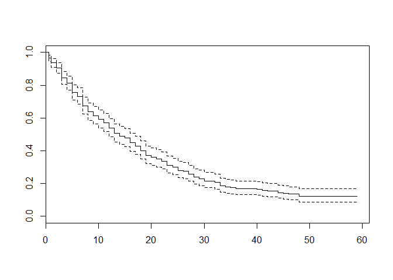

``` r
#alternativt med ggplot
temp = broom::tidy(KABL_fit)
ggplot(data=temp)+
  geom_line(aes(x=time,y=estimate))+
  geom_ribbon(aes(x=time,ymin=conf.low,ymax=conf.high),alpha=0.1)
```

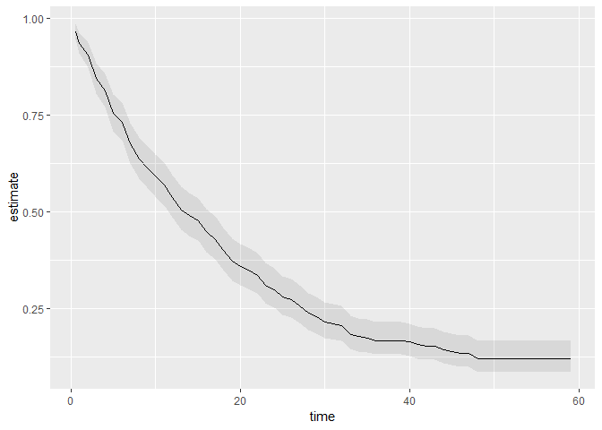

Da kan vi også finne H(t) - kumulativ hasard: '

``` r
KABL_fH = survfit(Surv(durat,ciep12)~1,type="fleming",data=df)
temp = broom::tidy(KABL_fH)
temp$fH = -log(temp$estimate)
temp$fH_upper = -log(temp$conf.high)
temp$fH_lower = -log(temp$conf.low)

ggplot(data=temp,aes(x=time))+
  geom_line(aes(y=fH))+
  geom_ribbon(aes(ymin=fH_lower,ymax=fH_upper),alpha=0.1)+
  geom_point(aes(y=fH),data=filter(temp,n.censor>0))
```

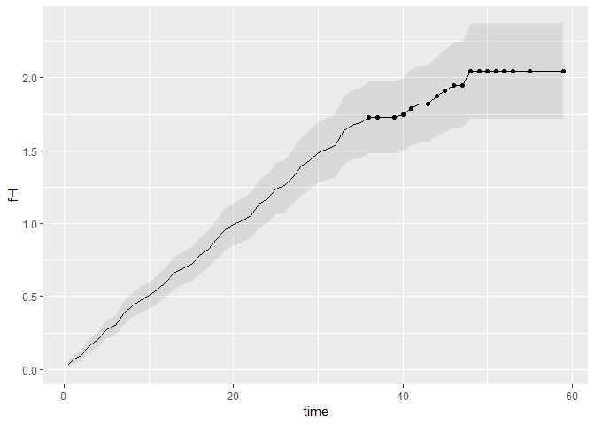

For å sammenlikne om to kurver er statistisk ulike, kan vi bruke log-rank-test for å teste ulikheter. Dette likner litt på en kjikvadrat-test.

``` r
#eksempel på logrank-test.

survdiff(Surv(durat,ciep12)~invest,data=df,rho=0)
```

    ## Call:
    ## survdiff(formula = Surv(durat, ciep12) ~ invest, data = df, rho = 0)
    ## 
    ##            N Observed Expected (O-E)^2/E (O-E)^2/V
    ## invest=0 172      137    178.7      9.72      30.5
    ## invest=1 142      134     92.3     18.81      30.5
    ## 
    ##  Chisq= 30.5  on 1 degrees of freedom, p= 0.00000003

Eller sammenlikne plot av Kaplan-Meier-kurver, med konfidensintervaller:

``` r
#modell
KABL_fit = survfit(Surv(durat,ciep12)~invest,data=df)

#plotter
temp = broom::tidy(KABL_fit)
ggplot(data=temp,aes(x=time))+
  geom_line(aes(y=estimate,colour=strata))+
  geom_ribbon(aes(ymin=conf.low,ymax=conf.high,colour=strata),alpha=0.1)
```

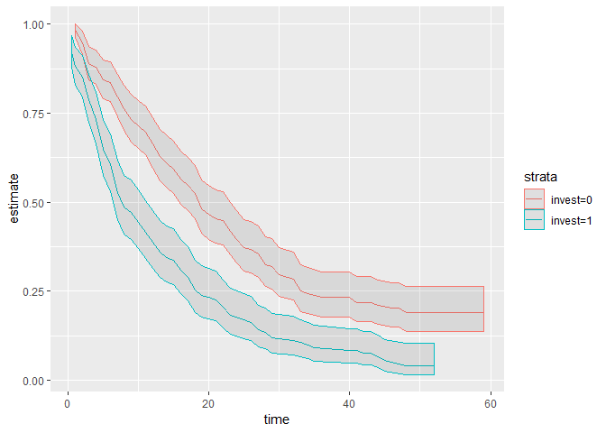

Så en omtur om counting process formulatio for survival anaysis -&gt; Martingales: Gitt observasjoner på X på mange tidspunkt 1-T, er det beste gjettinga på X(t+s), X(t) - altså en hukommelsesløs prosess, beste gjetning er det som skjedde sist. Nyttig for andre formuleringer og anvendelser av data. Hvis en serie er en Martingale, sier det noe om hvordan du skal tenke rundt den.

Parametric survival models
==========================

(hvordan ser egentlig prosedyren for fitting ut?)

T: overlevelse til tidspunkt T (sånn ca.)

Intuisjonen bak formel på slide 3: Hva kan vi lære av observerte hendelser? Noe om overlevelse, noe om sannsynlighet for å oppleve hendelsen på punkt t. Hva kan vi lære av sensurerte hendelser? Bare at de var med til et visst punkt - altså noe om overlevelse.

Gitt vanlige antakelser om sannsynligheter (hva nå enn det er - betinget uavhengighet?), kan en utlede en formel her. En trenger en fordeling for å komme lenger - hvilken fordeling kan passe for hasarden?

Eksponentiell modell
--------------------

Den enkleste matematiske fordelinga - en konstant over tid, som fører til utledning av eksponential modell for S(t). Illustrert på slide 5. Dvs. at vi gjør en antakelse om at hasarden er flat over tid.

Hvorfor har en flat hasard en avtakende overlevelsesfunksjon og en avtakende sannsynlighetsfordeling? Fordi individer med høy hasard faller ut tidlig (....?).

Funksjonen på slide 6 for S(t) er en log-log-funksjon, og er en del av en kobling til event count models. Ligner på en poisson-funksjon for sannsynligheten for å få en 0: Eksponential log-likelihood.

Mange av R-funksjonene for dette benytter en litt anna formulering: Accelerated Failure Time, AFT. På slide 8 utledes denne moldellen fra en klassisk regressjon av tid T, strengt positiv. Med antakelsen at feilleddet er eksponentielt fordelt, har en samme modell som over. Intuisjonen bak AFT-navnet er at X øker eller minsker tiden til hendelse - selv om hasarden er lik. Men fortegnet på koeffisientene er omvendt i denne formuleringa som i den over. Ting som øker hasarden, senker tiden til hendelse.

``` r
#eksempel med KABL-data som over
df <- read.csv("https://raw.githubusercontent.com/PrisonRodeo/GSERM-Oslo-2019-git/master/Data/KABL.csv")

# Survival object (again):
objekt_surv = Surv(df$durat,df$ciep12)

# En måte å sette opp en modell på
xvars<-c("fract","polar","format","invest","numst2","eltime2","caretk2")
modell = as.formula(paste("objekt_surv ~ ", paste(xvars,collapse="+")))


model_exp_aft = survreg(modell,data=df,dist="exponential")
summary(model_exp_aft)
```

    ## 
    ## Call:
    ## survreg(formula = modell, data = df, dist = "exponential")
    ##                 Value Std. Error     z            p
    ## (Intercept)  3.724599   0.630834  5.90 0.0000000035
    ## fract       -0.001164   0.000905 -1.29       0.1984
    ## polar       -0.016098   0.006097 -2.64       0.0083
    ## format      -0.090965   0.045544 -2.00       0.0458
    ## invest      -0.369368   0.139398 -2.65       0.0081
    ## numst2       0.514644   0.129233  3.98 0.0000682531
    ## eltime2      0.723161   0.134999  5.36 0.0000000847
    ## caretk2     -1.300350   0.259566 -5.01 0.0000005451
    ## 
    ## Scale fixed at 1 
    ## 
    ## Exponential distribution
    ## Loglik(model)= -1026   Loglik(intercept only)= -1101
    ##  Chisq= 150 on 7 degrees of freedom, p= 0.000000000000000000000000000037 
    ## Number of Newton-Raphson Iterations: 4 
    ## n= 314

"Scale fixed at 1" betyr at det er en eksponential modell.

Parametriske overlevelsesmodeller er litt vanskelige å kjøre i R. De fitter modellen i AFT-form. Så tolkninga av invest-koeffisienten -0.3 (exp=0.8) er at invest=1 gir kortere tid til hendelse - ikke at invest=1 har lavere hasard enn invest=0. (Hasarder kan økes uendelig, men overlevelsestider kan ikke senkes uendelig)

Hvordan tolke hasardrater (hvor kommer hasard-rater inn? i en modellformulering av eksponential-modellen og andre steder): hasardrate for A (med X1=1) / hasardrate for B (med X1=0), alt annet likt. P.g.a. algebra, kan du ta exp(koeffisient-estimat), og finne hasardraten. Dette er likt som oddsratioer.

``` r
koeff_exp_ph = (-model_exp_aft$coefficients)
koeff_exp_ph
```

    ## (Intercept)       fract       polar      format      invest      numst2 
    ##     -3.7246      0.0012      0.0161      0.0910      0.3694     -0.5146 
    ##     eltime2     caretk2 
    ##     -0.7232      1.3003

``` r
koeff_exp_hr = exp(-model_exp_aft$coefficients)
koeff_exp_hr
```

    ## (Intercept)       fract       polar      format      invest      numst2 
    ##       0.024       1.001       1.016       1.095       1.447       0.598 
    ##     eltime2     caretk2 
    ##       0.485       3.671

I eksempeldataene ser vi da, at

-   gjennomsnittlig effekt av "investiture" på regjeringens overlevelse er 100\*(1.45 - 1) = 45 % økning i hasard for sammenbrudd.
-   gjennomsnittlig synker investiture predikert overlevelsestid med 100\*(1-exp(-0.369)) = 30 %. (ikke helt sikker på hvor tallet kommer fra - AFT?)

Hvis du vil ha dette mer generelt, kan du - for flere enheters endring: ha exp(antall enheter endring \* betakoeffisient), - for endring av flere enheter samtidg: exp(vektor av variabler og variabelkoeffisienter som endres multiplisert med hverandre)

Eksempel på å plotte predikert overlevelsestid på slide 17. Kanskje lettere enn slik jeg gjorde det i intro-oppdraget?

``` r
model_exp = flexsurvreg(modell,data=df,dist="exp") #dette er proportional hazards, ikke AFT.

FakeInvest<-t(c(mean(df$fract),mean(df$polar),mean(df$format),1,
                mean(df$numst2),mean(df$eltime2),mean(df$caretk2)))
FakeNoInvest<-t(c(mean(df$fract),mean(df$polar),mean(df$format),0,
                  mean(df$numst2),mean(df$eltime2),mean(df$caretk2)))
colnames(FakeInvest)<-xvars
colnames(FakeNoInvest)<-xvars

plot(model_exp,FakeInvest,mark.time=FALSE,col.obs="black",
     lty.obs=c(0,0,0),xlab="Time (in months)",ylab="Survival Probability")
lines(model_exp,FakeNoInvest,mark.time=FALSE,col.obs="black",
      lty.obs=c(0,0,0),col=c(rep("green",times=3)))
legend("topright",inset=0.05,bty="n",
       c("Investiture Requirement","No Investiture Requirement"),
       lty=c(1,1),lwd=c(2,2),col=c("red","green"))
```

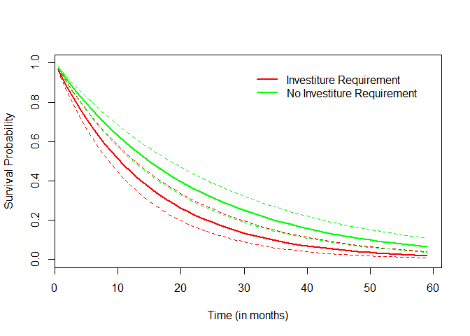

Weibull-modell
--------------

Så hvis antakelsen om at konstant hasardrate ikke er realisitsk (f.eks. fordi du studerer noe med liv - folk, garantier, mekaniske deler som forfaller): antakelse om konstant økende eller fallende hasardrate. p er et skalerings- eller formparameter.

Det er en modell hvor hasarden endes monotont over tid, og endringsraten estimeres fra data.

h(t) - For p=1, er weibull-modellen den eksponentielle modellen. - Hvis p&gt;1, øker h(t) med t - Hvis 0<p<1, synker h(t) med t

(illustrasjon på slide 21)


```r
#simulerer noen data
t<-cbind(1:60,1:60,1:60)
P<-c(0.5,1,2)
WeibullHs<-t(apply(t,1,function(t) 0.02*P*((0.02*t)^(P-1))))
WeibullSs<-t(apply(t,1,function(t) (exp(-0.02*t))^P))

#hasard-kurver for disse dataene
plot(t[,1],WeibullHs[,1],t="l",lwd=3,lty=1,col="green",
     xlab="Time",ylab="Hazard",ylim=c(0,0.08))
lines(t[,2],WeibullHs[,2],t="l",lwd=3,lty=2,col="black")
lines(t[,3],WeibullHs[,3],t="l",lwd=3,lty=3,col="red")
legend("topright",inset=.02,
       c("p = 0.5","p = 1.0","p = 2.0"),
       lty=c(1,2,3),lwd=c(3,3,3),col=c("green","black","red"),
       cex=1.2,bty="n")
```

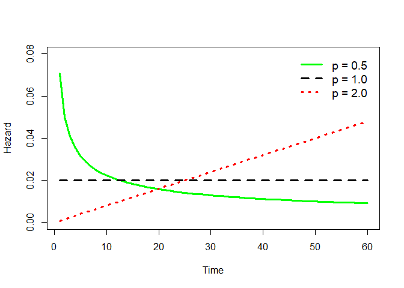


for S(t) impliserer det at S(t) faller kjappere for høyere p. (illustrasjon side 22).


```r
plot(t[,1],WeibullSs[,1],t="l",lwd=3,lty=1,col="green",
     xlab="Time",ylab="Survival Probability",ylim=c(0,1))
lines(t[,2],WeibullSs[,2],t="l",lwd=3,lty=2,col="black")
lines(t[,3],WeibullSs[,3],t="l",lwd=3,lty=3,col="red")
legend("bottomleft",inset=.02,
       c("p = 0.5","p = 1.0","p = 2.0"),
       lty=c(1,2,3),lwd=c(3,3,3),col=c("green","black","red"),
       cex=1.2,bty="n")
```

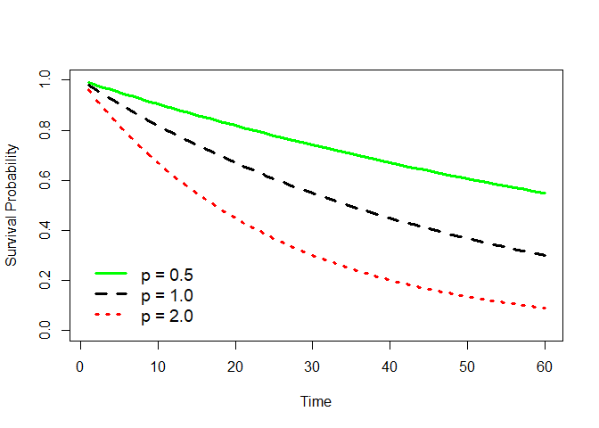

Lambda endres i modellen med kovariater, endrer nivået på hasarden før p (?). p er invers relatert til vairasjonen i feilleddet.

scale-parameteren i eksempelt på 25 er sigma, dvs. at p = 1/.77. 

Når du eksponenerer koeffisientene, forblir s.e. og slutninger de like.

Et eksempel med KABL-dataene. Første forskningsfunn var at kabinett-kollaps er en poisson-prosess, en nesten hukommelseløs prosess, hvor hasarden er flat over tid. Litt i motsetening til minoritets-koalisjons-litteratur-funn, hvor koallisjoner i regjeringer fører til flertaller faller sammen p.g.a. kompromisser som gjør folk misfornøgd: hasarden stiger.


```r
model_wbull_aft = survreg(modell,data=df,dist="weibull")
model_wbull_aft
```

```
## Call:
## survreg(formula = modell, data = df, dist = "weibull")
## 
## Coefficients:
## (Intercept)       fract       polar      format      invest      numst2 
##      3.6964     -0.0011     -0.0151     -0.0868     -0.3302      0.4635 
##     eltime2     caretk2 
##      0.6638     -1.3176 
## 
## Scale= 0.77 
## 
## Loglik(model)= -1014   Loglik(intercept only)= -1101
##  Chisq= 174 on 7 degrees of freedom, p= <0.0000000000000002 
## n= 314
```

```r
koeff_wbull_ph = (-model_wbull_aft$coefficients)/(model_wbull_aft$scale) 
koeff_wbull_ph
```

```
## (Intercept)       fract       polar      format      invest      numst2 
##     -4.7978      0.0014      0.0196      0.1126      0.4286     -0.6016 
##     eltime2     caretk2 
##     -0.8616      1.7102
```

```r
koeff_wbull_hr = exp(koeff_wbull_ph)
koeff_wbull_hr
```

```
## (Intercept)       fract       polar      format      invest      numst2 
##      0.0082      1.0014      1.0198      1.1192      1.5351      0.5479 
##     eltime2     caretk2 
##      0.4225      5.5298
```

Invesitutre øker sjansen for regjeringsfall med 1-1.54 = 54 %. 


```r
KABL.weib.Ihat<-predict(model_wbull_aft,newdata=as.data.frame(FakeInvest),
                        type="quantile",se.fit=TRUE,p=seq(.01,.99,by=.01))

KABL.weib.NoIhat<-predict(model_wbull_aft,newdata=as.data.frame(FakeNoInvest),
                          type="quantile",se.fit=TRUE,p=seq(.01,.99,by=.01))

# Plot:

plot(KABL.weib.NoIhat$fit,seq(.99,.01,by=-.01),t="l",lwd=3,col="green",
     xlab="Time (in months)",ylab="Survival Probability")
lines(KABL.weib.Ihat$fit,seq(.99,.01,by=-.01),lwd=3,col="red")
lines(KABL.weib.NoIhat$fit+1.96*(KABL.weib.NoIhat$se),
      seq(.99,.01,by=-.01),lty=2,lwd=1,col="green")
lines(KABL.weib.NoIhat$fit-1.96*(KABL.weib.NoIhat$se),
      seq(.99,.01,by=-.01),lty=2,lwd=1,col="green")
lines(KABL.weib.Ihat$fit+1.96*(KABL.weib.NoIhat$se),
      seq(.99,.01,by=-.01),lty=2,lwd=1,col="red")
lines(KABL.weib.Ihat$fit-1.96*(KABL.weib.NoIhat$se),
      seq(.99,.01,by=-.01),lty=2,lwd=1,col="red")
legend("topright",inset=0.05,bty="n",
       c("Investiture Requirement","No Investiture Requirement"),
       lty=c(1,1),lwd=c(2,2),col=c("red","green"))
```

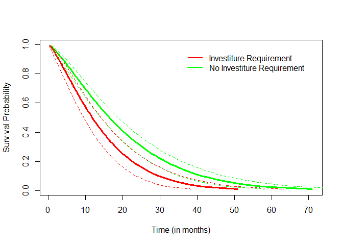

Det finnes en Weibull-modell-kult, og mange varianter av dette.

##Gompertz-modell (slide 29)
En helt fin modell, men som ikke brukes så mye som Weibull - selv om de er temmelig like. Det er en modell hvor hasarden endes monotont over tid, og endringsraten estimeres fra data.

Hvis gamma er større enn 0, går h(t) opp, hvis gamme er mindre enn 0, går h(t) ned. hvis lik 0 er h(t) lik exp(lamda). Dermed lik weibull i noen tilfeller.


```r
t<-cbind(1:1000,1:1000,1:1000)
t<-t/100
G<-c(-0.5,0,0.1)
GompertzHs<-t(apply(t,1,function(t) exp(0.2)*exp(G*t)))

# Plot:
plot(t[,1],GompertzHs[,1],t="l",lwd=3,lty=1,col="green",
     xlab="Time",ylab="Hazard",ylim=c(0,4))
lines(t[,2],GompertzHs[,2],lwd=3,lty=2,col="black")
lines(t[,3],GompertzHs[,3],lwd=3,lty=3,col="red")
legend("topleft",inset=.02,
       c("gamma = -0.5","gamma = 0","gamma = 0.2"),
       lty=c(1,2,3),lwd=c(3,3,3),col=c("green","black","red"),
       cex=1.2,bty="n")
```

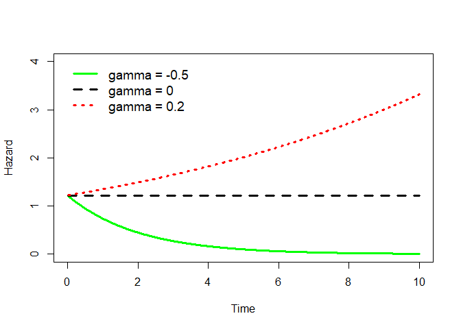

Dette er ikke en AFT-modell, kun hasardrate-modell (?).


```r
model_gomp = flexsurvreg(modell,data=df,dist="gompertz")
model_gomp
```

```
## Call:
## flexsurvreg(formula = modell, data = df, dist = "gompertz")
## 
## Estimates: 
##          data mean   est         L95%        U95%        se        
## shape            NA    0.023191    0.011519    0.034863    0.005955
## rate             NA    0.015200    0.004071    0.056755    0.010217
## fract    718.812102    0.001400   -0.000390    0.003190    0.000913
## polar     15.289809    0.018942    0.006662    0.031223    0.006266
## format     1.904459    0.107104    0.015856    0.198352    0.046556
## invest     0.452229    0.411722    0.137012    0.686433    0.140161
## numst2     0.630573   -0.608285   -0.867669   -0.348901    0.132341
## eltime2    0.487261   -0.873459   -1.152616   -0.594302    0.142430
## caretk2    0.054140    1.462474    0.944714    1.980234    0.264168
##          exp(est)    L95%        U95%      
## shape            NA          NA          NA
## rate             NA          NA          NA
## fract      1.001401    0.999610    1.003195
## polar      1.019123    1.006684    1.031715
## format     1.113050    1.015982    1.219392
## invest     1.509415    1.146842    1.986617
## numst2     0.544283    0.419929    0.705463
## eltime2    0.417505    0.315809    0.551948
## caretk2    4.316627    2.572079    7.244441
## 
## N = 314,  Events: 271,  Censored: 43
## Total time at risk: 5790
## Log-likelihood = -1018, df = 9
## AIC = 2055
```

##Log-logistic model (slide 33)
Men hva hvis hasard-raten er lav, stiger, og så faller? F.eks. ved beslutninger om å endre lover som oppfølging av høyesterettsvedtak?

Det gir en S(t) som likner på en logistisk kurve. Har en ekstra parameter p, som er en invers av skaleringsparametre og invers av hasard. Noen eksempler for ulike p-verdier:


```r
t<-cbind(1:100,1:100,1:100)
t<-t/2
p<-c(0.5,1.0,3.0)
LogLogHs<-t(apply(t,1,function(t) (0.05*p*((0.05*t)^(p-1)))/(1+(0.05*t)^p)))

# Plot:
plot(t[,1],LogLogHs[,1],t="l",lwd=3,lty=1,col="green",
     xlab="Time",ylab="Hazard",ylim=c(0,0.15))
lines(t[,2],LogLogHs[,2],lwd=3,lty=2,col="black")
lines(t[,3],LogLogHs[,3],lwd=3,lty=3,col="red")
legend("topright",inset=.02,
       c("p = 0.5","p = 1.0","p = 3.0"),
       lty=c(1,2,3),lwd=c(3,3,3),col=c("green","black","red"),
       cex=1.2,bty="n")
```

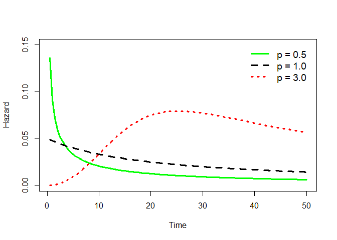

Eksempelet fra R er igjen AFT. p kan utledes som 1/scale i eksempelet. Men koeffisientene her kan ikke tolkes som hasardrater - det er kun en AFT-modell. (OBSOBS.)


```r
# KABL Log-Logistic:
model_loglog = survreg(modell,data=df,dist="loglogistic")
summary(model_loglog)
```

```
## 
## Call:
## survreg(formula = modell, data = df, dist = "loglogistic")
##                 Value Std. Error      z                    p
## (Intercept)  3.333841   0.547354   6.09         0.0000000011
## fract       -0.000913   0.000790  -1.15               0.2482
## polar       -0.019092   0.005885  -3.24               0.0012
## format      -0.096975   0.043155  -2.25               0.0246
## invest      -0.357403   0.128764  -2.78               0.0055
## numst2       0.479507   0.121039   3.96         0.0000744529
## eltime2      0.627837   0.124047   5.06         0.0000004165
## caretk2     -1.252349   0.231515  -5.41         0.0000000632
## Log(scale)  -0.568276   0.051157 -11.11 < 0.0000000000000002
## 
## Scale= 0.567 
## 
## Log logistic distribution
## Loglik(model)= -1024   Loglik(intercept only)= -1099
##  Chisq= 150 on 7 degrees of freedom, p= 0.00000000000000000000000000004 
## Number of Newton-Raphson Iterations: 4 
## n= 314
```

##Noen andre:
Log-logistisk og log-normal er liknende, men antar ulike fordelinger av feilleddet (logistisk og normal) - og likner da også på t.

Generalisert gamma: Tre parametre - baseline lamdba (hasard), hasard-form (p), og en tredje, som gir nok en form på hasard. Det gir enda en annen form på hasarden. Hvis p og 3 parametre = 1, så er det eksponentiell, hvis p = 1 så er det Weibull. 

Hvis dette er en mer generalisert form, hvorfor ikke bare bruke det? Fordi den er vanskelig å forstå og vanskelig å "fitte" (hva er det norske ordet her?) - du får gjerne større problemer enn du løser.

##Hvordan velge riktig fordeling for en parametrisk survival-modell?
Hva veit du om fordelinga av hasard-raten for det du modellerer, i den faktiske populasjonen du er interesert i å si noe om? 

Dette er enda et valg du må ta, i tillegg til øvrige modelleringsvalg. Og hvor alvorlig en slik feil er, er vanskelig å si.

Du kan starte med en mer parametrisert modell, og så gå ned i modell-rekka til mindre parametriserte modeller. Eller: gå over til cox-modellering som kommer lenger ned.

##Software-kommentar
Parametriske modeller i R håndterer tidsvarierende data svært dårlig. Da må du bruke Cox. Se slide 38. STATA er bedre. Skyldes forskjeller mellom disipliner - Cox er populært i biostats, parametriske modeller er populært i ingeniør-kretser.

#Cox og diskret tid-modeller
Grunnleggende ide: 
- Hvert individ i har en baseline-hasard, og 
- en hasard-rate proporsjonalt skalert av en vektor X (proporsjonalt fordi exp(X)).

S(t) synker fortere med større verdier av exp(X). 

Utleder en modell uten å gjøre distribusjons-antakelser. Utleder en sannsynlighet for at en person opplever en hendelse på et tidspunkt (med en antakelse om at ingen hendelser skjer samtidig). Bygger igjen en utledning av partial likelihood for en hendelse på et tidspunkt. Denne modellen tar også med sensurert informasjon, så lenge disse er i settet av individer med risiko for hendelse.

Gir konsistente estimater, er asymptotisk normalfordelt, og litt ineffektivt sammenliknet med en velfungerende parametrisk modell.

En parametrisk modell gjør en antakelse om fordelinga av hasard over tid (med basis i en sannsynlighetsfordeling), og bruker observerte varigheter for å estimere koeffisienter m.v. Dvs. at når tid-til-hendelse skifter, skifter modell-estimatene.

Cox-modellen bryr seg om sorteringa av hendelser, ikke den faktiske varigheten / tiden-til-hendelse: hva er sannsynligheten for at det var enhet A som hadde hendelsen på tidspunkt t. Og med uendelig observasjoner, lærer du like mye av rangering som av tid til hendelse. En kobling til rang-basert statistikk. Så hvis du skifter rekkefølge på observasjoner, vil koeffisientene skifte. 

Antakelse: ingen hendelse skjer på samme tidspunkt (fordi da kan du ikke si noe om rangeringa). Det er potensielt vanskelig.

Eksempel med tidsvarierende data på krig mellom stater (et klassisk treningseksempel for statsvitenskap). 

(Dyadene er også avhengig av hverandre - Pakistan vil ikke ha krig på flere fronter, så hvis krig ett sted. Det gir nettverkseffekter innad i variablene).


```r
df = read.csv("https://raw.githubusercontent.com/PrisonRodeo/GSERM-Oslo-2019-git/master/Data/OR.csv")
summary(df)
```

```
##      dyadid            year          start         stop        futime  
##  Min.   :  2020   Min.   :1951   Min.   : 0   Min.   : 1   Min.   : 5  
##  1st Qu.:100365   1st Qu.:1965   1st Qu.: 5   1st Qu.: 6   1st Qu.:23  
##  Median :220235   Median :1972   Median :11   Median :12   Median :31  
##  Mean   :253305   Mean   :1971   Mean   :12   Mean   :13   Mean   :29  
##  3rd Qu.:365600   3rd Qu.:1979   3rd Qu.:19   3rd Qu.:20   3rd Qu.:35  
##  Max.   :900920   Max.   :1985   Max.   :34   Max.   :35   Max.   :35  
##     dispute         allies         contig         trade      
##  Min.   :0.00   Min.   :0.00   Min.   :0.00   Min.   :0.000  
##  1st Qu.:0.00   1st Qu.:0.00   1st Qu.:0.00   1st Qu.:0.000  
##  Median :0.00   Median :0.00   Median :0.00   Median :0.000  
##  Mean   :0.02   Mean   :0.36   Mean   :0.31   Mean   :0.002  
##  3rd Qu.:0.00   3rd Qu.:1.00   3rd Qu.:1.00   3rd Qu.:0.001  
##  Max.   :1.00   Max.   :1.00   Max.   :1.00   Max.   :0.177  
##      growth         democracy        capratio 
##  Min.   :-0.265   Min.   :-1.00   Min.   : 0  
##  1st Qu.:-0.005   1st Qu.:-0.80   1st Qu.: 0  
##  Median : 0.015   Median :-0.70   Median : 0  
##  Mean   : 0.008   Mean   :-0.34   Mean   : 2  
##  3rd Qu.: 0.028   3rd Qu.: 0.20   3rd Qu.: 1  
##  Max.   : 0.165   Max.   : 1.00   Max.   :79
```

```r
# Surv object...
objekt_surv =  Surv(df$start,df$stop,df$dispute,type=c('counting'))
model_km = survfit(objekt_surv~1)

# Kaplan-Meier:

plot(model_km,mark.time=FALSE,lwd=c(2,1,1),
     xlab="Time (in years)",ylab="Survival Probability")
```

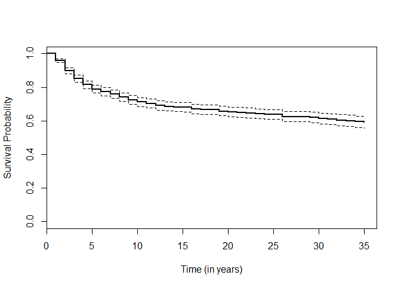

```r
model_cox = coxph(objekt_surv~allies+contig+capratio+growth+democracy+trade,
                data=df,na.action=na.exclude, method="breslow")
summary(model_cox)
```

```
## Call:
## coxph(formula = objekt_surv ~ allies + contig + capratio + growth + 
##     democracy + trade, data = df, na.action = na.exclude, method = "breslow")
## 
##   n= 20448, number of events= 405 
## 
##              coef exp(coef) se(coef)     z           Pr(>|z|)
\#\# allies -0.3485 0.7058 0.1110 -3.14 0.00169 \*\* \#\# contig 0.9486 2.5821 0.1217 7.79 0.0000000000000066 *** \#\# capratio -0.2230 0.8001 0.0516 -4.32 0.0000156921114073 *** \#\# growth -3.6949 0.0249 1.1995 -3.08 0.00207 \*\* \#\# democracy -0.3819 0.6825 0.0992 -3.85 0.00012 *** \#\# trade -3.2286 0.0396 9.4559 -0.34 0.73278
\#\# --- \#\# Signif. codes: 0 '***' 0.001 '\*\*' 0.01 '\*' 0.05 '.' 0.1 ' ' 1 \#\# \#\# exp(coef) exp(-coef) lower .95 upper .95 \#\# allies 0.7058 1.417 0.567810404668 0.877 \#\# contig 2.5821 0.387 2.034032423982 3.278 \#\# capratio 0.8001 1.250 0.723074050179 0.885 \#\# growth 0.0249 40.240 0.002367681170 0.261 \#\# democracy 0.6825 1.465 0.561987782904 0.829 \#\# trade 0.0396 25.244 0.000000000354 4433146.133 \#\# \#\# Concordance= 0.714 (se = 0.013 ) \#\# Rsquare= 0.01 (max possible= 0.234 ) \#\# Likelihood ratio test= 210 on 6 df, p=&lt;0.0000000000000002 \#\# Wald test = 160 on 6 df, p=&lt;0.0000000000000002 \#\# Score (logrank) test = 186 on 6 df, p=&lt;0.0000000000000002 \`\`\`

Tolkning av koeffisienter: exp(coef)

-   Land som er allierte har en forventa (0,706-1)\*100 = 29,4 % lavere hasard for konflikt, enn de som ikke er allierte
-   Land som ligger ved siden hverandre har en (2,582-1)\*100 = 158 % høyere hasard for konflikt enn ikke-vedsidenavhverandre
-   En en-enhets-økning i demokrati tilsvarer en (0,683-1)\*100 = 31,7 % nedgang i forventa hasard for konflikt.

Med eksempelet fra "growth" her: en enhets endring i growth = 100 % endring i GDP. ikke interessant. Bruk skalaer der 1 enhet endring gir mening.

``` r
df$growthPct = df$growth*100
summary(coxph(objekt_surv~allies+contig+capratio+growthPct+democracy+trade,
                data=df,na.action=na.exclude, method="breslow"))
```

    ## Call:
    ## coxph(formula = objekt_surv ~ allies + contig + capratio + growthPct + 
    ##     democracy + trade, data = df, na.action = na.exclude, method = "breslow")
    ## 
    ##   n= 20448, number of events= 405 
    ## 
    ##              coef exp(coef) se(coef)     z           Pr(>|z|)    
    ## allies    -0.3485    0.7058   0.1110 -3.14            0.00169 ** 
    ## contig     0.9486    2.5821   0.1217  7.79 0.0000000000000066 ***
    ## capratio  -0.2230    0.8001   0.0516 -4.32 0.0000156921114073 ***
    ## growthPct -0.0369    0.9637   0.0120 -3.08            0.00207 ** 
    ## democracy -0.3819    0.6825   0.0992 -3.85            0.00012 ***
    ## trade     -3.2286    0.0396   9.4559 -0.34            0.73278    
    ## ---
    ## Signif. codes:  0 '***' 0.001 '**' 0.01 '*' 0.05 '.' 0.1 ' ' 1
    ## 
    ##           exp(coef) exp(-coef)      lower .95   upper .95
    ## allies       0.7058      1.417 0.567810404668       0.877
    ## contig       2.5821      0.387 2.034032423982       3.278
    ## capratio     0.8001      1.250 0.723074050179       0.885
    ## growthPct    0.9637      1.038 0.941332888004       0.987
    ## democracy    0.6825      1.465 0.561987782904       0.829
    ## trade        0.0396     25.244 0.000000000354 4433146.133
    ## 
    ## Concordance= 0.714  (se = 0.013 )
    ## Rsquare= 0.01   (max possible= 0.234 )
    ## Likelihood ratio test= 210  on 6 df,   p=<0.0000000000000002
    ## Wald test            = 160  on 6 df,   p=<0.0000000000000002
    ## Score (logrank) test = 186  on 6 df,   p=<0.0000000000000002

-   Første formulering viste at en enhets økning i vekst (100% vekst) ga 97,5 % nedgang i hasarden
-   Andre formulering er nå at en enhets økning (1%) gir 4 % nedgang i hasarden
-   Dette er proporsjonalt det samme - 0.96373^100 = 0.02485

Cox-modellen har ingen konstant.

Ettersom den er uparametrisk og ikke definerer hasard-kurven (eller survival-kurve). Vi antar at alle har en baseline-hasard som er en konstant (men ikke estimeres? Eller er implisitt av modellen? Ah - det er en konstant, og lik for alle - ikke baseline-risiko, dette er relative hasardrater). Det sier ingenting om baserate-sjanse for en hendelse. Men cox-outputen kan brukes til å generere en baseline (integrert) hazard, som kan tolkes relativt til en lineær hasard (45 graders linje).

``` r
baseline_cox = basehaz(model_cox,centered=FALSE)

# Plot:

plot(baseline_cox$time,baseline_cox$hazard,t="l",lwd=4,col="red",
     xlab="Time (in years)",ylab="Baseline Integrated Hazard")
lines(abline(lm(baseline_cox$hazard~0+baseline_cox$time),lty=2,lwd=2))
legend("bottomright",inset=0.02,bty="n",
       c("Baseline Hazard","Linear Fit"),lty=c(1,2),
       lwd=c(4,2),col=c("red","black"))
```

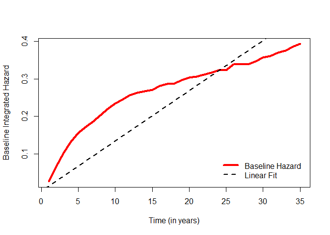

Samme som parametriske modeller, kan Cox også brukes til å sammenlikne S(t) for spesifikke kombinasjoner av verdier.

``` r
# Comparing survival curves:

FakeContig<-as.data.frame(t(c(mean(df$allies),1,mean(df$capratio),mean(df$growth),
              mean(df$democracy),mean(df$trade))))
FakeApart<-as.data.frame(t(c(mean(df$allies),0,mean(df$capratio),mean(df$growth),
              mean(df$democracy),mean(df$trade))))
colnames(FakeContig)<-c("allies","contig","capratio","growth",
                        "democracy","trade")
colnames(FakeApart)<-c("allies","contig","capratio","growth",
                        "democracy","trade")

FCHat<-survfit(model_cox,FakeContig)
FAHat<-survfit(model_cox,FakeApart)

# Plot:

plot(FAHat,col=c(rep("black",times=3)),lwd=c(3,1,1),lty=c(1,2,2),
     xlab="Time (in years)",ylab="Survival Probability",
     mark.time=FALSE)
par(new=TRUE)
plot(FCHat,col=c(rep("red",times=3)),lwd=c(3,1,1),lty=c(2,2,2),
     mark.time=FALSE)
legend("bottomleft",inset=0.02,bty="n",
       c("Non-Contiguous","Contiguous"),lty=c(1,2),
       lwd=c(3,3),col=c("black","red"))
```

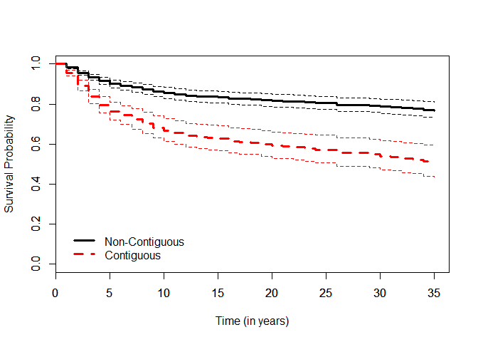

Sammenfallende hendelser - ties
-------------------------------

P.g.a. særlig diskretisering i data har vi hendelser som sammenfaller i tid. Dette gir problemer og gjør at betakoeffisienter nærmer seg 0 (fordi når du legger til hendelser på samme tidspunkt, får du ikke ny informasjon - bare mer. Hvis alle er på samme tid, har du en konstant uten variasjon)

(Dette er absolutt et problem for intro-dato: nesten alle slutter etter to år).

Løsning: - Cox hadde også tenkt på det, en eksakt måte å gjøre det på hvor du modellerer alle mulige utfall av sammenfall, og fordeler utfall deretter. På 70-tallet krevde det veldig mye regnekraft - og fortsatt litt for store datsett. - Breslows tilnærming til å løse dette var en slags empirisk justering underveis - men er dårlig for data med mange sammenfall. - Efron foreslår en avansert måte å legge til litt støy på hver tilfelle, tilfeldig.

(Eksempel) 1. eksempel der alle har ulike tid. 2. om lag 40 % sammenfall på t. Den faktiske koeffisienten er ikke lenger 1 - og Zorn mener exact er best.

``` r
Data = as.data.frame(cbind(c(rep(1,times=400)),c(rep(c(0,1),times=200))))
colnames(Data)<-c("C","X")
Data$T<-rexp(400,exp(0+1*Data$X)) # B = 1.0
Data.S<-Surv(Data$T,Data$C)

D.br<-coxph(Data.S~X,data=Data,method="breslow")
D.ef<-coxph(Data.S~X,data=Data,method="efron")
D.ex<-coxph(Data.S~X,data=Data,method="exact")

D.Bs<-c(D.br$coefficients,D.ef$coefficients,D.ex$coefficients)
Dlab<-c("Breslow","Efron","Exact")

# Plot:
dotchart(D.Bs,labels=Dlab,pch=19,cex=1.8,xlab="Estimated Beta")
```

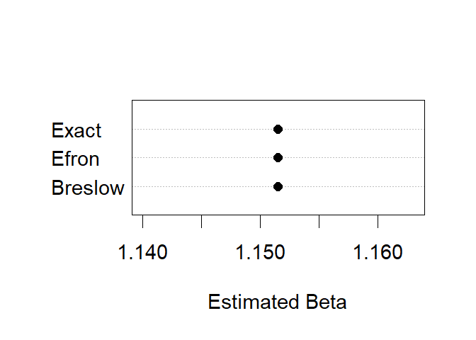

``` r
# Now add ties via rounding (nearest multiple of 5):
Data$Tied<-round(Data$T,0)
DataT.S<-Surv(Data$Tied,Data$C)

DT.br<-coxph(DataT.S~X,data=Data,method="breslow")
DT.ef<-coxph(DataT.S~X,data=Data,method="efron")
DT.ex<-coxph(DataT.S~X,data=Data,method="exact")
DT.Bs<-c(DT.br$coefficients,DT.ef$coefficients,DT.ex$coefficients)

#Plot:
dotchart(DT.Bs,labels=Dlab,pch=19,xlab="Estimated Beta",
         cex=1.8)
abline(v=D.ex$coefficients,lty=2,lwd=2)
```

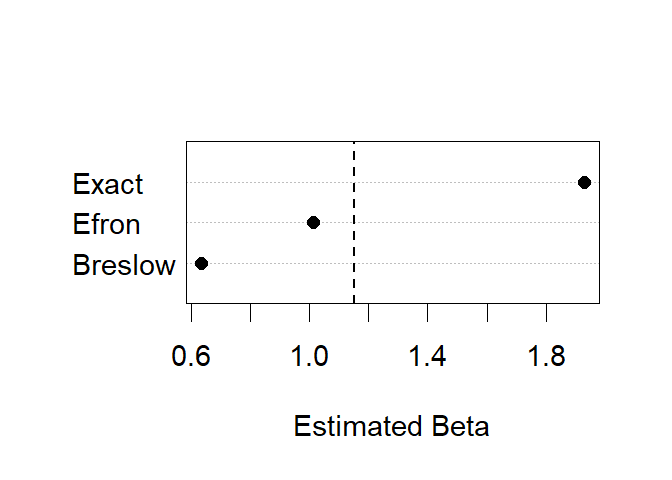

"Hvis du har mindre enn 10 % sammenfall, betyr det ingenting" - men ingen kilde. Hva betyr det? 10 % med samme tid? 10% deler tid med minst 1 annen hendelse? Zorn mfl. jobber på et paper om dette.

Sjekk hva som er standard i din programvare!

Modellvalg
----------

-   Parametrisk modell gjør det lettere å gjøre out-of-sample predictions. Vi kjenner kurven. Antakelsen gir oss noe å jobbe med.
-   Cox-modellen bryr seg ikke om tidspunkt hvor det ikke skjer hendelser. Så vanskelig å brke om tidspunkt hvor det ikke skjer hendelser. Men du tar ikke feil på fordelinga.

Så: 1. Sier teorien noe om fordelinga av h(t)? Veit vi ellers noe om h(t)? 2. Bryr vi oss om bias? Hvis vi driver med legemidler - ja, vi vil ha presise estimater av effekt, og vi har en del data. Velg Cox. (Kan også forklare hvorfor Cox er populært i medisin og biostat) 3. Eller bryr vi oss om effektivitet og prediksjoner? Dvs. at du får mest mulig ut av de få observasjonen du har, men forstår prosessen bak bedre? I så fall kan du velge parametrisk. (Kan også forklare hvorfor Weibull er populær blant ingeniører)

Når du tenker om fordelinga av variabelen, husk forskjellen mellom fordelinga av Y ukondisjonelt, og fordelinga av Y kondisjonelt på X. F.eks. hvordan inntekt over tid ser ut reint, og hvordan det ser ut etter at du har tatt ut kjønnsforskjeller. De kan være ganske forskjellige.

Diskret tid
===========

Begrenset utfallsrom for t (som f.eks. hvor gammel en er ved konfirmasjon)

(når er noe faktisk diskret? Skjønnsspørsmål, antakeligvis)

FUnksjonsutledningen er ganske grei, mer opptelling, samme logikk (Yit = Cit).

Løsning 1: ordinal regresjon
----------------------------

Hvis du har lite data (si 5 ulike tidspunkt), kan du bruke en ordinal logitstisk regresjon for kategoriske data.

Løsning 2: logistisk regresjon panel-data-style AKA grupperte data varighetsmodeller
------------------------------------------------------------------------------------

Mer vanlig er det at du er interessert i og modellerer et binært utfall - typisk hendelsen. Binary TSCS. Dette kan også modelleres med probit/logit, med eller uten FE/RE, kanskje også GEE. Dette har noen fordeler. Viktigst er det at det er lett å tolke, lett å kjøre.

Må håndtere - dvs. modellere - tidsavhengighet eksplisitt. Hvis du bare kjører en logistisk regresjon på tidsdata med 1 og 0, antar du at baseline-hasard er flat - rekkefølgen i t tas ikke hensyn til. Dette er samme antakelse som for parametrisk eksponentiell fordeling. Og da må du vite at dette skjer.

``` r
model_logit = glm(dispute~allies+contig+capratio+growth+democracy+trade,
              data=df,na.action=na.exclude,family="binomial")
summary(model_logit)
```

    ## 
    ## Call:
    ## glm(formula = dispute ~ allies + contig + capratio + growth + 
    ##     democracy + trade, family = "binomial", data = df, na.action = na.exclude)
    ## 
    ## Deviance Residuals: 
    ##    Min      1Q  Median      3Q     Max  
    ## -0.520  -0.218  -0.169  -0.120   3.868  
    ## 
    ## Coefficients:
    ##             Estimate Std. Error z value             Pr(>|z|)    
    ## (Intercept)  -4.3267     0.1145  -37.78 < 0.0000000000000002 ***
    ## allies       -0.4797     0.1127   -4.25             0.000021 ***
    ## contig        1.3536     0.1209   11.20 < 0.0000000000000002 ***
    ## capratio     -0.1962     0.0501   -3.92             0.000090 ***
    ## growth       -3.4275     1.2518   -2.74               0.0062 ** 
    ## democracy    -0.4012     0.1006   -3.99             0.000067 ***
    ## trade       -21.0761    11.3040   -1.86               0.0623 .  
    ## ---
    ## Signif. codes:  0 '***' 0.001 '**' 0.01 '*' 0.05 '.' 0.1 ' ' 1
    ## 
    ## (Dispersion parameter for binomial family taken to be 1)
    ## 
    ##     Null deviance: 3978.5  on 20447  degrees of freedom
    ## Residual deviance: 3693.8  on 20441  degrees of freedom
    ## AIC: 3708
    ## 
    ## Number of Fisher Scoring iterations: 9

Hvis du legger til et tidsledd, adresseres det. Det kan legges til som et parameter som likner på Weibull (slide 39), eller polynomer, eller splines...til ekstremtilfellet, med dummyvariabler for alle tidspunkt t. Full fleksibilitet, som likner på Cox-modellen. Dvs. at vi bruker mye data, mulig overfitting for prediksjon. Splines: Små tidseffekter. BKT nevner cubic splines som et eksempel, alle tok det som en obligatorisk teknikk etter BKT-artikkelen.

Lineær tidstrend:

``` r
df$duration = df$stop

modell_trend<-glm(dispute~allies+contig+capratio+growth+democracy+trade+duration,
                  data=df,na.action=na.exclude,family="binomial")
summary(modell_trend)
```

    ## 
    ## Call:
    ## glm(formula = dispute ~ allies + contig + capratio + growth + 
    ##     democracy + trade + duration, family = "binomial", data = df, 
    ##     na.action = na.exclude)
    ## 
    ## Deviance Residuals: 
    ##    Min      1Q  Median      3Q     Max  
    ## -0.658  -0.222  -0.145  -0.091   3.822  
    ## 
    ## Coefficients:
    ##             Estimate Std. Error z value             Pr(>|z|)    
    ## (Intercept)  -3.2711     0.1347  -24.28 < 0.0000000000000002 ***
    ## allies       -0.3630     0.1141   -3.18              0.00147 ** 
    ## contig        0.9969     0.1240    8.04  0.00000000000000089 ***
    ## capratio     -0.2357     0.0528   -4.47  0.00000795912698855 ***
    ## growth       -3.9574     1.2257   -3.23              0.00124 ** 
    ## democracy    -0.3612     0.0995   -3.63              0.00028 ***
    ## trade        -2.8710     9.8613   -0.29              0.77095    
    ## duration     -0.0912     0.0081  -11.26 < 0.0000000000000002 ***
    ## ---
    ## Signif. codes:  0 '***' 0.001 '**' 0.01 '*' 0.05 '.' 0.1 ' ' 1
    ## 
    ## (Dispersion parameter for binomial family taken to be 1)
    ## 
    ##     Null deviance: 3978.5  on 20447  degrees of freedom
    ## Residual deviance: 3534.6  on 20440  degrees of freedom
    ## AIC: 3551
    ## 
    ## Number of Fisher Scoring iterations: 9

Fjerde-ordens-polynomial trend:

``` r
df$d2<-df$duration^2*0.1
df$d3<-df$duration^3*0.01
df$d4<-df$duration^4*0.001

modell_p4 = glm(dispute~allies+contig+capratio+growth+democracy+trade+duration+d2+d3+d4,
           data=df,na.action=na.exclude,family="binomial")
summary(modell_p4)
```

    ## 
    ## Call:
    ## glm(formula = dispute ~ allies + contig + capratio + growth + 
    ##     democracy + trade + duration + d2 + d3 + d4, family = "binomial", 
    ##     data = df, na.action = na.exclude)
    ## 
    ## Deviance Residuals: 
    ##    Min      1Q  Median      3Q     Max  
    ## -0.681  -0.215  -0.137  -0.097   3.757  
    ## 
    ## Coefficients:
    ##             Estimate Std. Error z value             Pr(>|z|)    
    ## (Intercept) -3.40136    0.20681  -16.45 < 0.0000000000000002 ***
    ## allies      -0.36413    0.11420   -3.19               0.0014 ** 
    ## contig       0.99558    0.12407    8.02    0.000000000000001 ***
    ## capratio    -0.22836    0.05226   -4.37    0.000012435412496 ***
    ## growth      -3.86433    1.24562   -3.10               0.0019 ** 
    ## democracy   -0.39246    0.10069   -3.90    0.000097169966661 ***
    ## trade       -4.03229    9.63117   -0.42               0.6755    
    ## duration     0.05804    0.09147    0.63               0.5257    
    ## d2          -0.27496    0.12845   -2.14               0.0323 *  
    ## d3           0.13609    0.06323    2.15               0.0314 *  
    ## d4          -0.01886    0.00991   -1.90               0.0571 .  
    ## ---
    ## Signif. codes:  0 '***' 0.001 '**' 0.01 '*' 0.05 '.' 0.1 ' ' 1
    ## 
    ## (Dispersion parameter for binomial family taken to be 1)
    ## 
    ##     Null deviance: 3978.5  on 20447  degrees of freedom
    ## Residual deviance: 3510.0  on 20437  degrees of freedom
    ## AIC: 3532
    ## 
    ## Number of Fisher Scoring iterations: 9

Hvorvidt polynom-modellen var en forbedring kan testes med anova:

``` r
test = anova(model_logit,modell_p4,test="Chisq")
test
```

    ## Analysis of Deviance Table
    ## 
    ## Model 1: dispute ~ allies + contig + capratio + growth + democracy + trade
    ## Model 2: dispute ~ allies + contig + capratio + growth + democracy + trade + 
    ##     duration + d2 + d3 + d4
    ##   Resid. Df Resid. Dev Df Deviance            Pr(>Chi)    
    ## 1     20441       3694                                    
    ## 2     20437       3510  4      184 <0.0000000000000002 ***
    ## ---
    ## Signif. codes:  0 '***' 0.001 '**' 0.01 '*' 0.05 '.' 0.1 ' ' 1

Tidsdummyer:

``` r
modell_dummy = glm(dispute~allies+contig+capratio+growth+democracy+trade+as.factor(duration),
              data=df,na.action=na.exclude,family="binomial")
```

    ## Warning: glm.fit: fitted probabilities numerically 0 or 1 occurred

``` r
summary(modell_dummy)
```

    ## 
    ## Call:
    ## glm(formula = dispute ~ allies + contig + capratio + growth + 
    ##     democracy + trade + as.factor(duration), family = "binomial", 
    ##     data = df, na.action = na.exclude)
    ## 
    ## Deviance Residuals: 
    ##    Min      1Q  Median      3Q     Max  
    ## -0.761  -0.216  -0.139  -0.086   3.741  
    ## 
    ## Coefficients:
    ##                       Estimate Std. Error z value             Pr(>|z|)    
    ## (Intercept)            -3.6112     0.1822  -19.82 < 0.0000000000000002 ***
    ## allies                 -0.3692     0.1144   -3.23              0.00125 ** 
    ## contig                  0.9939     0.1242    8.00   0.0000000000000012 ***
    ## capratio               -0.2278     0.0522   -4.36   0.0000127493102035 ***
    ## growth                 -3.9762     1.2494   -3.18              0.00146 ** 
    ## democracy              -0.3956     0.1008   -3.93   0.0000865432735821 ***
    ## trade                  -3.4673     9.6261   -0.36              0.71870    
    ## as.factor(duration)2    0.4549     0.1961    2.32              0.02033 *  
    ## as.factor(duration)3    0.3602     0.2063    1.75              0.08084 .  
    ## as.factor(duration)4    0.1419     0.2218    0.64              0.52229    
    ## as.factor(duration)5   -0.1017     0.2438   -0.42              0.67661    
    ## as.factor(duration)6   -0.5724     0.2873   -1.99              0.04637 *  
    ## as.factor(duration)7   -0.5586     0.2874   -1.94              0.05195 .  
    ## as.factor(duration)8   -0.4894     0.2815   -1.74              0.08218 .  
    ## as.factor(duration)9   -0.4187     0.2819   -1.49              0.13748    
    ## as.factor(duration)10  -0.7065     0.3178   -2.22              0.02620 *  
    ## as.factor(duration)11  -0.9197     0.3525   -2.61              0.00907 ** 
    ## as.factor(duration)12  -0.7980     0.3393   -2.35              0.01866 *  
    ## as.factor(duration)13  -1.3975     0.4369   -3.20              0.00138 ** 
    ## as.factor(duration)14  -2.0266     0.5982   -3.39              0.00070 ***
    ## as.factor(duration)15  -2.0467     0.5981   -3.42              0.00062 ***
    ## as.factor(duration)16  -0.9176     0.3683   -2.49              0.01273 *  
    ## as.factor(duration)17  -1.6861     0.5241   -3.22              0.00130 ** 
    ## as.factor(duration)18  -3.0554     1.0123   -3.02              0.00254 ** 
    ## as.factor(duration)19  -1.0744     0.4095   -2.62              0.00870 ** 
    ## as.factor(duration)20  -1.4157     0.4742   -2.99              0.00283 ** 
    ## as.factor(duration)21  -2.2611     0.7247   -3.12              0.00181 ** 
    ## as.factor(duration)22  -1.7711     0.5990   -2.96              0.00311 ** 
    ## as.factor(duration)23  -1.5901     0.5996   -2.65              0.00801 ** 
    ## as.factor(duration)24  -1.4802     0.6002   -2.47              0.01366 *  
    ## as.factor(duration)25 -15.1044   330.4483   -0.05              0.96354    
    ## as.factor(duration)26  -0.4652     0.4426   -1.05              0.29325    
    ## as.factor(duration)27 -15.0599   385.3911   -0.04              0.96883    
    ## as.factor(duration)28 -15.0188   383.7575   -0.04              0.96878    
    ## as.factor(duration)29  -1.3911     0.7282   -1.91              0.05610 .  
    ## as.factor(duration)30  -0.9017     0.6037   -1.49              0.13527    
    ## as.factor(duration)31  -1.9249     1.0159   -1.89              0.05813 .  
    ## as.factor(duration)32  -1.0965     0.7298   -1.50              0.13298    
    ## as.factor(duration)33  -1.6447     1.0172   -1.62              0.10589    
    ## as.factor(duration)34  -0.8697     0.7316   -1.19              0.23454    
    ## as.factor(duration)35  -1.3878     1.0186   -1.36              0.17305    
    ## ---
    ## Signif. codes:  0 '***' 0.001 '**' 0.01 '*' 0.05 '.' 0.1 ' ' 1
    ## 
    ## (Dispersion parameter for binomial family taken to be 1)
    ## 
    ##     Null deviance: 3978.5  on 20447  degrees of freedom
    ## Residual deviance: 3464.4  on 20407  degrees of freedom
    ## AIC: 3546
    ## 
    ## Number of Fisher Scoring iterations: 17

``` r
test_dummy = anova(model_logit,modell_dummy,test="Chisq")
test_dummy
```

    ## Analysis of Deviance Table
    ## 
    ## Model 1: dispute ~ allies + contig + capratio + growth + democracy + trade
    ## Model 2: dispute ~ allies + contig + capratio + growth + democracy + trade + 
    ##     as.factor(duration)
    ##   Resid. Df Resid. Dev Df Deviance            Pr(>Chi)    
    ## 1     20441       3694                                    
    ## 2     20407       3464 34      229 <0.0000000000000002 ***
    ## ---
    ## Signif. codes:  0 '***' 0.001 '**' 0.01 '*' 0.05 '.' 0.1 ' ' 1

En kan se på predikerte hasarder for å sammenlikne ulike tidstilnærminger:

``` r
Xhats<-as.data.frame(t(c(mean(df$allies),mean(df$contig),mean(df$capratio),
                         mean(df$growth),mean(df$democracy),mean(df$trade))))
Xhats<-Xhats[rep(1:nrow(Xhats),each=max(df$duration)),]
Xhats$duration<-1:max(df$duration)        
Xhats$d2<-Xhats$duration^2*0.1
Xhats$d3<-Xhats$duration^3*0.01
Xhats$d4<-Xhats$duration^4*0.001
colnames(Xhats)<-c("allies","contig","capratio","growth","democracy",
                   "trade","duration","d2","d3","d4")

Hat.logit<-predict(model_logit,Xhats,type="response")
Hat.trend<-predict(modell_trend,Xhats,type="response")
Hat.P4<-predict(modell_p4,Xhats,type="response")
Hat.dummy<-predict(modell_dummy,Xhats,type="response")

plot(Xhats$duration,Hat.logit,ylim=c(0,0.04),t="l",lwd=3,col="black",
     xlab="Time (in years)",ylab="Predicted Probability")
lines(Xhats$duration,Hat.trend,lwd=3,lty=2,col="blue")
lines(Xhats$duration,Hat.P4,lwd=3,lty=3,col="green")
lines(Xhats$duration,Hat.dummy,lwd=3,lty=4,col="red")
legend("topright",inset=0.05,bty="n",
       c("No Duration Dependence","Linear Dependence",
         "Fourth-Degree Polynomial","Duration Dummies"),lty=c(1,2,3,4),
       lwd=c(3,3,3,3),col=c("black","blue","green","red"))
```

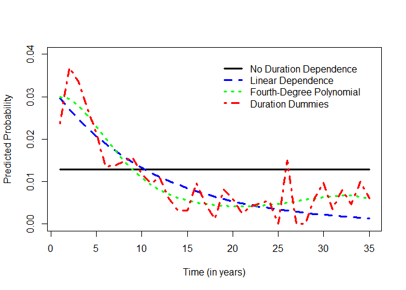

Hvordan velge løsning på tid? - Teoretisk begrunnelse, - teste fra generell til spesifikk modell, - sammenlikne fitted values for modellspesifisering med kryssvalidering.

Zorn anbefaler kombinasjon av teori og kryssvalidering. Slide 51 har eksempler på prediksjonstesting.

Cox-modeller er grupperte data varighetsmodeller
------------------------------------------------

i markedsføringsforskning ser en på multinomisk regresjon på valg hos velgeren, og alternativer ved valget. Fixed effects for valget brukes gjerne. Så hvis valget er hendelsen, er kondisjonelle logit-modeller cox-modeller (HM?). Og mer generelt: grupperte data varighetsmodeller er cox-modeller, eller i hvert fall: de er liknende/proporsjonale.

Så noen eksempler på modellestimering.

Eksempelet på slide 52: for at poisson skal være lik cox, må cox ha breslow-metode ved ties, og poisson må ha tids-dummyer for alle år.

``` r
modell_cox = coxph(Surv(df$start,df$stop,df$dispute)~allies+contig+capratio+growth+democracy+trade,
                   data=df,method="breslow")

modell_poisson = glm(dispute~allies+contig+capratio+growth+democracy+trade+as.factor(duration),
                data=df,na.action=na.exclude,family="poisson")

plot(modell_cox$coefficients[1:6],modell_poisson$coefficients[2:7],pch=19,
     xlab="Cox Estimates",ylab="Poisson Estimates",
     xlim=c(-4,1.5),ylim=c(-4,1.5))
abline(0,1)
text(modell_cox$coefficients[1:6],modell_poisson$coefficients[2:7],
     labels=colnames(Xhats[1:6]),pos=4,cex=0.8)
legend("bottomright",bty="n",inset=0.02,c("Line is 45-degree line"))
```

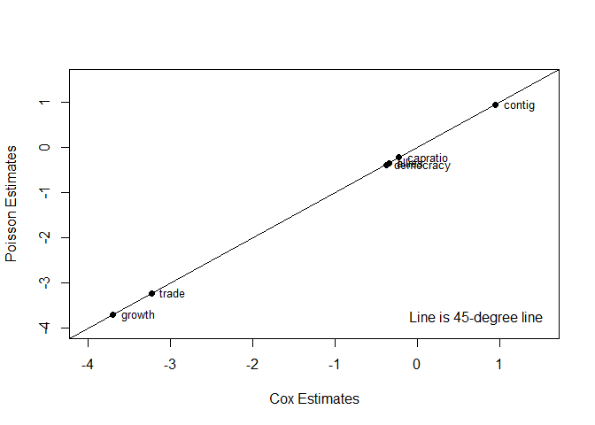

Utvidelse til overlevelsesanalyse:
==================================

Følgende temaer er ikke dekket:

-   varighetsavhengighet, dvs. at hasarden stiger eller synker som funksjon av tid, eller uobserverte variabler.
-   brudd på proposjonalitetsantakelsen i Cox-modellen (æsj). Kan håndteres med tidsinteraksjoner (med tid eller log(tid)).
-   konkurrende risiko-modeller med flere avhengige utfall. Ganske rett fram, største spørsmål er om de ulike utfallene er uavhengig. Ofte kan de gjøres uavhengig ved å kontrollere/modellere riktig.
-   gjentakende hendelser: observasjoner som går inn og ut av risikogruppa/flere utfall (f.eks. inn og ut av arbeid flere ganger. ekteskap.). Hvor ofte kan hendelsen skje? Hvordan påvirkes hasarden post-hendelse? Hvis du har vært i jobb, har du da høyere/lavere hasard for mer jobb?

(Zorn legger ut kode og slides på dette på GitHub - sa han. Mulig det må etterspørres hvis det er behov)

Det som derimot ble diskutert var "cure models" og "frailty-models"

Cure models
-----------

En implisitt antakelse i all regresjonsanalyse er at når du har lagt inn modelleringa di, med X og evt. enhetseffekter, så er Y tilfeldig fordelt. Observasjonene er mer eller mindre utvekslbare - exchangeability. Dette er ikke nødvendigvis sant.

Alle observasjoner vil før eller seinere oppleve hendelsen.

Eksempel: testing av medisin, der noen får medisin og noen får placebo, og så måler en tid til tilbakefall. Noen blir kurert, og vil aldri oppleve hendelsen igjen - enten pga medisin, eller "selv-kurering". Noen dør av sykdom, noen dør av andre ting og blir sensurert.

Det er to varianter av cure models: miksturkur og ikke-miksturkur.

### miksturkur-modell (Mixture cure model)

Kalles mikstur-modell fordi to grupper - kurerte og ikke-kurerte - mikses, med mikse-parameteret delta.

Variabelen for personer som vil oppleve hendelsen og ikke oppleve hendelsen er latent. Den kan ikke observeres. Men vi kan beregne en sannsynlighet for om en person er i den gruppa. Slide 4 viser hvordan dette gir en S(t) som har en nedre verdi som ikke er 0 - det er en nedre verdi der de som ikke er på risiko. "Likelihood"-utledninga er lik som for andre data, men betinget på at risiko-settet er begrensa.

Sensurering er annerledes: Du kan enten være sensurert, eller kurert. Dvs. at sannsynigheten for at du ikke får hendelsen er sannsynligheten for at du er kurert + sannsynlighet for at hendelsen kommer etter tidspunkt T/t.

I denne modellen kan du ha kovariater både i X - sannsynlighet for hendelse - og delta - mikseparameteret/sannsynligheten for å være kurert. Modell-estimatet gir også en gammaparameteret, som jeg ikke helt skjønner - men et slags sannsynlgihetsestimat av hvem som er kurert og hvem som ikke er kurert. Det er altså et anslag på en individuell heteregoenitet som vi ikke kjenner. Magisk! (?)

Denne modellen tilsvarer en "zero-inflated Poisson". Større sannsynlighet for å få 0, men du vet ikke noe om det.

Eksempel med simulerte data. Vi simulerer noe data, med en spesifikk fordeling og sammenheng + støy.

``` r
X<-rnorm(500)
Z<-rbinom(500,1,0.5)
T<-rweibull(500,shape=1.2,scale=1/(exp(0.5+1*X)))
C<-rbinom(500,1,(0.4-0.3*Z)) # Z increases cure probability
S<-Surv(T,C)

plot(survfit(S~1),mark.time=FALSE,lwd=c(3,1,1),
     xlab="Time",ylab="Survival")
```

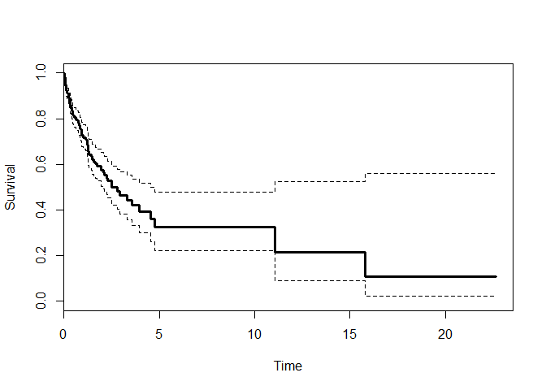

``` r
coxph(S~X)
```

    ## Call:
    ## coxph(formula = S ~ X)
    ## 
    ##   coef exp(coef) se(coef)  z                   p
    ## X  1.5       4.4      0.1 11 <0.0000000000000002
    ## 
    ## Likelihood ratio test=129  on 1 df, p=<0.0000000000000002
    ## n= 500, number of events= 124

``` r
coxph(S~X+Z)
```

    ## Call:
    ## coxph(formula = S ~ X + Z)
    ## 
    ##   coef exp(coef) se(coef)  z                    p
    ## X  1.4       4.1      0.1 10 < 0.0000000000000002
    ## Z -1.5       0.2      0.2 -6          0.000000001
    ## 
    ## Likelihood ratio test=178  on 2 df, p=<0.0000000000000002
    ## n= 500, number of events= 124

Cox-regresjonen viser en en mulig effekt av Z, der Z sre ut til å minke hasarden. Men den gjør ikke det, i de simulerte dataene øker de sannsynligheten for å være kurert. Så det er en falsk positiv. Hvis du setter den inn som "cureform", går det bra.

``` r
#data.cure<-cbind(X,Z,T,C)
#data.cure<-data.frame(data.cure)
#cure.fit<-smcure(S~X,cureform=~Z,data=data.cure,model="ph")

#cure.hat<-predictsmcure(cure.fit,c(rep(mean(X),times=2)),
#                        c(0,1),model="ph")
#cure.pic<-plotpredictsmcure(cure.hat,type="S",model="ph",
#            lwd=c(3,3))

# Plot:
#plotpredictsmcure(cure.hat,type="S",model="ph",
#                  lwd=c(3,3),main="Predicted Survival")
#legend("topright",inset=0.04,bty="n",lty=c(1,2),cex=1.2,
#      c("X at mean, Z = 0","X at mean, Z = 1"))
```

smcure er beste R-pakke. Noen eksempler: Eksempel med kur-modell som ikke konvergerte p.g.a. kanskje for lite data. Og så en modell med 60 000 datapunkter. Funka dårlig i R, funka i STATA. Kraftige modeller, men vanskelige.

Ikke-miksturkur-modell
----------------------

Hvis en pasient har fått strålebehandling, så vil vi vite om det er noen gjenværende kreftceller. Her kan en modellere tiden til nytt kreftutbrudd. Det er en mulighet for at du er kurert, men det er også mulig at det er igjen kreftceller, som trenger tid for å vokse. Overlevelsesfunksjonen S(t) kan utledes som å være Cox, men med en sannsynlighet for at du er kurert. Men du bruker ikke to grupper i data - alle har samme Poisson-fordelte sannsynlighet, men noen får 0 celler, andre får ikke-0. Sannsynligheten for 0 er den samme som den nedre grensa i miksturkur-modellen.

Ikke-kreft-eksempel: opprørsgrupper i et land. Noen land er immune, de har ikke opprør.

Eksempel på slide 11.

Denne modellen tilsvarer en "hurdle Poisson".

(HM)

Simulert sammenlikning av mikstur og ikke-mikstur:

``` r
t<-seq(0.1,50,by=0.1)
pi<-0.5 # P(cured) = 0.5
lambda<-0.1
S.exp<-exp(-(lambda*t))
S.mix<-pi+((1-pi)*(exp(-lambda*t)))
S.nomix<-exp(log(pi)*(1-(exp(-lambda*t))))

# Plot:

plot(t,S.exp,t="l",lwd=3,xlab="Time",ylab="Survival",
     main=expression(paste("Exponential Hazards with ",
          lambda," = 0.1 and ",pi," = 0.5")))
lines(t,S.mix,lwd=3,lty=2,col="red")
lines(t,S.nomix,lwd=3,lty=3,col="blue")
abline(h=0.5,lty=5,col="grey")
legend("topright",bty="n",lwd=3,lty=c(1,2,3),
       col=c("black","red","blue"),
       c("No Cured Fraction","Mixture Cure","Non-Mixture Cure"))
```

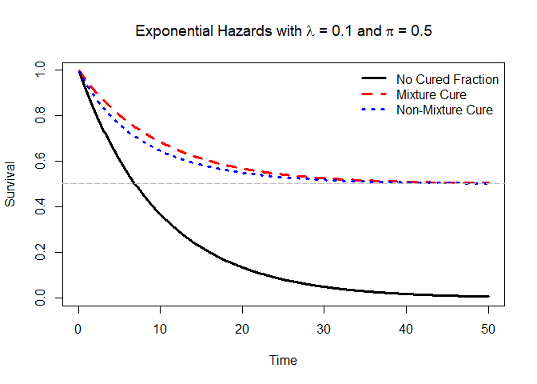

Inkluderer også et eksempel på cure-model i R som ikke gikk så bra:

``` r
# Fitting real cure models...sorta.

#CFURL<-"https://raw.githubusercontent.com/PrisonRodeo/GSERM-Oslo-2019-git/master/Data/ceasefiresTC.csv"
#temp<-getURL(CFURL)
#CF<-read.csv(textConnection(temp))
#rm(CFURL,temp)

#CF<-CF[complete.cases(CF),]

#CF.S<-Surv(CF$peace,CF$uncensor)

#plot(survfit(CF.S~1),mark.time=FALSE,lwd=c(3,1,1),
#     xlab="Time (in months)",ylab="Survival")

#CF.cox<-coxph(CF.S~tie+imposed+lndeaths+contig+onedem+twodem,
#              data=CF,method="efron")
#CF.cox

#CF.cure1.fit<-smcure(CF.S~tie+lndeaths+imposed,
#                   cureform=~contig,data=CF,model="ph",
#                    link="logit",emmax=500)
# LNB:

#LNBURL<-"https://raw.githubusercontent.com/PrisonRodeo/GSERM-Oslo-2019-git/master/Data/LNB.csv"
#temp<-getURL(LNBURL)
#LNB<-read.csv(textConnection(temp))
#rm(LNBURL,temp)

# Deal w/missing data + sort:

#LNB<-LNB[complete.cases(LNB),]
#LNB<-LNB[order(LNB$dyad,LNB$year),]

#LNB.S<-Surv(LNB$count1-1,LNB$count1,LNB$buofmzmid)
#LNB.altS<-Surv(LNB$count1,LNB$buofmzmid)

#plot(survfit(LNB.S~1,id=dyad,data=LNB),mark.time=FALSE,lwd=c(3,1,1),
#     xlab="Time (in years)",ylab="Survival")
#legend("bottomright",inset=0.04,bty="n",cex=1.2,
#       c("Kaplan-Meier Survival", "Estimate, Long et al. (2007)"))

#LNB.cox<-coxph(LNB.S~relcap+major+jdem+border+wartime+s_wt_glo+
#               medarb+noagg+arbcom+organ+milinst+cluster(dyad),
#               data=LNB,method="breslow")
#LNB.cox

# # Runs for a long time:
#LNB.cure<-smcure(LNB.altS~relcap+major+jdem+border+wartime+s_wt_glo+
#                   medarb+noagg+arbcom+organ+milinst,
#                   cureform=~border,model="ph",data=LNB)

# # Also does not work:
# LNB.cure1<-nltm(LNB.S~relcap+major+jdem+border,
#                 nlt.model="PHPHC",data=LNB)

# Stata code for strsmix:
# 
# stset count1, id(episode) f(buofmzmid==1)
# gen h0=0
# strsmix major jdem border wartime, bhazard(h0) distribution(weibull) \\\
#    link(logistic) k1(relcap major jdem border wartime s_wt_glo medarb \\\
#    noagg arbcom organ milinst)
```

Fordeler og problemer
---------------------

-   Mange hendelser har ikke 100 % sannsynlighet for å skje.
-   Vanskelig å skille (empirisk) om noen aldri vil få hendelsen, og hva som påvirker sannsynlighet for hendelse. En kurert observasjon og en sensurert observasjon ser like ut. En mulighet er å plotte overlevelseskurva og se om den har en lang hale som ikke går til 0. Men det ignorerer måleproblemer, ref. intro-dataene som aldri gikk til 0 for maks 3 år i program.

Frailty models
==============

Ellers like personer har allikevel en (uobservert) egenskap som gjør dem forskjellige (unit level effects - i overlevelsesanalyse heter disse frailties. Sjaber-effekt?) mu(i) som påvirker en hasard multiplikativt. Det gir en eksponentiel effekt på overlevelsesfunksjonen, større verdi gir kortere overlevelestid.

(Mulig dumt spørsmål: Når er noe en uavhengig variabel, og når er noe en frailty?)

Et simulert eksempel: Tid trekkes fra eksponential-fordelinga, for å gi en flat hasard. Grupper lagd først, så individer innafor hver gruppe med konstant frailty/gruppe-effekt.

``` r
G<-1:40        # "groups"
F<-rnorm(40)   # frailties
data<-data.frame(cbind(G,F))
data<-data[rep(1:nrow(data),each=20),]
data$X<-rbinom(nrow(data),1,0.5)
data$T<-rexp(nrow(data),rate=exp(0+1*data$X+(2*data$F)))
data$C<-rbinom(nrow(data),1,0.5)
data<-data[order(data$F),]

S<-Surv(data$T,data$C)

Fcolors<-diverge_hcl(length(F))[rank(F)]

plot(survfit(S~strata(data$G)),col=Fcolors,mark=20,
     xlab="ln(Time)",ylab="Survival",log="x",xlim=c(0.0001,100))
legend("bottomleft",bty="n",cex=0.9,inset=0,
       c("Reds indicate strata","with larger frailties;",
         "blues with smaller ones"))
```

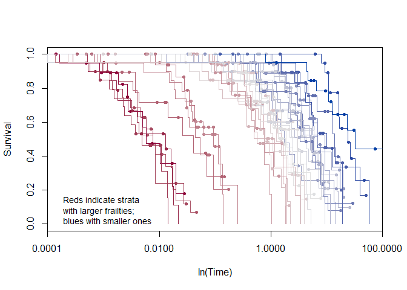

Plottet viser at frailty er viktig. Hva om du ikke inkluderer frailty? Frailty er uavhengig av variablene, og burde ikke påvirke modellen. Men den gjør det: underestimerer effekten. Det skyldes seleksjon - de som er igjen har lengre S(t).

Dette kan plugges inn i en cox-funksjon - eller en parametrisk weibull-modell.

``` r
cox.noF<-coxph(S~X,data=data)
summary(cox.noF)
```

    ## Call:
    ## coxph(formula = S ~ X, data = data)
    ## 
    ##   n= 800, number of events= 424 
    ## 
    ##     coef exp(coef) se(coef)    z  Pr(>|z|)    
    ## X 0.4577    1.5805   0.0998 4.59 0.0000045 ***
    ## ---
    ## Signif. codes:  0 '***' 0.001 '**' 0.01 '*' 0.05 '.' 0.1 ' ' 1
    ## 
    ##   exp(coef) exp(-coef) lower .95 upper .95
    ## X      1.58      0.633       1.3      1.92
    ## 
    ## Concordance= 0.557  (se = 0.014 )
    ## Rsquare= 0.026   (max possible= 0.998 )
    ## Likelihood ratio test= 21  on 1 df,   p=0.000005
    ## Wald test            = 21  on 1 df,   p=0.000005
    ## Score (logrank) test = 21.4  on 1 df,   p=0.000004

``` r
weib.noF<-survreg(S~X,data=data,dist="weib")
summary(weib.noF)
```

    ## 
    ## Call:
    ## survreg(formula = S ~ X, data = data, dist = "weib")
    ##               Value Std. Error     z                    p
    ## (Intercept)  2.1830     0.1533 14.24 < 0.0000000000000002
    ## X           -0.9621     0.2117 -4.54            0.0000055
    ## Log(scale)   0.7786     0.0387 20.12 < 0.0000000000000002
    ## 
    ## Scale= 2.18 
    ## 
    ## Weibull distribution
    ## Loglik(model)= -850   Loglik(intercept only)= -860
    ##  Chisq= 20 on 1 degrees of freedom, p= 0.0000082 
    ## Number of Newton-Raphson Iterations: 6 
    ## n= 800

Hva med weibull? Vel, koeffisienter er riktig, men scale-parameteret tolkes 1/1.92, som antyder at hasarden går ned.. Og det gjør den ikke.

I bunn og grunn: hvis du har feil modell, får du feil svar.

Men for å kunne estimere det, må vi anta noe om fordelinga: I overlevelsesmodeller er det svært sjeldent å bruke fixed effects, en bruker random - der en trekker tilfeldige, sentrert på 1, og med positiv variasjon. Hvilken fordeling kan en da velge? vanligere er

-   gamma. Theta-parameteret (variasjon) inngår så i den nye overlevelsesfunksjonen. Jo større variasjoner i gamma-fordelinga av frailties, jo større variabilitet.
-   inverse-gaussian. Mer kompleks, men gir et liknende forhold der variasjonen i frailties påvirker variasjonen i overleelsfunksjonen.

Praktiske ting: Vanskelig, iterativ greie. Den fulle informasjonsmatrisa har masse data (kvadratet av antall enheter/grupper + variabler). E-M var brukt først, penalized likelihood nå.

``` r
cox.F<-coxph(S~X+frailty.gaussian(F),data=data)
```

    ## Warning in coxpenal.fit(X, Y, strats, offset, init = init, control, weights
    ## = weights, : Inner loop failed to coverge for iterations 2 3

``` r
summary(cox.F)
```

    ## Call:
    ## coxph(formula = S ~ X + frailty.gaussian(F), data = data)
    ## 
    ##   n= 800, number of events= 424 
    ## 
    ##                     coef  se(coef) se2  Chisq  DF   p                   
    ## X                   0.935 0.11     0.11   72.3  1.0 0.000000000000000018
    ## frailty.gaussian(F)                     1860.8 39.1 0.000000000000000000
    ## 
    ##   exp(coef) exp(-coef) lower .95 upper .95
    ## X      2.55      0.393      2.05      3.16
    ## 
    ## Iterations: 8 outer, 96 Newton-Raphson
    ##      Variance of random effect= 4.9 
    ## Degrees of freedom for terms=  1.0 39.1 
    ## Concordance= 0.843  (se = 0.843 )
    ## Likelihood ratio test= 696  on 40.1 df,   p=<0.0000000000000002

``` r
weib.F<-survreg(S~X+frailty.gaussian(F),data=data,dist="weib")
summary(weib.F)
```

    ## 
    ## Call:
    ## survreg(formula = S ~ X + frailty.gaussian(F), data = data, dist = "weib")
    ##               Value Std. Error     z                   p
    ## (Intercept)  0.7647     0.3794  2.02               0.044
    ## X           -0.9287     0.0986 -9.42 <0.0000000000000002
    ## Log(scale)  -0.0445     0.0386 -1.16               0.248
    ## 
    ## Scale= 0.956 
    ## 
    ## Weibull distribution
    ## Loglik(model)= -490   Loglik(intercept only)= -860
    ##  Chisq= 740 on 38 degrees of freedom, p= 1.1e-130 
    ## Number of Newton-Raphson Iterations:  6 19 
    ## n= 800

Tolkning av variance of random effects: grad av variasjon i S(t) som en funksjon av frailities.

Når vi inkluderer enhetseffekter, så blir modellen kondisjonell på disse enhetseffekter. Dvs. at vi får individuelle/enhets-nivå-funksjoner. Du kan også utlede en populasjonsgjennomsnittsmodell, der du bruker gjennomsnittet for enhets-effekter/frailities i beregning av overlevelse.

Tolkning: Enten bruke theta og snittet til å integrere deg fram til et populasjonssnitt, eller estimere for spesifikke grupper eller et gjennomsnitt 1. Pakker: survival, coxme, frailtypack. (Spørsmål: RCT der en gruppe får medisin eller ikke-medisin, og data er overlevelsesdata. Randomiseringa skal håndtere ting, slik at medisinen er ortogonal til alle andre variabler. Dvs. at enhetseffekt-leddet også skal være ukorrelert med X, og dermed kan en bruke random effects. Hvorfor? Bør du ikke kunne ignorert enhetseffektene også, siden de ikke påvirker X? Nei. Hvis du bruker et hasard-rammeverk, og tar ut observasjoner etter hvert som de får hendelsen, vil datasettet etter hvert bestå av folk som har en lavere hasard - uten at det nødvendigvis har noe med hasarden for hendelsen)

### Eksempel fra hjemme-oppgave!

``` r
lead<-read.csv("https://raw.githubusercontent.com/PrisonRodeo/GSERM-Oslo-2019-git/master/Data/leaders.csv")

lead<-lead[lead$year<2004,]
lead.S<-Surv(lead$tenstart,lead$tenure,lead$tenureend)
```

    ## Warning in Surv(lead$tenstart, lead$tenure, lead$tenureend): Stop time must
    ## be > start time, NA created

``` r
Rs<-as.matrix(lead[,13:17])
lead$region<-factor((Rs %*% 1:ncol(Rs))+1,
                    labels=c("NorthAm",colnames(Rs)))
rm(Rs)

lead.F<-coxph(lead.S~female*region+frailty.gamma(ccode),data=lead) #versjonen med gamma(leadid) krasjer?
```

    ## Warning in coxpenal.fit(X, Y, strats, offset, init = init, control, weights
    ## = weights, : Inner loop failed to coverge for iterations 2 3

``` r
summary(lead.F)
```

    ## Call:
    ## coxph(formula = lead.S ~ female * region + frailty.gamma(ccode), 
    ##     data = lead)
    ## 
    ##   n= 15222, number of events= 2806 
    ##    (22 observations deleted due to missingness)
    ## 
    ##                      coef    se(coef) se2    Chisq  DF 
    ## female                1.2427 0.462    0.4594   7.24   1
    ## regionLatinAm        -0.1259 0.208    0.0333   0.37   1
    ## regionEurope          0.0414 0.160    0.0545   0.07   1
    ## regionAfrica         -0.7047 0.160    0.0840  19.45   1
    ## regionAsia           -0.3896 0.164    0.0742   5.65   1
    ## regionMidEast        -0.7478 0.186    0.0986  16.13   1
    ## frailty.gamma(ccode)                         523.81 119
    ## female:regionLatinAm -1.8826 0.851    0.8495   4.89   1
    ## female:regionEurope  -1.5424 0.624    0.6212   6.11   1
    ## female:regionAfrica   0.7854 0.861    0.8556   0.83   1
    ## female:regionAsia    -1.8765 0.572    0.5666  10.76   1
    ## female:regionMidEast -1.2175 0.861    0.8551   2.00   1
    ##                      p                                                      
    ## female               0.00710000000000000040800696154974502860568463802337646
    ## regionLatinAm        0.54000000000000003552713678800500929355621337890625000
    ## regionEurope         0.80000000000000004440892098500626161694526672363281250
    ## regionAfrica         0.00001000000000000000081748843805407034324161941185594
    ## regionAsia           0.01700000000000000122124532708767219446599483489990234
    ## regionMidEast        0.00005899999999999999754189683454086434721830300986767
    ## frailty.gamma(ccode) 0.00000000000000000000000000000000000000000000000000045
    ## female:regionLatinAm 0.02699999999999999969468866822808195138350129127502441
    ## female:regionEurope  0.01299999999999999940325512426397835952229797840118408
    ## female:regionAfrica  0.35999999999999998667732370449812151491641998291015625
    ## female:regionAsia    0.00100000000000000002081668171172168513294309377670288
    ## female:regionMidEast 0.16000000000000000333066907387546962127089500427246094
    ## 
    ##                      exp(coef) exp(-coef) lower .95 upper .95
    ## female                   3.465      0.289    1.4016     8.566
    ## regionLatinAm            0.882      1.134    0.5870     1.324
    ## regionEurope             1.042      0.959    0.7616     1.427
    ## regionAfrica             0.494      2.023    0.3613     0.676
    ## regionAsia               0.677      1.476    0.4912     0.934
    ## regionMidEast            0.473      2.112    0.3287     0.682
    ## female:regionLatinAm     0.152      6.571    0.0287     0.808
    ## female:regionEurope      0.214      4.676    0.0630     0.726
    ## female:regionAfrica      2.193      0.456    0.4060    11.848
    ## female:regionAsia        0.153      6.531    0.0499     0.470
    ## female:regionMidEast     0.296      3.379    0.0548     1.599
    ## 
    ## Iterations: 10 outer, 83 Newton-Raphson
    ##      Variance of random effect= 0.24   I-likelihood = -19476.6 
    ## Degrees of freedom for terms=   1.0   1.3 119.3   4.9 
    ## Concordance= 0.662  (se = 0.662 )
    ## Likelihood ratio test= 858  on 127 df,   p=<0.0000000000000002

``` r
#plot(survfit(lead.F,se.fit=TRUE),conf.int=TRUE,mark.time=FALSE,
#     log="x",lwd=c(2,1,1),col="red",xlab="Time (in days)",
#     ylab="Survival")
#lines(survfit(lead.S~1),conf.int=FALSE,col="black",
#      mark.time=FALSE,lwd=2)
#legend("bottomleft",bty="n",inset=0.04,lty=1,lwd=3,col=c("red","black"),
#       c("Predicted Survival","Baseline (Univariate) Survival"))
```

-   interkasjon mellom kvinne og region. For å tolke disse: legg coeff sammen og exp?
-   frailty-ledd for leder-ID funker ikke, men det funker for land. Men gir det substansiell mening? -&gt; Her kommer bomba. Inner loop er betakoeffisienter for en spesifikk theta-verdi i en gamma-fordeling. Det var ti ytre forsøk, så det bør gå bra.
-   bruker log-skala for x-aksen med tid. sammenlikner baseline med predikert overlevelse (for hvilken gruppe? Ellr er det et popiulasjonssnitt?)

-   fall i kurven henger sammen med diskrete hendelser/datotilfeleler: folk slutter etter 1 år, 4 år-

-&gt; Så dette impliserer mixed effects-overlevelsesmodeller. coxme i R. Eksempel!

``` r
lead.coxME<-coxme(lead.S~female + (1 | ccode/female),data=lead)
lead.coxME
```

    ## Cox mixed-effects model fit by maximum likelihood
    ##   Data: lead
    ##   events, n = 2806, 15222 (22 observations deleted due to missingness)
    ##   Iterations= 38 160 
    ##                  NULL Integrated Fitted
    ## Log-likelihood -19738     -19505 -19314
    ## 
    ##                   Chisq  df p AIC  BIC
    ## Integrated loglik   465   3 0 459  441
    ##  Penalized loglik   849 129 0 590 -177
    ## 
    ## Model:  lead.S ~ female + (1 | ccode/female) 
    ## Fixed coefficients
    ##         coef exp(coef) se(coef)     z    p
    ## female -0.07      0.93     0.22 -0.31 0.75
    ## 
    ## Random effects
    ##  Group        Variable    Std Dev Variance
    ##  ccode/female (Intercept) 0.279   0.078   
    ##  ccode        (Intercept) 0.487   0.237

Tolk fixed effects som et snitt for female, og random effect st.dev som variasjon rundt den effekten

Tror Zorn prøver å dytte oss.

-   Stratifisering: Hver gruppe har en ulik baseline/konstantledd
-   Frailties: Hver gruppe har en varierende, random effekt
-   Robuste slutninger / cluster: GEE/PCSE, som korrigerer for feilstruktur etter estimering.

Gir alt mening? Ikke i alle tilfeller. En overlevelseskurve for hvert land? Kanskje.

Wald-test vs. likelihood og logrank: sistnevnte anbefaler uavhengighet mellom individer i grupper. Men når du begynner å clustre ting, vil du sjå forskjeller i testene her.

En cluster-tilnærming impliserer en GEE, fordi det klustrer standardfeil, robuste standardfeil. En frailtiy-tilnærming er en enhets-tilnærming. Disse to kan ikke kombineres. Se slide 57 og 58.

``` r
# Stratified vs. Frailty, etc.
plot(survfit(lead.S~1,id=leadid,data=lead),mark.time=FALSE,lwd=c(3,1,1),
     xlab="Time (in days)",ylab="Survival",log="x")
```

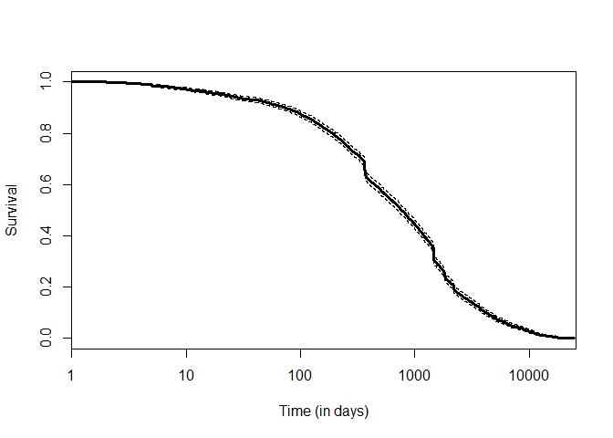

``` r
# Plot strata by country
plot(survfit(lead.S~strata(ccode),id=leadid,data=lead),
     col=brewer.pal(9,"Set1"),log="x",mark.time=FALSE,
     xlab="Time (in days)", ylab="Survival")
```

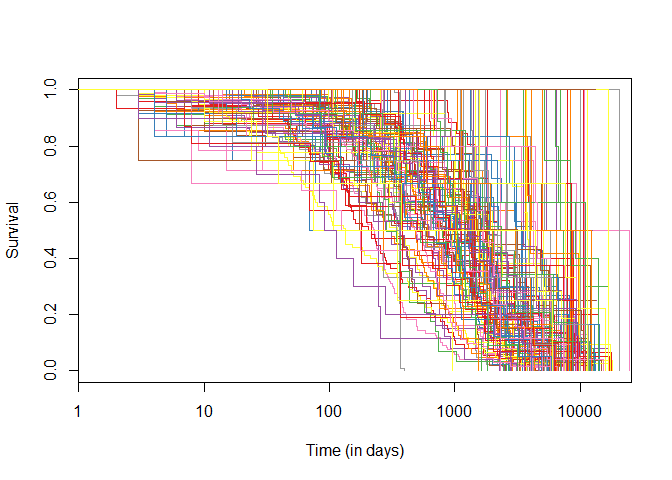

``` r
# Plot strata by region:
plot(survfit(lead.S~strata(region),id=leadid,data=lead),
     col=brewer.pal(6,"Set1"),lwd=2,log="x",mark.time=FALSE,
     xlab="Time (in days)", ylab="Survival")
legend("bottomleft",inset=0.02,bty="n",col=brewer.pal(6,"Set1"),
       c("N. America","Latin America","Europe","Africa","Asia",
         "Middle East"),lty=1,lwd=2)
```

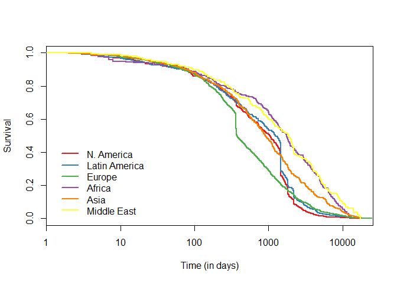

### Strata + frailty

``` r
lead.Fstrat<-coxph(lead.S~female*strata(region)+
                     frailty.gamma(ccode),data=lead)
```

    ## Warning in coxpenal.fit(X, Y, strats, offset, init = init, control, weights
    ## = weights, : Inner loop failed to coverge for iterations 2 3 4

``` r
summary(lead.Fstrat)
```

    ## Call:
    ## coxph(formula = lead.S ~ female * strata(region) + frailty.gamma(ccode), 
    ##     data = lead)
    ## 
    ##   n= 15222, number of events= 2806 
    ##    (22 observations deleted due to missingness)
    ## 
    ##                           coef  se(coef) se2   Chisq  DF 
    ## female                     1.46 0.463    0.461   9.88   1
    ## frailty.gamma(ccode)                           594.82 121
    ## female:strata(region)Lati -2.20 0.853    0.851   6.63   1
    ## female:strata(region)Euro -1.75 0.625    0.623   7.81   1
    ## female:strata(region)Afri  0.13 0.869    0.864   0.02   1
    ## female:strata(region)Asia -2.07 0.573    0.568  13.04   1
    ## female:strata(region)MidE -1.31 0.862    0.857   2.32   1
    ##                           p                                                                 
    ## female                    0.0016999999999999999052840982116663326451089233160018920898437500
    ## frailty.gamma(ccode)      0.0000000000000000000000000000000000000000000000000000000000000015
    ## female:strata(region)Lati 0.0100000000000000002081668171172168513294309377670288085937500000
    ## female:strata(region)Euro 0.0051999999999999997613020497055913438089191913604736328125000000
    ## female:strata(region)Afri 0.8800000000000000044408920985006261616945266723632812500000000000
    ## female:strata(region)Asia 0.0003099999999999999999479582957206957871676422655582427978515625
    ## female:strata(region)MidE 0.1300000000000000044408920985006261616945266723632812500000000000
    ## 
    ##                           exp(coef) exp(-coef) lower .95 upper .95
    ## female                        4.291      0.233    1.7302    10.641
    ## female:strata(region)Lati     0.111      8.993    0.0209     0.592
    ## female:strata(region)Euro     0.174      5.732    0.0513     0.594
    ## female:strata(region)Afri     1.139      0.878    0.2073     6.254
    ## female:strata(region)Asia     0.126      7.926    0.0410     0.388
    ## female:strata(region)MidE     0.269      3.720    0.0496     1.456
    ## 
    ## Iterations: 10 outer, 114 Newton-Raphson
    ##      Variance of random effect= 0.24   I-likelihood = -15052.7 
    ## Degrees of freedom for terms=   1.0 121.3   4.9 
    ## Concordance= 0.649  (se = 0.649 )
    ## Likelihood ratio test= 625  on 127 df,   p=<0.0000000000000002

### Strata + clustering

``` r
#lead.stratCl<-coxph(lead.S~female*strata(region)+
#                      cluster(ccode),data=lead)
#summary(lead.stratCl)

# boom
```

### Frailty + clustering

Fraily er en mixed effects, mens cluster gir en GEE - disse kan ikke kombineres.

``` r
#lead.FstratCl<-coxph(lead.S~female*strata(region)+frailty.gamma(ccode)+
#                       cluster(ccode),data=lead)
```

Enda flere ting som ikke er nevnt på slide 59
---------------------------------------------

-   overlevelses og longitudinell samtidig: både overlevelse/tid-til-hendelse, og en verdi på en anna variabel Y (f.eks. tid til kjøp av TV størrelse Y) (dette høres jo muligens relevant ut for intro - tid til utfall, og det kan være flere ulike utfall? Nei, ikke helt det samme?)

Noen andre tips.

-   simPH skal være en pakke som gir bedre presentasjons-resultater,
-   Statistics in Medicine er et bra tidsskrift med gode, praktiske løsninger,
-   deltakelse på kurset gir en livstids-emailtilgang på å svare på statistikkspørsmål.
